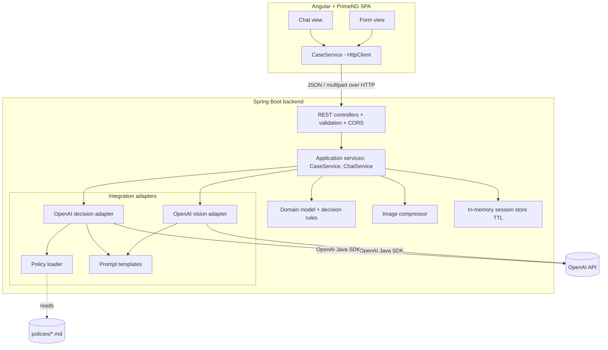
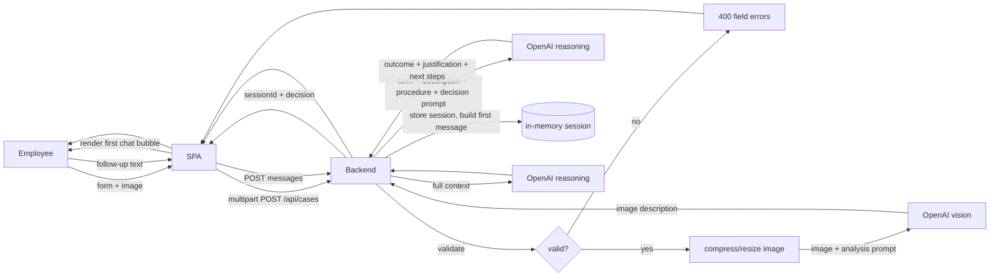
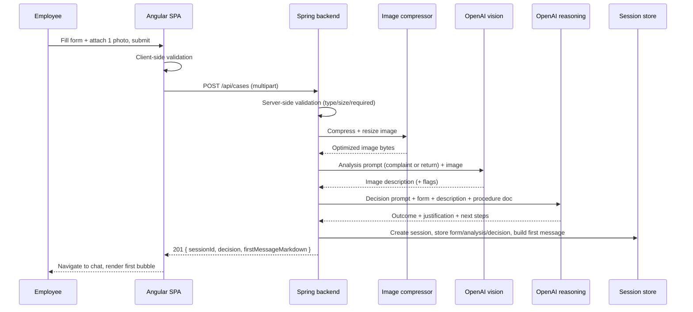
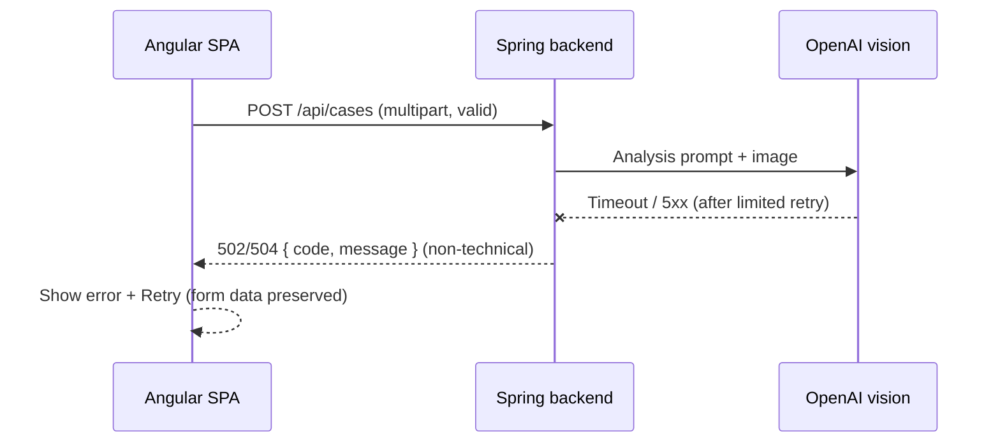
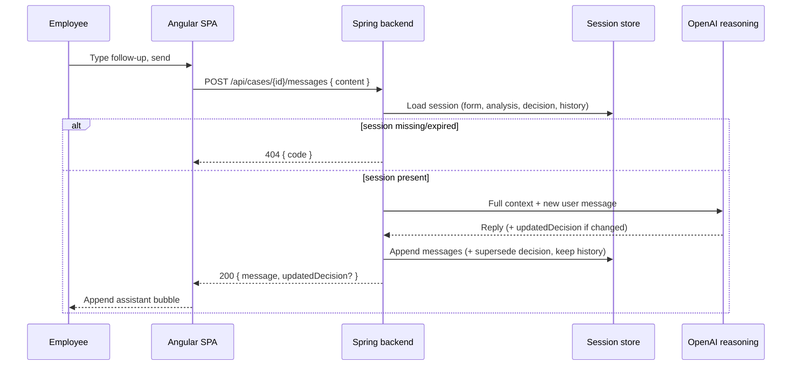

# ADR: Hardware Service Decision Copilot — Main Architecture

**Date:** 2026-06-24
**Status:** Accepted
**PRD:** [docs/PRD-Product-Requirements-Document.md](../PRD-Product-Requirements-Document.md)

---

## 1. Overview

This ADR set defines the architecture for the **Hardware Service Decision Copilot** MVP described in the PRD: an internal tool that helps support/service employees decide whether to **Approve / Reject / Escalate** a complaint or return. An employee fills a structured form and uploads one photo; the backend compresses the image, asks a multimodal model to describe its condition, then asks a reasoning model — given the form data, the image description, and the applicable company procedure — to produce a justified decision. The decision opens a chat where the employee can ask questions and add information.

The system is a **Single-Page Application (Angular + PrimeNG) talking to a Spring Boot REST backend**, with the backend integrating OpenAI through the official OpenAI Java SDK. This document (ADR-000) owns the overall architecture, the cross-cutting decisions, the shared data model, the REST surface at a high level, environment configuration, and the system-level testing strategy. Focused areas are split into:

- [`001-backend-api.md`](001-backend-api.md) — Spring Boot REST backend, request handling, image pipeline, error model.
- [`002-frontend-angular.md`](002-frontend-angular.md) — Angular + PrimeNG SPA, form and chat views.
- [`003-ai-llm-integration.md`](003-ai-llm-integration.md) — OpenAI Java SDK integration, prompts, decision contract.
- [`004-data-and-persistence.md`](004-data-and-persistence.md) — in-memory session model for the MVP and the deferred persistence design.

---

## 2. Context7 Library References

Implementing agents must fetch docs using these handles (resolve again only if a handle 404s). Per project rules, do not rely on training knowledge for API specifics.

| Library | Context7 Handle | Used for |
|---|---|---|
| Spring Boot | `/spring-projects/spring-boot` | Backend application, REST (`spring-boot-starter-web`), validation, config, multipart |
| OpenAI Java SDK | `/openai/openai-java` | Multimodal image analysis + reasoning/chat completions |
| Angular | `/angular/angular` | Frontend SPA (standalone components, signals, reactive forms, HttpClient) |
| PrimeNG | `/websites/v20_primeng` | Form controls, file upload, buttons, messages, spinners, cards |
| Thumbnailator | resolve `net.coobird:thumbnailator` via `library` if adopted | Server-side image compression/resize (candidate) |
| ngx-markdown | resolve `ngx-markdown` via `library` if adopted | Render the formatted (Markdown) decision message in chat |
| Playwright | resolve `Playwright` via `library` | E2E tests against the running stack |

> Spring AI (`/spring-projects/spring-ai`) was considered for LLM access but rejected — see §8 "LLM access library". The official OpenAI Java SDK is the chosen client.

---

## 3. System Architecture

### Architecture pattern
**SPA + REST API**, two deployable artifacts in one repository (polyrepo-in-monorepo layout):

- **Frontend:** Angular standalone-component SPA served by the Angular dev server in development.
- **Backend:** Spring Boot monolith exposing a stateless-over-HTTP REST API. Session state for the MVP is held **in-memory in the backend** keyed by an opaque session id (see ADR-004); the API itself requires no server-rendered views.
- Communication is **JSON over HTTP**, except case creation which is **`multipart/form-data`** (form fields + image). No GraphQL, no WebSocket in the MVP.

### Repository structure
```
app/
  backend/          Spring Boot app (Maven)
    src/main/java/...        web / application / domain / integration / support layers
    src/main/resources/
      policies/              complaint-procedure.md, return-procedure.md (packaged copies)
      prompts/               system/analysis/decision prompt templates
      application.yaml
    src/test/java/...        unit + integration tests
  frontend/         Angular + PrimeNG SPA
    src/app/
      features/form/         intake form view
      features/chat/         chat view
      core/                  CaseService (HttpClient), models, interceptors
    src/environments/
docs/
  PRD-Product-Requirements-Document.md
  ADR/             this folder
  policies/        source-of-truth example procedures (copied into backend resources)
```

The two example procedure documents in `docs/policies/` are the source of truth; the backend build copies (or references via configurable path) them so the agent can inject them at runtime.

### Technology stack

| Layer | Technology | Reason |
|---|---|---|
| Language (BE) | Java 21 (LTS) | Current LTS; matches NBP enterprise Java direction. |
| Backend framework | Spring Boot 3.x (latest stable 3.5.x) | Mandated stack; mature REST, validation, multipart, testing. |
| Build (BE) | Maven | Conventional for Spring/enterprise; reproducible across the 12 participants. |
| LLM client | OpenAI Java SDK (`com.openai:openai-java`) | User-mandated; official, supports vision + reasoning models. |
| Image processing | Thumbnailator (candidate) | Simple, dependency-light compression/resize before LLM call. |
| Frontend framework | Angular 20 (standalone components, signals) | Mandated stack. |
| UI components | PrimeNG 20 | Mandated; provides form controls, file upload, spinners, messages. |
| Markdown render | ngx-markdown (candidate) | Render the formatted decision message safely. |
| Database | None at runtime (in-memory) for MVP | PRD keeps persistence as Backlog; schema designed in ADR-004. |
| AI/LLM | OpenAI multimodal + reasoning models (ids via env) | Vision for image description; reasoning model for the decision agent. |
| E2E testing | Playwright | Drives the real stack per AGENTS.md test strategy. |

---

## 4. Module Structure & Dependencies

Backend layers (dependencies point inward; no circular dependencies):

- **web** — REST controllers, request/response DTOs, multipart binding, validation annotations, global exception handler, CORS config. Depends on **application**.
- **application** — use-case services: `CaseService` (orchestrates validate → compress → analyze → decide → open session), `ChatService` (continues a session). Defines **ports** (interfaces) for the LLM and image operations. Depends on **domain** and the **port** interfaces.
- **domain** — pure model + business rules independent of frameworks: case data, decision value object, decision categories, session model. Depends on nothing.
- **integration** — adapters implementing application ports: `OpenAiVisionAdapter`, `OpenAiDecisionAdapter` (both over the OpenAI Java SDK), `PolicyDocumentLoader`, `PromptTemplateProvider`. Depends on **application** ports + **domain**.
- **support** — image compression utility, session store (in-memory), configuration properties. Depends on **domain**.

Frontend modules:

- **core** — `CaseService` (HttpClient wrapper for the REST API), typed models matching the API contracts, HTTP error interceptor. Depended on by features.
- **features/form** — intake form view + form state. Depends on **core**.
- **features/chat** — chat view + conversation state. Depends on **core**.

Dependency direction overall: `frontend → (HTTP/REST) → web → application → domain`; `integration → application/domain`. The OpenAI SDK is reachable **only** from `integration`, never from `web`/`domain`.

---

## 5. Data Models

Conceptual (not schema code). Full field tables are in ADR-004.

- **CaseSession** — one complaint/return case and its conversation. Key fields: `id` (UUID, opaque to client), `caseType` (COMPLAINT | RETURN), `form` (CaseForm), `imageAnalysis` (ImageAnalysis), `decision` (Decision), `messages` (ordered list of ChatMessage), `createdAt`, `expiresAt`. Stored **in-memory** with TTL for the MVP. No persistence across restart.
- **CaseForm** — submitted form data: `caseType`, `equipmentCategory` (enum from the predefined list), `modelName` (string), `purchaseDate` (date, not future), `reason` (string; required when COMPLAINT). The raw uploaded image is **not** retained after processing; only the compressed bytes needed for the analysis call are used transiently.
- **ImageAnalysis** — output of the multimodal model: `description` (text), `caseTypeContext` (COMPLAINT | RETURN), and optional structured flags (e.g., `damageObserved`, `signsOfUse`, `usable`) when the model returns them. Retained for the session (AC-12).
- **Decision** — agent output: `outcome` (APPROVE | REJECT | ESCALATE), `justification` (text referencing the procedure), `nextSteps` (text), `firstMessageMarkdown` (the formatted first chat bubble), `disclaimerIncluded` (boolean invariant — must be true). One per session, may be superseded by an updated recommendation produced in chat (history preserved).
- **ChatMessage** — `role` (SYSTEM_ASSISTANT | USER | ASSISTANT), `content` (text/Markdown), `createdAt`, ordered. The first message is the formatted decision (AC-18/19).

---

## 6. API / Interface Contracts (high level)

Detailed contracts (status codes, error bodies, validation) are in ADR-001. All paths are under `/api`. All responses JSON unless noted. No authentication in the MVP.

| # | Endpoint | Input | Output | Notes |
|---|---|---|---|---|
| 1 | `POST /api/cases` | `multipart/form-data`: `caseType`, `equipmentCategory`, `modelName`, `purchaseDate`, `reason?`, `image` (one file) | `{ sessionId, decision { outcome, justification, nextSteps, firstMessageMarkdown }, imageAnalysisSummary }` | Validates → compresses image → vision analysis → decision. Synchronous. |
| 2 | `POST /api/cases/{sessionId}/messages` | `{ content: string }` | `{ message { role, content, createdAt }, updatedDecision? }` | Continues the conversation with full context (AC-20/21). Synchronous JSON. |
| 3 | `GET /api/cases/{sessionId}` | — | `{ sessionId, form, imageAnalysisSummary, decision, messages[] }` | Re-hydrate a session (e.g., chat view load / refresh within TTL). |
| 4 | `GET /api/metadata` | — | `{ caseTypes[], equipmentCategories[], imageConstraints { acceptedTypes[], maxBytes } }` | Drives the form selectors so options match backend prompts/validation. |

Error responses use a consistent problem shape: `{ code, message, fieldErrors? }`. Key cases: `400` validation (with `fieldErrors`), `404` unknown/expired session, `413` image too large, `415` unsupported image type, `502/503` LLM upstream failure (retryable), `504` LLM timeout.

---

## 7. Environment Variables

| Variable | Purpose | Required | Example value |
|---|---|---|---|
| `OPENAI_API_KEY` | OpenAI authentication | Yes | `sk-...` |
| `OPENAI_BASE_URL` | Override API base (proxy / OpenRouter-compatible / E2E stub) | No | `https://api.openai.com/v1` |
| `OPENAI_VISION_MODEL` | Multimodal model id for image analysis | No (has default) | a vision-capable GPT-4o-class model id |
| `OPENAI_REASONING_MODEL` | Reasoning model id for the decision agent | No (has default) | an o-series reasoning model id |
| `OPENAI_REQUEST_TIMEOUT_MS` | Per-call timeout | No | `60000` |
| `APP_IMAGE_MAX_UPLOAD_BYTES` | Reject uploads larger than this | No | `10485760` (10 MB) |
| `APP_IMAGE_MAX_DIMENSION_PX` | Long-side resize cap before LLM | No | `2048` |
| `APP_IMAGE_TARGET_FORMAT` | Re-encode format after compression | No | `jpeg` |
| `APP_POLICY_COMPLAINT_PATH` | Complaint procedure source | No | `classpath:/policies/complaint-procedure.md` |
| `APP_POLICY_RETURN_PATH` | Return procedure source | No | `classpath:/policies/return-procedure.md` |
| `APP_SESSION_TTL_MINUTES` | In-memory session lifetime | No | `60` |
| `APP_CORS_ALLOWED_ORIGIN` | Allowed SPA origin | No | `http://localhost:4200` |
| `SERVER_PORT` | Backend HTTP port | No | `8080` |

Model ids are intentionally env-configured and **must not be hard-coded**, so the group can pick exact models during implementation without a code change. Defaults are applied if unset.

---

## 8. Technical Decisions

### SPA + REST split (Angular ⇄ Spring Boot)
**Status:** Accepted · **Date:** 2026-06-24
**Context:** The PRD has two screens (form, chat) and an internal employee audience; the group mandated Angular/PrimeNG on the front and Java/Spring on the back.
**Decision:** Build an Angular SPA that calls a Spring Boot REST API over JSON (multipart for upload). Clean separation of concerns; each layer testable in isolation.
**Rejected alternatives:**
- Server-side rendered Thymeleaf UI: contradicts the mandated Angular/PrimeNG stack.
- Backend-for-frontend gateway / micro-frontends: unnecessary complexity for a 2-screen MVP.
**Consequences:** (+) Independent FE/BE development and testing; familiar enterprise pattern. (−) Requires CORS config and a duplicated type contract across languages.
**Review trigger:** If SSR/SEO or multi-app sharing becomes a requirement.

### LLM access library — OpenAI Java SDK (not Spring AI)
**Status:** Accepted · **Date:** 2026-06-24
**Context:** The backend must call a multimodal model and a reasoning model; the group specified "OpenAI Java".
**Decision:** Use the official OpenAI Java SDK (`com.openai:openai-java`) behind application ports, so the rest of the app is provider-agnostic.
**Rejected alternatives:**
- Spring AI: higher-level abstraction, but the group explicitly chose the OpenAI Java SDK; using the official SDK keeps vision + reasoning model access first-class and current.
- Hand-rolled HTTP client: re-implements retries, streaming, multipart, and types the SDK already provides.
**Consequences:** (+) First-class OpenAI feature access; provider isolated behind ports. (−) Swapping providers later means a new adapter (mitigated by `OPENAI_BASE_URL` for OpenAI-compatible gateways).
**Review trigger:** If the group moves to a non-OpenAI-compatible provider, or adopts Spring AI for RAG (Backlog).

### Synchronous responses (no streaming) for the MVP
**Status:** Accepted · **Date:** 2026-06-24
**Context:** Chat UX benefits from token streaming, but it adds SSE/WebSocket plumbing on both ends.
**Decision:** Both case creation and chat replies return complete JSON synchronously; the UI shows loading/typing indicators (AC-25) during the call.
**Rejected alternatives:**
- SSE streaming now: more moving parts (event parsing, partial-render, cancellation) than the MVP needs.
**Consequences:** (+) Simple REST, simple tests. (−) User waits for the full reply with a spinner; reasoning-model latency is visible.
**Review trigger:** If reply latency degrades UX in user testing, add SSE streaming for `POST .../messages`.

### In-memory session state for the MVP
**Status:** Accepted · **Date:** 2026-06-24
**Context:** The PRD lists session/decision persistence as Backlog and asks to keep the MVP minimal.
**Decision:** Store sessions in an in-memory store with a TTL; design (but do not wire) the persistence schema in ADR-004.
**Rejected alternatives:**
- Ship SQLite now: extra setup/migrations not required by the MVP scope.
**Consequences:** (+) No DB dependency; fastest path. (−) State lost on restart; single-instance only.
**Review trigger:** When persistence/audit (Backlog) is pulled into scope, or when more than one backend instance is run.

### Stateless auth — none in the MVP
**Status:** Accepted · **Date:** 2026-06-24
**Context:** PRD explicitly excludes auth/accounts.
**Decision:** No authentication; the API is reachable only from the configured CORS origin in local dev. Secrets (`OPENAI_API_KEY`) come from the environment, never the client.
**Rejected alternatives:** OAuth2/JWT (Spring Security): out of scope for the MVP.
**Consequences:** (+) Minimal surface. (−) Not production-safe; must be addressed before any real deployment.
**Review trigger:** Any deployment beyond local/course use.

---

## 9. Diagrams

### 9.1 Architecture / Component Diagram


### 9.2 Data Flow Diagram


### 9.3 Sequence Diagrams

#### Case submission and AI decision (happy path)


#### Case submission — LLM upstream failure (error path)


#### Chat turn (continuation)


---

## 10. Testing Strategy

### Philosophy
TDD per AGENTS.md: write/extend tests before production code, confirm they fail for the right reason, implement the minimum to pass, then refactor green. Tests are the implementing agent's primary self-validation. The external LLM API is the **only** thing mocked at the integration layer; unit tests mock all dependencies; E2E runs the real stack.

### Test layers

| Layer | Type | Scope | Tools |
|---|---|---|---|
| Unit (BE) | All deps mocked | Validators, image compressor, prompt builder, decision parser, session store, domain rules | JUnit 5, Mockito, AssertJ |
| Unit (FE) | All deps mocked | Form validation logic, CaseService (HttpClientTestingController), component state/signals | Jasmine + Karma (Angular default) |
| Integration (BE) | Only the OpenAI API mocked | REST endpoints end-to-end through controllers→services with a stubbed OpenAI endpoint | Spring Boot Test, MockMvc/WebTestClient, MockWebServer/WireMock |
| E2E | Nothing mocked (real stack) | Full flow: form → decision → chat in a browser against running BE+FE | Playwright |

> E2E determinism: because AGENTS.md mandates a real stack for E2E, the automated E2E suite points `OPENAI_BASE_URL` at a local OpenAI-compatible stub returning canned responses, so flows are deterministic and free; a separate, manually-run smoke test may target the real OpenAI API. Any such substitution must be logged in the test output, not silent.

### Key test scenarios
- **Valid complaint → decision:** valid form + clear damage photo → one of APPROVE/REJECT/ESCALATE, justification references complaint procedure, first message contains greeting+decision+justification+next steps+disclaimer. Edge: missing reason → 400 before any LLM call.
- **Valid return → decision:** valid form (no reason) + clean-item photo → decision references return procedure. Edge: reason omitted is allowed for RETURN.
- **Invalid input:** missing required field, future purchase date, no image, oversized image, unsupported type → `400/413/415` with field-level errors and **no** LLM call.
- **LLM failure:** vision or reasoning call times out / 5xx → `502/504`, no session persisted as decided, retry possible. Edge: partial failure (vision ok, reasoning fails).
- **Low confidence:** blurry/irrelevant image or contradictory data → outcome ESCALATE with stated missing info (AC-17).
- **Chat continuation:** follow-up uses full context; new material info → `updatedDecision` present with explanation; original first message still in history. Edge: off-topic question → polite redirect (AC-22). Edge: unknown/expired session → 404.
- **Localization:** all user-facing strings and agent output are Polish (AC-23).

### Technical acceptance criteria
- **TAC-01:** `POST /api/cases` with any missing/invalid required field returns `400` with a `fieldErrors` map and triggers **zero** OpenAI calls (verified by mock interaction count).
- **TAC-02:** An upload over `APP_IMAGE_MAX_UPLOAD_BYTES` returns `413`; a non-JPEG/PNG/WebP file returns `415`.
- **TAC-03:** The image sent to the vision adapter is never the original bytes — its dimensions ≤ `APP_IMAGE_MAX_DIMENSION_PX` on the long side and its byte size ≤ the original (verified in a unit test on the compressor).
- **TAC-04:** The decision returned is always exactly one of `APPROVE`/`REJECT`/`ESCALATE`; any other model output is coerced to `ESCALATE` (fail-safe) — verified by the decision parser unit test.
- **TAC-05:** Every decision payload has a non-empty justification and `disclaimerIncluded == true`.
- **TAC-06:** For COMPLAINT the complaint procedure text is present in the decision-call context; for RETURN the return procedure text is present (verified via the stubbed OpenAI request body).
- **TAC-07:** A request to an unknown/expired `sessionId` returns `404`.
- **TAC-08:** On any OpenAI error after retries, the API returns `502/503/504` (never `500` with a stack trace) and no inconsistent session is left behind.
- **TAC-09:** CORS allows the configured SPA origin and rejects others.
- **TAC-10:** A Playwright E2E run completes the form → decision → one chat turn flow against the running stack and asserts the first bubble structure and a successful chat reply.
