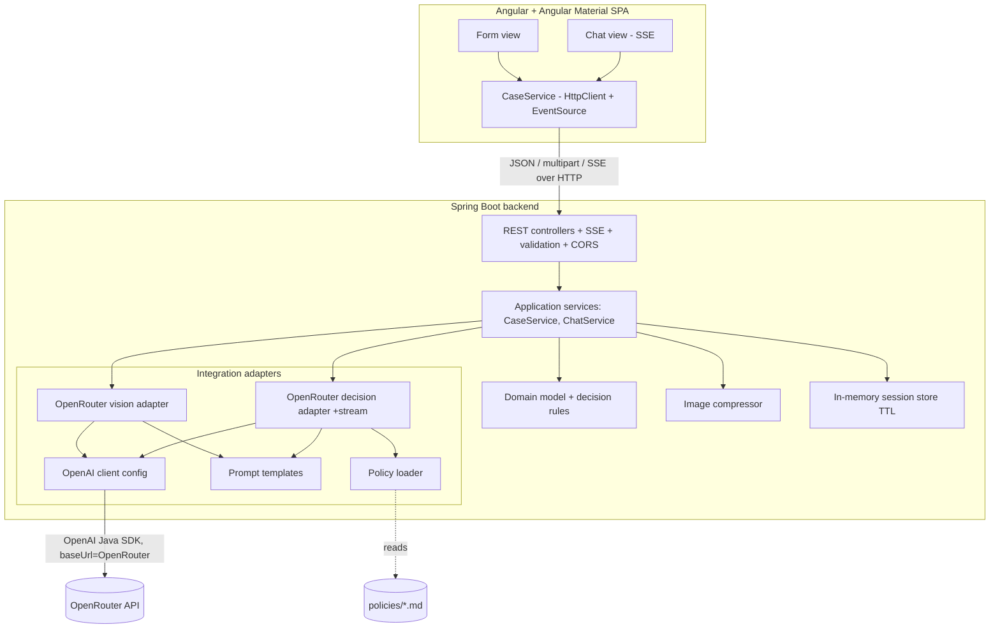
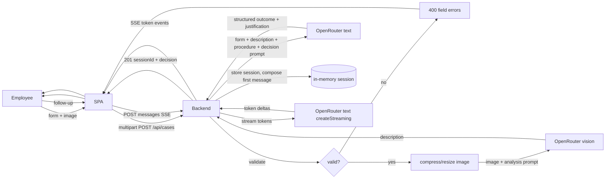
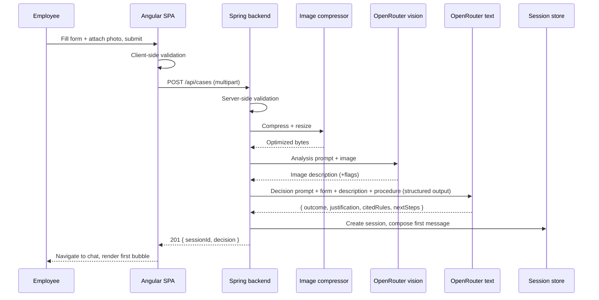
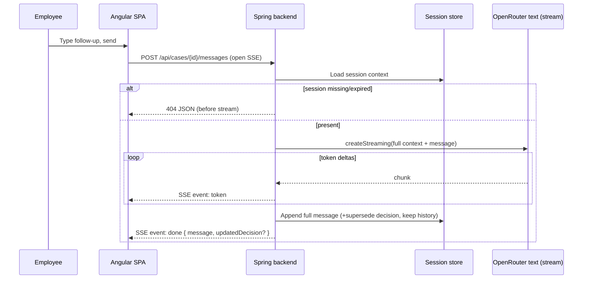
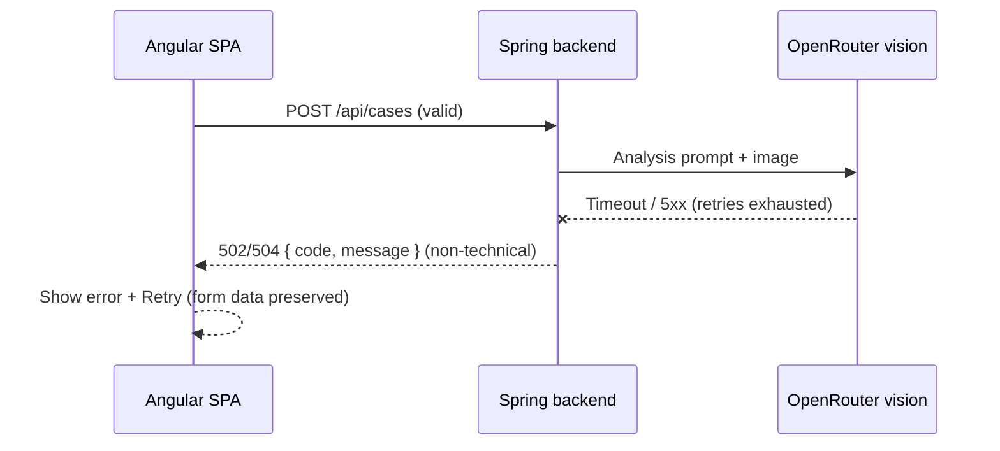

# ADR: Hardware Service Decision Copilot — Main Architecture

**Date:** 2026-06-24
**Status:** Accepted
**PRD:** [docs/PRD-Product-Requirements-Document.md](../PRD-Product-Requirements-Document.md)

---

## 1. Overview

This ADR set defines the architecture for the **Hardware Service Decision Copilot** MVP (see PRD): an internal tool that helps support/service employees decide whether to **Approve / Reject / Escalate** a complaint or return. An employee fills a structured form and uploads one photo; the backend compresses the image, asks a multimodal model to describe its condition, then asks a reasoning model — given the form data, the image description, and the matching company procedure — to produce a justified decision. The decision opens a chat where the employee can ask questions and add information, with replies streamed token-by-token.

The system is an **Angular + Angular Material SPA** talking to a **Spring Boot REST backend** (Maven, Java 21). The backend integrates LLMs through the **official OpenAI Java SDK pointed at OpenRouter**. This document owns the overall architecture, cross-cutting decisions, the shared data model, the high-level REST surface, environment configuration, and the system-level testing strategy. Focused areas:

- [`001-backend-api.md`](001-backend-api.md) — Spring Boot REST backend, request handling, image pipeline, SSE streaming, error model.
- [`002-frontend-angular.md`](002-frontend-angular.md) — Angular + Angular Material SPA, form and streaming chat views.
- [`003-ai-llm-integration.md`](003-ai-llm-integration.md) — OpenAI Java SDK → OpenRouter, Chat Completions vs Responses decision, prompts, structured decision contract.
- [`004-data-and-persistence.md`](004-data-and-persistence.md) — in-memory session model for the MVP and the deferred persistence design.
- [`005-project-setup.md`](005-project-setup.md) — tooling versions, Maven/Spring + Angular initialization, dev proxy, build/run commands, env wiring.

---

## 2. Context7 Library References

Implementing agents must fetch docs using these handles (re-resolve only if a handle 404s). Do not rely on training knowledge for API specifics.

| Library | Context7 Handle | Used for |
|---|---|---|
| Spring Boot | `/spring-projects/spring-boot` | Backend app, REST (`spring-boot-starter-web`), validation, multipart, SSE (`SseEmitter`), config |
| OpenAI Java SDK | `/openai/openai-java` | LLM client (Chat Completions, vision, streaming, structured outputs) pointed at OpenRouter |
| Angular | `/angular/angular` | SPA (standalone components, signals, reactive forms, HttpClient) |
| Angular Material | `/websites/material_angular_dev` | UI components (form fields, cards, list, buttons, progress, toolbar, snackbar) |
| ngx-markdown | resolve `ngx-markdown` via `resolve-library-id` if adopted | Render formatted/streamed Markdown messages safely |
| Playwright | resolve `Playwright` via `resolve-library-id` | E2E tests against the running stack |
| Thumbnailator | resolve `net.coobird:thumbnailator` if adopted | Server-side image compression/resize (candidate) |

> **Provider note:** We use the OpenAI Java SDK as the *client library* but the *endpoint* is OpenRouter (`OPENROUTER_BASE_URL`). OpenRouter is OpenAI-API-compatible for Chat Completions. See ADR-003 for the Chat-Completions-vs-Responses decision.

---

## 3. System Architecture

### Architecture pattern
**SPA + REST API**, two build artifacts in one repository:

- **Frontend:** Angular standalone-component SPA with Angular Material; served by the Angular dev server in development, proxying `/api` to the backend.
- **Backend:** Spring Boot monolith (Spring MVC, servlet stack) exposing a REST API. Chat replies are delivered via **Server-Sent Events**. Session state is held **in-memory** keyed by an opaque session id (ADR-004).
- Communication: **JSON over HTTP**; case creation is **`multipart/form-data`** (form + image); chat streaming is **`text/event-stream`** (SSE). No WebSocket, no GraphQL.

### Repository structure
```
app/
  backend/          Spring Boot app (Maven, Java 21)
    src/main/java/.../{web,application,domain,integration,support}
    src/main/resources/
      policies/      complaint-procedure.md, return-procedure.md (packaged copies)
      prompts/       system/analysis/decision/chat prompt templates
      application.yaml
    src/test/java/...
    pom.xml
  frontend/         Angular + Angular Material SPA
    src/app/{features/form, features/chat, core}
    proxy.conf.json  (/api -> http://localhost:8080)
    package.json, angular.json
docs/
  PRD-Product-Requirements-Document.md
  ADR/             this folder
  policies/        source-of-truth example procedures (copied into backend resources)
.env.example       OPENROUTER_* keys (root)
```

### Technology stack

| Layer | Technology | Reason |
|---|---|---|
| Language (BE) | Java 21 (LTS) | Current LTS; NBP enterprise direction. |
| Backend framework | Spring Boot 3.x (latest stable 3.5.x) | Mandated; REST, validation, multipart, SSE, testing. |
| Build (BE) | Maven | Mandated; reproducible across the 12 participants. |
| LLM client | OpenAI Java SDK (`com.openai:openai-java`) | Mandated; supports Chat Completions, vision, streaming, structured outputs; custom base URL for OpenRouter. |
| LLM endpoint | OpenRouter (`/api/v1`) | Repo-provided keys (`.env.example`); model-agnostic gateway. |
| Image processing | Thumbnailator (candidate) | Lightweight compression/resize before the LLM call. |
| Frontend framework | Angular 20 (standalone + signals) | Mandated. |
| UI components | Angular Material 20 | Mandated; accessible Material components. |
| Chat UI | Custom, built on Material primitives + ngx-markdown | No first-party Material chat component exists (see ADR-002). |
| Markdown render | ngx-markdown (candidate) | Safe rendering of streamed Markdown. |
| Database | None at runtime (in-memory) for MVP | PRD keeps persistence as Backlog; schema designed in ADR-004. |
| AI/LLM | OpenRouter text + vision models (ids via env) | `OPENROUTER_TEXT_MODEL`, `OPENROUTER_VISION_MODEL`. |
| E2E testing | Playwright | Drives the real stack per AGENTS.md. |

---

## 4. Module Structure & Dependencies

Backend layers (dependencies point inward; no cycles):

- **web** — REST controllers, request/response DTOs, multipart binding, validation, the SSE chat endpoint, global exception handler, CORS. Depends on **application**.
- **application** — use-case services: `CaseService` (validate → compress → analyze → decide → open session), `ChatService` (stream a reply over the session context). Defines **ports**: `VisionAnalysisPort`, `DecisionPort` (incl. a streaming variant), `ImageCompressor`, `SessionStore`, `PolicyProvider`, `PromptProvider`. Depends on **domain** + ports.
- **domain** — framework-free model + rules: case data, decision value object, decision categories, session model. Depends on nothing.
- **integration** — adapters implementing ports over the OpenAI Java SDK: `OpenRouterVisionAdapter`, `OpenRouterDecisionAdapter` (+ streaming), `PolicyDocumentLoader`, `PromptTemplateProvider`, `OpenAiClientConfig`. Depends on **application** ports + **domain**.
- **support** — image compressor, in-memory session store, `@ConfigurationProperties`. Depends on **domain**.

Frontend modules:
- **core** — `CaseService` (HttpClient + SSE client), typed models mirroring the REST DTOs, HTTP error interceptor, signal-based app state. Depended on by features.
- **features/form** — intake form view. Depends on **core**.
- **features/chat** — streaming chat view. Depends on **core**.

Overall direction: `frontend → (HTTP/SSE) → web → application → domain`; `integration → application/domain`. The OpenAI SDK is reachable **only** from `integration`.

---

## 5. Data Models

Conceptual (full field tables in ADR-004).

- **CaseSession** — one case + conversation: `id` (UUID), `caseType` (COMPLAINT|RETURN), `form`, `imageAnalysis`, `decision`, `messages[]`, `createdAt`, `expiresAt`. In-memory with TTL.
- **CaseForm** — `caseType`, `equipmentCategory` (enum), `modelName`, `purchaseDate` (not future), `reason` (required iff COMPLAINT). Raw image not retained after processing.
- **ImageAnalysis** — multimodal output: `description` (text) + optional flags (`damageObserved`, `signsOfUse`, `usableForResale`, `confidence`). Retained (AC-12).
- **Decision** — agent output: `outcome` (APPROVE|REJECT|ESCALATE), `justification`, `citedRules[]`, `nextSteps`, `confidence`, plus a server-composed `firstMessageMarkdown` (greeting + decision + justification + next steps + mandatory disclaimer).
- **ChatMessage** — `role` (SYSTEM_ASSISTANT|USER|ASSISTANT), `content` (Markdown), `createdAt`, ordered; index 0 is the decision bubble.

---

## 6. API / Interface Contracts (high level)

Details (status codes, error bodies, SSE event shapes) in ADR-001. Paths under `/api`. No auth in the MVP.

| # | Endpoint | Input | Output | Notes |
|---|---|---|---|---|
| 1 | `POST /api/cases` | `multipart/form-data`: `caseType`, `equipmentCategory`, `modelName`, `purchaseDate`, `reason?`, `image` | `201 { sessionId, decision, imageAnalysisSummary }` | Validate → compress → vision → decision. **Synchronous** (structured decision). |
| 2 | `POST /api/cases/{id}/messages` | `{ content }` | **SSE** `text/event-stream`: `token` events then a final `done` event `{ message, updatedDecision? }` | Streamed reply with full context (AC-20/21). |
| 3 | `GET /api/cases/{id}` | — | `200 { sessionId, form, imageAnalysisSummary, decision, messages[] }` | Rehydrate session within TTL. |
| 4 | `GET /api/metadata` | — | `200 { caseTypes[], equipmentCategories[], imageConstraints }` | Drives form selectors to match backend. |

Errors use a consistent shape `{ code, message, fieldErrors? }`: `400` validation, `404` unknown/expired session, `413` image too large, `415` unsupported type, `502/503` LLM upstream failure, `504` LLM timeout. For the SSE endpoint, a pre-stream failure returns a normal JSON error; a mid-stream failure emits an `error` SSE event and closes.

---

## 7. Environment Variables

Aligned with the repo's `.env.example` (OpenRouter). The OpenAI Java SDK client is built from these.

| Variable | Purpose | Required | Example value |
|---|---|---|---|
| `OPENROUTER_API_KEY` | OpenRouter auth (used as the SDK api key) | Yes | `sk-or-v1-...` |
| `OPENROUTER_BASE_URL` | SDK base URL → OpenRouter | Yes | `https://openrouter.ai/api/v1` |
| `OPENROUTER_TEXT_MODEL` | Reasoning/decision/chat model id | Yes | `openai/gpt-5.4-mini` |
| `OPENROUTER_VISION_MODEL` | Multimodal image-analysis model id | Yes | `openai/gpt-5.4` |
| `OPENROUTER_MODEL` | Fallback model when a split var is missing (non-prod) | No | `openai/gpt-5.4-mini` |
| `OPENAI_API_KEY` | If set, overrides `OPENROUTER_API_KEY` as the SDK key | No | `sk-...` |
| `OPENROUTER_HTTP_REFERER` | Optional OpenRouter ranking header | No | `http://localhost:4200` |
| `OPENROUTER_APP_TITLE` | Optional OpenRouter ranking header (`X-Title`) | No | `HW Service Copilot` |
| `OPENAI_REQUEST_TIMEOUT_MS` | Per-call timeout | No | `60000` |
| `APP_IMAGE_MAX_UPLOAD_BYTES` | Reject larger uploads | No | `10485760` |
| `APP_IMAGE_MAX_DIMENSION_PX` | Long-side resize cap before LLM | No | `2048` |
| `APP_IMAGE_TARGET_FORMAT` | Re-encode format | No | `jpeg` |
| `APP_POLICY_COMPLAINT_PATH` | Complaint procedure source | No | `classpath:/policies/complaint-procedure.md` |
| `APP_POLICY_RETURN_PATH` | Return procedure source | No | `classpath:/policies/return-procedure.md` |
| `APP_SESSION_TTL_MINUTES` | In-memory session lifetime | No | `60` |
| `APP_CORS_ALLOWED_ORIGIN` | Allowed SPA origin | No | `http://localhost:4200` |
| `SERVER_PORT` | Backend HTTP port | No | `8080` |

Model ids are env-configured and **must not be hard-coded**. Key resolution: prefer `OPENAI_API_KEY` if present, else `OPENROUTER_API_KEY` (matches `.env.example`).

---

## 8. Technical Decisions

### SPA + REST split (Angular Material ⇄ Spring Boot)
**Status:** Accepted · **Date:** 2026-06-24
**Context:** Two screens (form, chat), internal audience; group mandated Angular/Angular Material front and Java/Spring back.
**Decision:** Angular Material SPA calling a Spring Boot REST API (JSON, multipart upload, SSE chat). Clean FE/BE separation, each testable in isolation.
**Rejected alternatives:** Thymeleaf SSR (contradicts mandated Angular); micro-frontends (overkill for 2 screens).
**Consequences:** (+) Familiar enterprise pattern. (−) CORS + a duplicated contract across languages.
**Review trigger:** If SSR/SEO or app sharing is required.

### OpenAI Java SDK pointed at OpenRouter
**Status:** Accepted · **Date:** 2026-06-24
**Context:** The group provided OpenRouter keys (`.env.example`) and chose the OpenAI Java SDK.
**Decision:** Build the SDK client with `baseUrl = OPENROUTER_BASE_URL` and `apiKey = OPENROUTER_API_KEY`, behind application ports so the rest of the app is provider-agnostic; optionally set OpenRouter ranking headers per request.
**Rejected alternatives:** Spring AI (group chose the OpenAI SDK); a hand-rolled HTTP client (re-implements retries/streaming/types).
**Consequences:** (+) One SDK, swap models via env; provider isolated. (−) OpenRouter is OpenAI-compatible for Chat Completions but not a 1:1 mirror of every OpenAI feature — see ADR-003.
**Review trigger:** Switching to a non-OpenAI-compatible provider.

### Streaming chat over SSE; synchronous case creation
**Status:** Accepted · **Date:** 2026-06-24
**Context:** The group asked for streaming from the backend; chat UX benefits from token streaming, but the initial decision is a *structured* object that must be parsed whole before composing the first bubble.
**Decision:** Stream chat replies via SSE (`SseEmitter` fed by the SDK's `createStreaming`); keep `POST /api/cases` synchronous JSON.
**Rejected alternatives:** WebSocket (heavier than needed for one-way token push); streaming the structured decision (can't compose/validate APPROVE/REJECT/ESCALATE until complete).
**Consequences:** (+) Responsive chat; simple, validated decisions. (−) Two response styles to implement and test.
**Review trigger:** If creation latency hurts UX, add progressive status events.

### In-memory session state for the MVP
**Status:** Accepted · **Date:** 2026-06-24
**Context:** PRD lists persistence as Backlog; keep MVP minimal.
**Decision:** In-memory store with TTL behind a `SessionStore` port; design (not wire) persistence in ADR-004.
**Rejected alternatives:** Ship SQLite now (unneeded setup/migrations).
**Consequences:** (+) No DB dependency. (−) State lost on restart; single-instance only.
**Review trigger:** Audit/persistence (Backlog) pulled in, or multi-instance.

### No authentication in the MVP
**Status:** Accepted · **Date:** 2026-06-24
**Context:** PRD excludes auth/accounts.
**Decision:** No auth; API reachable only from the configured CORS origin in local dev; secrets via env, never the client.
**Rejected alternatives:** OAuth2/JWT (out of scope).
**Consequences:** (+) Minimal surface. (−) Not production-safe.
**Review trigger:** Any deployment beyond local/course use.

---

## 9. Diagrams

### 9.1 Architecture / Component Diagram


### 9.2 Data Flow Diagram


### 9.3 Sequence Diagrams

#### Case submission and AI decision (happy path)


#### Chat turn (SSE streaming)


#### Case submission — LLM upstream failure (error path)


---

## 10. Testing Strategy

### Philosophy
TDD per AGENTS.md: tests first, confirm red, minimal green, refactor. The external LLM (OpenRouter) is the **only** thing mocked at the integration layer; unit tests mock all deps; E2E runs the real stack.

### Test layers

| Layer | Type | Scope | Tools |
|---|---|---|---|
| Unit (BE) | All deps mocked | Validators, image compressor, prompt builder, decision parser, session store, domain rules | JUnit 5, Mockito, AssertJ |
| Unit (FE) | All deps mocked | Form validation, CaseService (HttpTestingController), SSE handling, component state | Jasmine + Karma (Angular default) |
| Integration (BE) | Only OpenRouter mocked | REST + SSE end-to-end through controllers→services against a stubbed OpenAI-compatible endpoint | Spring Boot Test, MockMvc/WebTestClient, MockWebServer/WireMock |
| E2E | Nothing mocked (real stack) | Form → decision → streaming chat in a browser | Playwright |

> E2E determinism: AGENTS.md mandates a real stack for E2E. The automated suite points `OPENROUTER_BASE_URL` at a local OpenAI-compatible stub returning canned (and streamable) responses; an optional manual smoke test targets real OpenRouter. Any substitution is logged, never silent.

### Key test scenarios
- **Valid complaint/return → decision**: structured outcome in {APPROVE,REJECT,ESCALATE}; justification cites the right procedure; first message has greeting+decision+justification+next steps+disclaimer. Edge: missing reason for COMPLAINT → 400 before any LLM call.
- **Invalid input**: missing field, future date, no image, oversized/unsupported image → `400/413/415`, **no** LLM call.
- **LLM failure**: vision or text call times out / 5xx → `502/504`; partial failure (vision ok, text fails). Mid-stream chat failure → `error` SSE event + close.
- **Low confidence**: blurry/irrelevant/contradictory → ESCALATE with stated missing info (AC-17).
- **Chat streaming**: tokens arrive incrementally; final `done` carries full message; material new info → `updatedDecision`; history preserved; off-topic → polite redirect; unknown/expired session → 404.
- **Localization**: all user-facing text + agent output in Polish (AC-23).

### Technical acceptance criteria
- **TAC-01:** `POST /api/cases` with any invalid/missing required field → `400` + `fieldErrors`, **zero** OpenRouter calls (verified by mock interaction count).
- **TAC-02:** Upload over `APP_IMAGE_MAX_UPLOAD_BYTES` → `413`; non-JPEG/PNG/WebP → `415`.
- **TAC-03:** The image sent to the vision adapter is never the original bytes — long side ≤ `APP_IMAGE_MAX_DIMENSION_PX` and byte size ≤ original.
- **TAC-04:** Decision outcome is always exactly one of APPROVE/REJECT/ESCALATE; any other/unparseable model output → coerced to ESCALATE.
- **TAC-05:** Every decision has a non-empty justification and includes the mandatory advisory disclaimer.
- **TAC-06:** COMPLAINT injects the complaint procedure text into the decision call; RETURN injects the return procedure (verified via the stubbed request body).
- **TAC-07:** Unknown/expired `sessionId` → `404`.
- **TAC-08:** On OpenRouter error after retries → `502/503/504` (never `500` + stack trace); no inconsistent session left behind; chat mid-stream error → `error` SSE event then close.
- **TAC-09:** The SDK client is constructed with `baseUrl = OPENROUTER_BASE_URL` and the resolved key; model ids come from `OPENROUTER_TEXT_MODEL`/`OPENROUTER_VISION_MODEL` (asserted via the stub request).
- **TAC-10:** CORS allows the configured SPA origin and rejects others.
- **TAC-11:** A Playwright E2E run completes form → decision → one streamed chat turn against the running stack, asserting the first-bubble structure and incremental token rendering.
