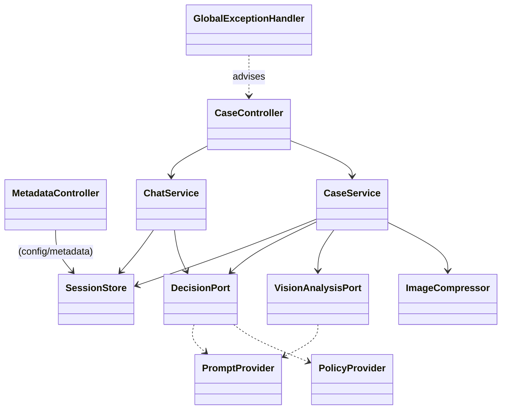
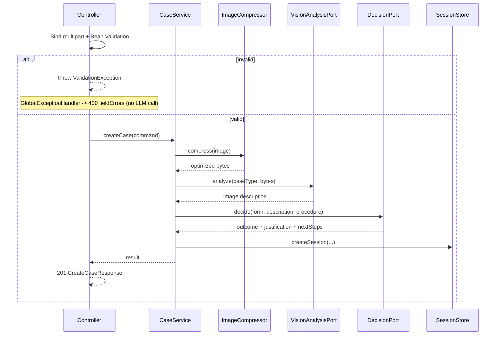
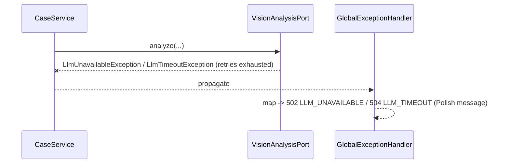

# ADR-001: Backend — Spring Boot REST API

**Date:** 2026-06-24
**Status:** Accepted
**Relates to:** [`000-main-architecture.md`](000-main-architecture.md)

---

## 1. Scope

Covers the Spring Boot backend: REST surface, request/response contracts, validation, the server-side image pipeline, orchestration of the AI calls, the error model, CORS, and configuration. It does **not** cover the OpenAI prompts and decision parsing (ADR-003), the session/data model details (ADR-004), or the frontend (ADR-002).

---

## 2. Context7 References

| Library | Context7 Handle | Used for |
|---|---|---|
| Spring Boot | `/spring-projects/spring-boot` | `spring-boot-starter-web`, `-validation`, config properties, multipart |
| OpenAI Java SDK | `/openai/openai-java` | Called via integration adapters (detailed in ADR-003) |
| Thumbnailator | resolve `net.coobird:thumbnailator` if adopted | Image compression/resize |

---

## 3. Component Design

Layered (see ADR-000 §4). Backend-specific responsibilities:

- **web**
  - `CaseController` — `POST /api/cases` (multipart), `GET /api/cases/{id}`, `POST /api/cases/{id}/messages`.
  - `MetadataController` — `GET /api/metadata`.
  - **Request DTOs** with Jakarta Bean Validation constraints; **response DTOs** decoupled from domain.
  - `GlobalExceptionHandler` (`@RestControllerAdvice`) mapping exceptions → consistent error bodies + status codes.
  - CORS configuration restricting the SPA origin (`APP_CORS_ALLOWED_ORIGIN`).
  - Multipart limits aligned to `APP_IMAGE_MAX_UPLOAD_BYTES`.
- **application**
  - `CaseService.createCase(command)` — orchestrates: validate (business) → compress → vision analyze → decide → create session → build first message. Returns a result the controller maps to the response DTO.
  - `ChatService.reply(sessionId, content)` — loads session, calls the decision adapter with full context, appends messages, optionally supersedes the decision, returns the reply.
  - **Ports:** `VisionAnalysisPort`, `DecisionPort` (implemented in integration), `ImageCompressor`, `SessionStore`, `PolicyProvider`, `PromptProvider`.
- **support**
  - `ThumbnailatorImageCompressor` implements `ImageCompressor`.
  - `InMemorySessionStore` implements `SessionStore` (TTL eviction).
  - `@ConfigurationProperties` beans for `app.image.*`, `app.session.*`, `app.policy.*`, `app.cors.*`.

State management: no HTTP session; the only server state is the in-memory `SessionStore` keyed by `sessionId` (ADR-004).

---

## 4. Data Structures (DTOs)

Conceptual shapes; field types are logical, not Java declarations.

**CreateCaseRequest** (`multipart/form-data` parts):
- `caseType`: enum string — `COMPLAINT` | `RETURN` (required)
- `equipmentCategory`: enum string from the predefined list (required)
- `modelName`: string, trimmed non-empty, max 200 (required)
- `purchaseDate`: ISO date `YYYY-MM-DD`, not in the future (required)
- `reason`: string, max 4000; **required iff** `caseType == COMPLAINT`
- `image`: single file part; content type in {`image/jpeg`,`image/png`,`image/webp`}; size ≤ `APP_IMAGE_MAX_UPLOAD_BYTES` (required)

**CreateCaseResponse** (`201`):
- `sessionId`: string (UUID)
- `decision`: { `outcome`: APPROVE|REJECT|ESCALATE, `justification`: string, `nextSteps`: string, `firstMessageMarkdown`: string }
- `imageAnalysisSummary`: string (short, for the case-summary panel)

**ChatRequest**: { `content`: string, non-empty, max 4000 }
**ChatResponse** (`200`): { `message`: { `role`: ASSISTANT, `content`: string (Markdown), `createdAt`: ISO datetime }, `updatedDecision`?: { outcome, justification, nextSteps } }

**SessionResponse** (`200`, `GET /api/cases/{id}`): { `sessionId`, `form`: {caseType, equipmentCategory, modelName, purchaseDate, reason?}, `imageAnalysisSummary`, `decision`, `messages`: [ {role, content, createdAt} ] }

**MetadataResponse** (`200`): { `caseTypes`: [{id,labelPl}], `equipmentCategories`: [{id,labelPl}], `imageConstraints`: { `acceptedTypes`: [...], `maxBytes`: number } }

**ErrorResponse** (all non-2xx): { `code`: string (e.g. `VALIDATION_ERROR`, `SESSION_NOT_FOUND`, `IMAGE_TOO_LARGE`, `UNSUPPORTED_MEDIA_TYPE`, `LLM_UNAVAILABLE`, `LLM_TIMEOUT`), `message`: string (Polish, user-safe), `fieldErrors`?: { fieldName: messagePl } }

---

## 5. Interface Contracts

| Endpoint | Method | Success | Error cases |
|---|---|---|---|
| `/api/cases` | POST (multipart) | `201 CreateCaseResponse` | `400 VALIDATION_ERROR` (+fieldErrors), `413 IMAGE_TOO_LARGE`, `415 UNSUPPORTED_MEDIA_TYPE`, `502 LLM_UNAVAILABLE`, `504 LLM_TIMEOUT` |
| `/api/cases/{id}/messages` | POST (JSON) | `200 ChatResponse` | `400 VALIDATION_ERROR`, `404 SESSION_NOT_FOUND`, `502/504` LLM errors |
| `/api/cases/{id}` | GET | `200 SessionResponse` | `404 SESSION_NOT_FOUND` |
| `/api/metadata` | GET | `200 MetadataResponse` | — |

Notes:
- All endpoints: no auth; CORS limited to the configured origin; JSON except request #1 (multipart).
- Validation runs **before** any OpenAI call; a failed validation never incurs an LLM call (TAC-01).
- Idempotency: `POST /api/cases` is not idempotent (creates a session); the SPA disables the submit button during the call to prevent duplicates (AC-25).
- Retry policy for upstream LLM errors is bounded (e.g., limited retries with backoff) inside the integration adapters; exhausted retries surface as `502/504` (detailed in ADR-003).

---

## 6. Technical Decisions

### Image pipeline location and library
**Status:** Accepted · **Date:** 2026-06-24
**Context:** AC-09 requires server-side compression/resize before the LLM call; uploads can be up to 10 MB but models prefer smaller images.
**Decision:** Compress/resize in a dedicated `ImageCompressor` (Thumbnailator) inside `support`, invoked by `CaseService` before the vision adapter. Cap the long side at `APP_IMAGE_MAX_DIMENSION_PX` (default 2048), re-encode to `APP_IMAGE_TARGET_FORMAT` (default JPEG, quality ~0.8), then base64-encode for the SDK call.
**Rejected alternatives:**
- Send original bytes: violates AC-09; larger payloads, higher cost/latency.
- Client-side compression only: cannot be trusted; AC-09 says server-side.
- Java ImageIO by hand: more code than Thumbnailator for the same result.
**Consequences:** (+) Smaller, predictable payloads; AC-09 satisfied. (−) Re-encoding loses minor detail (acceptable for condition assessment). WebP decode support must be verified; if absent, accept WebP upload and re-encode to JPEG.
**Review trigger:** If image quality proves insufficient for damage assessment, raise the dimension cap / quality.

### Synchronous orchestration in a single request
**Status:** Accepted · **Date:** 2026-06-24
**Context:** Case creation chains two LLM calls (vision → reasoning); total latency can be several seconds.
**Decision:** Perform both calls within the `POST /api/cases` request and return the decision synchronously; rely on `OPENAI_REQUEST_TIMEOUT_MS` and a server request timeout to bound waiting; the SPA shows a loading state.
**Rejected alternatives:**
- Async job + polling/webhook: more infrastructure than a single-instance MVP needs.
**Consequences:** (+) Simplest contract and tests. (−) A long request; the SPA must set a generous client timeout.
**Review trigger:** If combined latency regularly exceeds a few seconds, move to async + streaming.

### Consistent error model via `@RestControllerAdvice`
**Status:** Accepted · **Date:** 2026-06-24
**Context:** AC-24 requires non-technical errors and retry; the SPA needs machine-readable codes.
**Decision:** One global handler maps validation, multipart-size, unsupported-type, not-found, and LLM exceptions to the `ErrorResponse` shape with stable `code`s and Polish user messages; never leak stack traces; never return `500` for known conditions.
**Rejected alternatives:** Per-controller try/catch: duplicative and inconsistent.
**Consequences:** (+) Uniform, testable errors. (−) Must keep the `code` enum in sync with the frontend.
**Review trigger:** Adding new error categories.

---

## 7. Diagrams

### Component / Class Diagram

### Sequence — `POST /api/cases` with validation gate

### Sequence — LLM error mapping

---

## 8. Testing Strategy

### Test scenarios for this area

| Scenario | Type | Input | Expected output | Edge cases |
|---|---|---|---|---|
| Valid complaint creates case | Integration | Valid multipart, COMPLAINT, JPEG | `201` with decision + firstMessageMarkdown; stubbed OpenAI hit twice | Reason present; categories valid |
| Valid return creates case | Integration | Valid multipart, RETURN, no reason | `201`; return procedure in decision context | Reason omitted allowed |
| Missing required field | Integration | RETURN→COMPLAINT without reason; or no modelName | `400 VALIDATION_ERROR` + fieldErrors; **zero** OpenAI calls | Future purchaseDate → 400 |
| No image | Integration | Multipart without `image` | `400` fieldError on `image` | — |
| Oversized image | Integration | File > max bytes | `413 IMAGE_TOO_LARGE` | Exactly at limit passes |
| Unsupported type | Integration | `image/gif` | `415 UNSUPPORTED_MEDIA_TYPE` | — |
| Compression invariant | Unit | Large JPEG | Long side ≤ cap; bytes ≤ original; format = target | WebP input re-encoded to JPEG |
| LLM unavailable | Integration | Valid case; stub returns 5xx | `502 LLM_UNAVAILABLE`; no decided session left | Vision ok, reasoning fails |
| LLM timeout | Integration | Stub delays beyond timeout | `504 LLM_TIMEOUT` | — |
| Chat reply | Integration | Valid sessionId + content | `200 ChatResponse`; history appended | `updatedDecision` when info changes |
| Unknown session | Integration | Random sessionId | `404 SESSION_NOT_FOUND` | Expired (past TTL) → 404 |
| Metadata | Integration | GET /api/metadata | `200` with caseTypes, categories, imageConstraints | Labels in Polish |
| CORS | Integration | Preflight from allowed vs other origin | Allowed origin permitted; others rejected | — |

### Technical acceptance criteria
- **TAC-001-01:** Bean Validation rejects invalid `CreateCaseRequest` with `400` + `fieldErrors`, asserted with **zero** interactions on the OpenAI stub.
- **TAC-001-02:** Multipart size limit yields `413`; unsupported content type yields `415`; both before any LLM call.
- **TAC-001-03:** `ThumbnailatorImageCompressor` output satisfies dimension/byte/format invariants for JPEG, PNG, and WebP inputs (TAC-03 in ADR-000).
- **TAC-001-04:** `GlobalExceptionHandler` maps every known failure to its documented `code`/status; no `500` for known conditions; no stack trace in the body.
- **TAC-001-05:** `POST /api/cases` returns within the configured server timeout; LLM stub latency beyond `OPENAI_REQUEST_TIMEOUT_MS` produces `504`.
- **TAC-001-06:** `GET /api/cases/{id}` returns the full session including ordered messages; unknown id → `404`.
- **TAC-001-07:** Integration tests mock **only** the OpenAI endpoint (MockWebServer/WireMock); no other dependency is stubbed.
