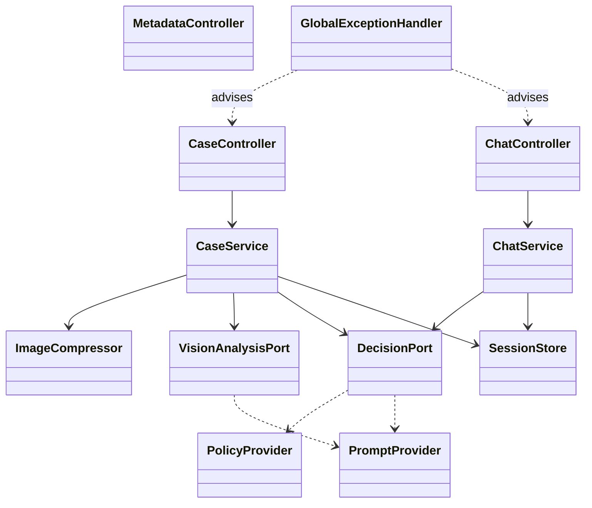
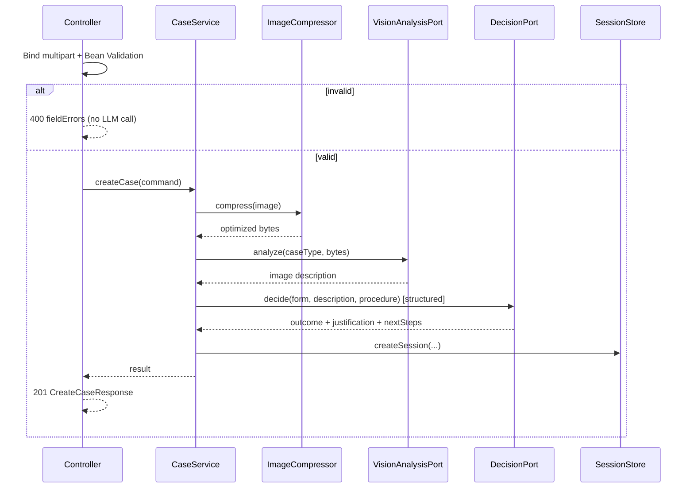
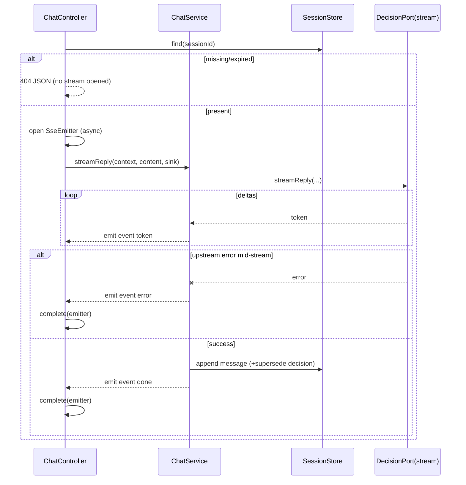

# ADR-001: Backend — Spring Boot REST API + SSE

**Date:** 2026-06-24
**Status:** Accepted
**Relates to:** [`000-main-architecture.md`](000-main-architecture.md)

---

## 1. Scope

Covers the Spring Boot backend: REST surface, request/response contracts, validation, the server-side image pipeline, orchestration of the AI calls, the **SSE streaming** chat endpoint, the error model, CORS, and configuration. It does **not** cover prompts/decision parsing (ADR-003), the session/data model details (ADR-004), the frontend (ADR-002), or project setup (ADR-005).

---

## 2. Context7 References

| Library | Context7 Handle | Used for |
|---|---|---|
| Spring Boot | `/spring-projects/spring-boot` | `spring-boot-starter-web`, `-validation`, multipart, `SseEmitter`, config properties |
| OpenAI Java SDK | `/openai/openai-java` | Called via integration adapters (ADR-003) |
| Thumbnailator | resolve `net.coobird:thumbnailator` if adopted | Image compression/resize |

---

## 3. Component Design

Layered (ADR-000 §4). Backend-specific responsibilities:

- **web**
  - `CaseController` — `POST /api/cases` (multipart), `GET /api/cases/{id}`.
  - `ChatController` — `POST /api/cases/{id}/messages` returning `SseEmitter` (`text/event-stream`).
  - `MetadataController` — `GET /api/metadata`.
  - Request DTOs with Jakarta Bean Validation; response DTOs decoupled from domain.
  - `GlobalExceptionHandler` (`@RestControllerAdvice`) → consistent error bodies + status codes.
  - CORS config restricting the SPA origin (`APP_CORS_ALLOWED_ORIGIN`); multipart limits aligned to `APP_IMAGE_MAX_UPLOAD_BYTES`.
- **application**
  - `CaseService.createCase(command)` — validate → compress → vision analyze → decide → create session → compose first message.
  - `ChatService.streamReply(sessionId, content, sink)` — load session, call the streaming decision port, push token events to the SSE sink, then append the full message and optionally supersede the decision.
  - Ports: `VisionAnalysisPort`, `DecisionPort` (sync `decide` + `streamReply`), `ImageCompressor`, `SessionStore`, `PolicyProvider`, `PromptProvider`.
- **support**
  - `ThumbnailatorImageCompressor`, `InMemorySessionStore`, `@ConfigurationProperties` beans (`app.image.*`, `app.session.*`, `app.policy.*`, `app.cors.*`, `openrouter.*`).

State: no HTTP session; the only server state is the in-memory `SessionStore` (ADR-004). SSE work runs on a managed async executor so streaming does not block the servlet container threads; each emitter has a timeout and completion/error callbacks.

---

## 4. Data Structures (DTOs)

Conceptual; logical types.

**CreateCaseRequest** (`multipart/form-data`):
- `caseType`: COMPLAINT | RETURN (required)
- `equipmentCategory`: enum from the predefined list (required)
- `modelName`: string, trimmed non-empty, ≤200 (required)
- `purchaseDate`: ISO date, not future (required)
- `reason`: string ≤4000; **required iff** COMPLAINT
- `image`: one file; type ∈ {image/jpeg, image/png, image/webp}; size ≤ `APP_IMAGE_MAX_UPLOAD_BYTES` (required)

**CreateCaseResponse** (`201`): `{ sessionId, decision { outcome, justification, nextSteps, firstMessageMarkdown }, imageAnalysisSummary }`

**ChatRequest**: `{ content: string non-empty ≤4000 }`

**SSE event stream** (`POST /api/cases/{id}/messages`, `text/event-stream`):
- event `token` — `data: { delta: string }` (repeated, incremental assistant text)
- event `done` — `data: { message { role: ASSISTANT, content, createdAt }, updatedDecision? { outcome, justification, nextSteps } }`
- event `error` — `data: { code, message }` (mid-stream failure; stream then closes)

**SessionResponse** (`200`): `{ sessionId, form, imageAnalysisSummary, decision, messages[] }`
**MetadataResponse** (`200`): `{ caseTypes[{id,labelPl}], equipmentCategories[{id,labelPl}], imageConstraints { acceptedTypes[], maxBytes } }`
**ErrorResponse** (non-2xx JSON): `{ code, message (Polish, user-safe), fieldErrors? { field: messagePl } }`. Codes: `VALIDATION_ERROR`, `SESSION_NOT_FOUND`, `IMAGE_TOO_LARGE`, `UNSUPPORTED_MEDIA_TYPE`, `LLM_UNAVAILABLE`, `LLM_TIMEOUT`.

---

## 5. Interface Contracts

| Endpoint | Method | Success | Error cases |
|---|---|---|---|
| `/api/cases` | POST (multipart) | `201 CreateCaseResponse` | `400` (+fieldErrors), `413`, `415`, `502`, `504` |
| `/api/cases/{id}/messages` | POST → SSE | `200 text/event-stream` (`token`* → `done`) | Pre-stream: `400`, `404`. Mid-stream: `error` event then close |
| `/api/cases/{id}` | GET | `200 SessionResponse` | `404` |
| `/api/metadata` | GET | `200 MetadataResponse` | — |

Notes:
- Validation runs **before** any OpenRouter call (TAC-01).
- `POST /api/cases` is not idempotent; the SPA disables submit during the call (AC-25).
- LLM retry/backoff is bounded inside the adapters (ADR-003); exhausted retries surface as `502/504` (pre-stream) or an `error` SSE event (mid-stream).
- SSE responses set no-cache headers and a configured emitter timeout; client disconnect cancels the upstream stream.

---

## 6. Technical Decisions

### SSE via Spring MVC `SseEmitter` (not WebFlux)
**Status:** Accepted · **Date:** 2026-06-24
**Context:** Chat replies stream token-by-token; the OpenAI Java SDK streaming API is blocking (OkHttp `StreamResponse`). Introducing WebFlux for one endpoint would make the whole app reactive.
**Decision:** Use Spring MVC servlet stack with `SseEmitter` on an async-dispatched endpoint; a bounded task executor bridges the SDK's blocking stream to SSE events.
**Rejected alternatives:** WebFlux/`Flux<ServerSentEvent>` (forces reactive everywhere, mismatches the blocking SDK); WebSocket (bidirectional overhead unnecessary for one-way token push).
**Consequences:** (+) Simple, consistent servlet stack; direct fit with the blocking SDK. (−) One thread per active stream — fine at MVP scale; revisit under high concurrency.
**Review trigger:** Many concurrent chat streams strain the thread pool.

### Image pipeline location and library
**Status:** Accepted · **Date:** 2026-06-24
**Context:** AC-09 requires server-side compression/resize before the LLM call.
**Decision:** `ImageCompressor` (Thumbnailator) in `support`, invoked by `CaseService` before the vision adapter; cap long side at `APP_IMAGE_MAX_DIMENSION_PX` (default 2048), re-encode to `APP_IMAGE_TARGET_FORMAT` (JPEG, ~0.8), then base64 for the SDK image content block.
**Rejected alternatives:** Send original bytes (violates AC-09); client-side only (untrusted); hand-rolled ImageIO (more code).
**Consequences:** (+) Smaller, predictable payloads. (−) WebP decode must be verified; if absent, accept WebP upload then re-encode to JPEG.
**Review trigger:** If image quality is insufficient for damage assessment.

### Synchronous orchestration for case creation
**Status:** Accepted · **Date:** 2026-06-24
**Context:** Creation chains vision → reasoning and returns a *structured* decision.
**Decision:** Both calls within `POST /api/cases`, returning the decision synchronously; bound waiting via `OPENAI_REQUEST_TIMEOUT_MS` + a server request timeout; the SPA shows a loading state.
**Rejected alternatives:** Async job + polling (over-engineered for the MVP); streaming the decision (can't validate the enum/compose the bubble until complete).
**Consequences:** (+) Simplest contract/tests. (−) A multi-second request behind a spinner.
**Review trigger:** If combined latency degrades UX.

### Consistent error model via `@RestControllerAdvice`
**Status:** Accepted · **Date:** 2026-06-24
**Context:** AC-24 needs non-technical errors + retry; the SPA needs machine-readable codes; SSE needs an in-band error channel.
**Decision:** One global handler maps validation/multipart-size/unsupported-type/not-found/LLM exceptions to the `ErrorResponse` shape with stable `code`s and Polish messages; never leak stack traces; never `500` for known conditions. Mid-stream failures convert to an `error` SSE event.
**Rejected alternatives:** Per-controller try/catch (duplicative/inconsistent).
**Consequences:** (+) Uniform, testable errors. (−) Keep the `code` enum in sync with the frontend.
**Review trigger:** New error categories.

---

## 7. Diagrams

### Component / Class Diagram

### Sequence — `POST /api/cases` with validation gate

### Sequence — Chat SSE streaming with error fallback

---

## 8. Testing Strategy

### Test scenarios for this area

| Scenario | Type | Input | Expected output | Edge cases |
|---|---|---|---|---|
| Valid complaint creates case | Integration | Valid multipart COMPLAINT, JPEG | `201` with decision + firstMessageMarkdown; stub hit twice | categories valid |
| Valid return creates case | Integration | Valid RETURN, no reason | `201`; return procedure in decision context | reason omitted allowed |
| Missing required field | Integration | COMPLAINT without reason; no modelName | `400` + fieldErrors; **zero** LLM calls | future date → 400 |
| No image / oversized / wrong type | Integration | missing image / >max / gif | `400` / `413` / `415` | exactly at limit passes |
| Compression invariant | Unit | large JPEG | long side ≤ cap; bytes ≤ original; format=target | WebP re-encoded to JPEG |
| LLM unavailable / timeout | Integration | stub 5xx / slow | `502` / `504`; no decided session left | vision ok, text fails |
| Chat SSE happy | Integration | valid id + content | content-type `text/event-stream`; ≥1 `token` then `done`; history appended | `updatedDecision` when info changes |
| Chat SSE mid-stream error | Integration | stub errors after first chunk | `error` event then close; session not corrupted | — |
| Unknown/expired session (chat) | Integration | random id | `404` JSON, no stream | expired past TTL → 404 |
| Metadata | Integration | GET /api/metadata | `200` caseTypes/categories/constraints; Polish labels | — |
| CORS | Integration | preflight allowed vs other origin | allowed permitted; others rejected | — |

### Technical acceptance criteria
- **TAC-001-01:** Invalid `CreateCaseRequest` → `400` + `fieldErrors`, asserted with **zero** OpenRouter-stub interactions.
- **TAC-001-02:** Multipart size limit → `413`; unsupported type → `415`; both before any LLM call.
- **TAC-001-03:** `ThumbnailatorImageCompressor` output meets dimension/byte/format invariants for JPEG, PNG, WebP inputs.
- **TAC-001-04:** `GlobalExceptionHandler` maps every known failure to its documented `code`/status; no `500` for known conditions; no stack trace in the body.
- **TAC-001-05:** The chat endpoint returns `text/event-stream`, emits at least one `token` event and a terminal `done` (or `error`) event, and never leaves a corrupted session.
- **TAC-001-06:** `GET /api/cases/{id}` returns the full ordered session; unknown id → `404`.
- **TAC-001-07:** Integration tests mock **only** the OpenRouter endpoint (MockWebServer/WireMock); no other dependency stubbed.
