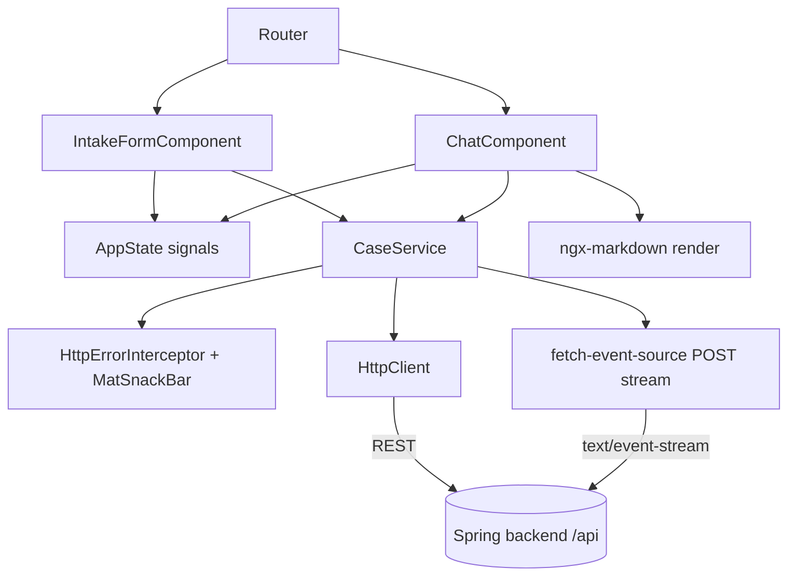
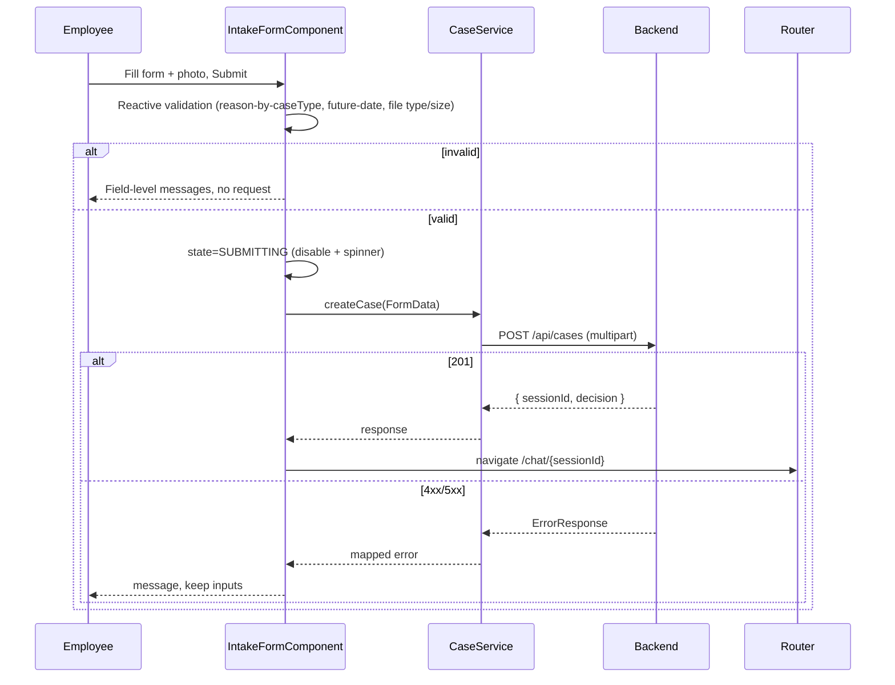

# ADR-002: Frontend — Angular + Angular Material SPA

**Date:** 2026-06-24
**Status:** Accepted
**Relates to:** [`000-main-architecture.md`](000-main-architecture.md)

---

## 1. Scope

Covers the Angular + Angular Material SPA: the two views (intake form, **streaming chat**), client-side validation, REST + SSE communication, state handling, loading/error UX, and rendering of streamed Markdown. It does **not** cover the REST/SSE contract internals (ADR-001), AI behavior (ADR-003), or project setup (ADR-005).

---

## 2. Context7 References

| Library | Context7 Handle | Used for |
|---|---|---|
| Angular | `/angular/angular` | Standalone components, signals, reactive forms, HttpClient, router |
| Angular Material | `/websites/material_angular_dev` | Form field, input, select, datepicker, button, card, list, toolbar, progress spinner/bar, snackbar |
| ngx-markdown | resolve `ngx-markdown` if adopted | Render Markdown (decision + streamed replies) with sanitization |
| @microsoft/fetch-event-source | resolve if adopted | Consume **POST**-based SSE streams (native `EventSource` is GET-only) |

---

## 3. Component Design

Angular 20, **standalone components**, signal-based state, lazy-loaded routes.

- **core/**
  - `CaseService` — wraps `HttpClient` for `getMetadata()`, `createCase(formData)` (multipart), `getSession(id)`; and a **streaming** `sendMessage(id, content)` that opens the POST SSE stream and emits token deltas + a final result.
  - `models` — TypeScript interfaces mirroring the REST DTOs and SSE event payloads.
  - `http-error.interceptor` — maps `ErrorResponse.code` → Polish message + retryable flag; surfaces via `MatSnackBar`.
  - `app-state` — signal store holding `sessionId`, form snapshot (for the case-summary panel + retry), decision, message list, and per-action `PendingState`.
- **features/form/**
  - `IntakeFormComponent` — Angular Material reactive form: `mat-select` (case type, category), `matInput` (model name), `mat-datepicker` (purchase date, future disabled), `matInput` textarea (reason, required toggled by case type), a file picker (native input styled with a Material button + thumbnail preview; validated for type/size). On submit: validate → `createCase` → navigate to chat on success; on error show message + keep inputs.
- **features/chat/**
  - `ChatComponent` — message list rendered with Material `mat-card`/`mat-list` bubbles; first bubble = decision Markdown; an expandable case-summary panel (`mat-expansion-panel`); a composer (`mat-form-field` textarea + `mat-icon-button` send). On send: append user bubble, open the SSE stream, append an assistant bubble that **grows token-by-token**, show a typing indicator, disable the composer until `done`. If `updatedDecision` arrives, render it inline without removing history. "Start new case" resets state → form.

Routing: `/` → IntakeForm; `/chat/:sessionId` → Chat (guard redirects to `/` if `getSession` 404s). State: signals + a small store service (no NgRx).

---

## 4. Data Structures

Frontend models mirror ADR-001 DTOs (same names/enums). Client-only additions:
- `PendingState`: `IDLE | SUBMITTING | STREAMING | ERROR`.
- `DisplayMessage`: `{ role, content, createdAt, isDecision, isStreaming }` — `isStreaming` drives the live-growing bubble + typing indicator.
- `SseEvent` union: `{ type: 'token', delta }` | `{ type: 'done', message, updatedDecision? }` | `{ type: 'error', code, message }`.
- `FieldError` map surfaced beneath controls from `ErrorResponse.fieldErrors`.

The uploaded image is held only as a `File` + preview object URL until submit; not stored after navigation.

---

## 5. Interface Contracts (consumed)

`CaseService` consumes the ADR-001 endpoints:
- `GET /api/metadata` → populates selectors + image constraints (no hard-coded lists).
- `POST /api/cases` (multipart) → `201`: store + route to chat; `400`: map `fieldErrors`; `413/415`: file message; `502/504`: retryable error.
- `POST /api/cases/{id}/messages` (**SSE over POST**) → stream `token` events into the live bubble; on `done` finalize the message + any `updatedDecision`; on `error` SSE event or `404` (expired) show inline error / offer new case.
- `GET /api/cases/{id}` → rehydrate chat on reload.

---

## 6. Technical Decisions

### Build the chat UI on Material primitives (no third-party chat library)
**Status:** Accepted · **Date:** 2026-06-24
**Context:** The group mandated Angular Material. Research found Material has **no first-party chat component**; ready-made chat libraries (Stream Chat Angular, Syncfusion AI AssistView, Kendo Conversational UI, Nebular, CometChat) are third-party, mostly commercial/licensed, and not Material-native.
**Decision:** Compose the chat from Material primitives (`mat-card`/`mat-list` bubbles, `mat-form-field` composer, `mat-progress-spinner`/typing indicator, `mat-expansion-panel` summary) + `ngx-markdown` for formatted content. Two simple views need no chat framework.
**Rejected alternatives:**
- Stream/Syncfusion/Kendo/CometChat: licensing + bundle weight + non-Material styling for an internal 2-screen MVP.
- Nebular chat UI: pulls in the Nebular design system, conflicting with Angular Material.
**Consequences:** (+) Pure Material, no license, full control of the streaming bubble. (−) We implement bubble layout/scroll/typing ourselves (small, well-understood).
**Review trigger:** If chat needs threads, reactions, attachments, presence — reconsider a dedicated library.

### Consume SSE over POST via a fetch-based stream (not native EventSource)
**Status:** Accepted · **Date:** 2026-06-24
**Context:** The chat reply is streamed; the request carries a body (`content`) so it is a **POST**. The browser's native `EventSource` only supports **GET** with no body.
**Decision:** Consume the POST SSE stream using `@microsoft/fetch-event-source` (or an equivalent `fetch` + `ReadableStream` reader) inside `CaseService`, parsing `token`/`done`/`error` events and exposing them as an Angular signal/observable.
**Rejected alternatives:**
- Native `EventSource`: would force a GET endpoint and putting the message in the query string — awkward and size-limited.
- WebSocket: bidirectional overhead unnecessary for one-way token push (consistent with ADR-001).
**Consequences:** (+) Clean POST + body + streaming; cancelable on navigation. (−) One small extra dependency / a bit of manual SSE parsing.
**Review trigger:** If the backend moves chat to a GET/WebSocket transport.

### Backend-driven form options via `/api/metadata`
**Status:** Accepted · **Date:** 2026-06-24
**Context:** Case types, categories, and image constraints must match backend validation/prompts (AC-01/02/08).
**Decision:** Fetch options/constraints from `/api/metadata` at form load rather than hard-coding them.
**Rejected alternatives:** Hard-code lists client-side (drift from backend enums/prompts).
**Consequences:** (+) Single source of truth on the backend. (−) One extra startup request (cacheable).
**Review trigger:** If options become user-configurable (admin UI is out of scope).

### Markdown rendering with sanitization
**Status:** Accepted · **Date:** 2026-06-24
**Context:** AC-18/19 require a formatted first message; streamed replies are Markdown from an LLM.
**Decision:** Render Markdown via `ngx-markdown` with sanitization on (Angular `DomSanitizer`/DOMPurify); re-render the growing buffer as tokens arrive.
**Rejected alternatives:** Raw HTML from the model (XSS); plain text (fails formatting AC).
**Consequences:** (+) Readable, safe. (−) Extra dependency; sanitization must stay on; re-render throttling may be needed for very fast streams.
**Review trigger:** Richer interactive message content.

---

## 7. Diagrams

### Component / View Diagram


### Sequence — Form submit to chat


### Sequence — Streaming chat turn
```mermaid
sequenceDiagram
    participant U as Employee
    participant C as ChatComponent
    participant S as CaseService
    participant API as Backend
    U->>C: Type message, send
    C->>C: append user bubble; state=STREAMING; add empty assistant bubble + typing indicator
    C->>S: sendMessage(id, content)
    S->>API: POST /api/cases/{id}/messages (SSE)
    loop token events
        API-->>S: event token { delta }
        S-->>C: append delta to assistant bubble (re-render Markdown)
    end
    alt done
        API-->>S: event done { message, updatedDecision? }
        S-->>C: finalize bubble (+ updated decision inline); state=IDLE
    else error / 404
        API-->>S: event error / 404
        S-->>C: inline error + retry (or "Sesja wygasła" + new case)
    end
```

---

## 8. Testing Strategy

### Test scenarios for this area

| Scenario | Type | Input | Expected output | Edge cases |
|---|---|---|---|---|
| Reason required toggling | Unit | switch caseType | `reason` required only for COMPLAINT | value kept on switch |
| Future date blocked | Unit | pick tomorrow | validation error; submit disabled | today allowed |
| File type/size guard | Unit | GIF / 11 MB | rejected client-side with message | exactly 10 MB accepted |
| Submit success → navigate | Unit | mocked `201` | router → `/chat/{id}`; store has decision | — |
| Submit field errors | Unit | mocked `400` fieldErrors | errors under correct controls; inputs preserved | — |
| Submit LLM error | Unit | mocked `502` | retryable message; form re-enabled | — |
| First bubble structure | Unit | session with decision | Markdown rendered; greeting/decision/justification/next-steps + disclaimer | — |
| SSE token streaming | Unit | mocked token events | assistant bubble grows per delta; typing indicator while streaming | empty stream handled |
| SSE done finalization | Unit | mocked `done` | bubble finalized; `updatedDecision` rendered inline; composer re-enabled | — |
| SSE error / expired | Unit | mocked `error` / `404` | inline error / "Sesja wygasła" + new-case action | — |
| Metadata drives selectors | Unit | mocked metadata | options + constraints from response; Polish labels | — |
| Full flow | E2E (Playwright) | real stack | form → decision → streamed chat turn | ADR-000 TAC-11 |

### Technical acceptance criteria
- **TAC-002-01:** `reason` is required when `caseType == COMPLAINT`, optional otherwise (AC-05).
- **TAC-002-02:** Date picker rejects future dates; submit disabled while invalid (AC-04/25).
- **TAC-002-03:** Files outside accepted types/size rejected client-side before any request (AC-06/08).
- **TAC-002-04:** `CaseService` REST methods tested with `HttpTestingController` (no real network), including error branches.
- **TAC-002-05:** SSE consumption renders tokens incrementally and finalizes on `done`; sanitization is on (raw HTML in content is not executed).
- **TAC-002-06:** During `SUBMITTING`/`STREAMING` the relevant controls are disabled and an indicator shown; duplicate submit/send impossible (AC-25).
- **TAC-002-07:** All visible labels and messages render in Polish (AC-23).
