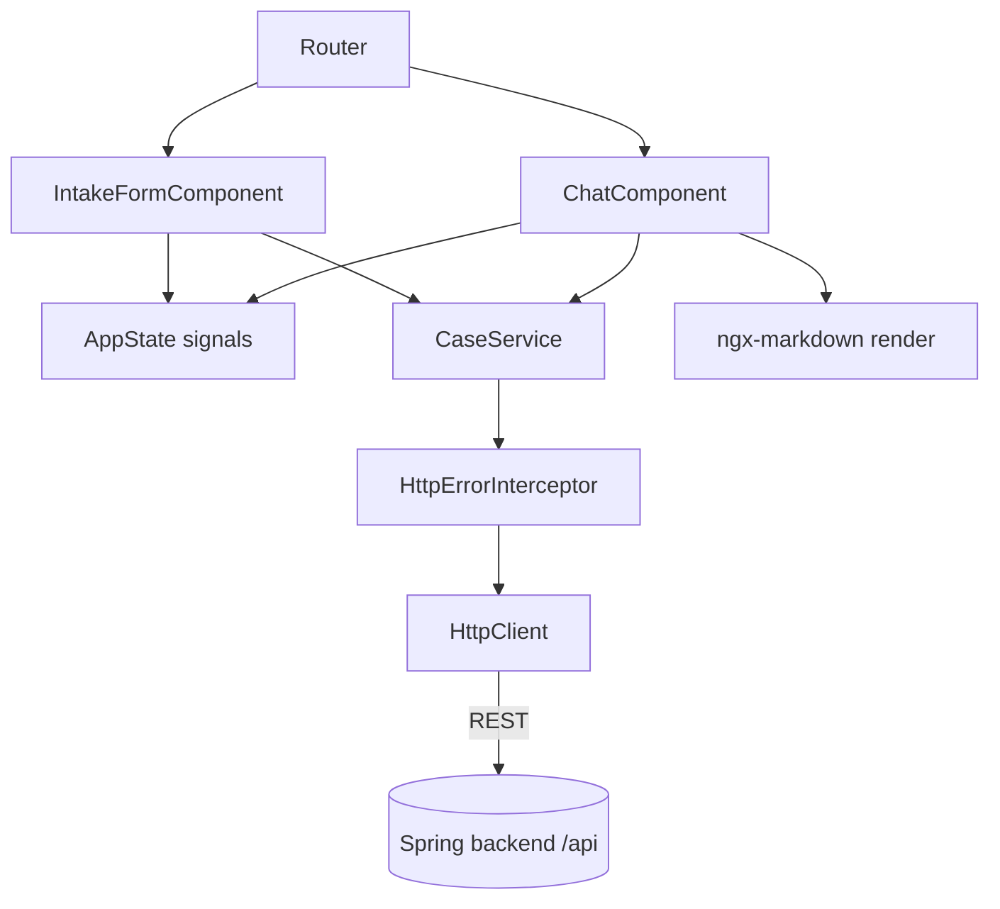
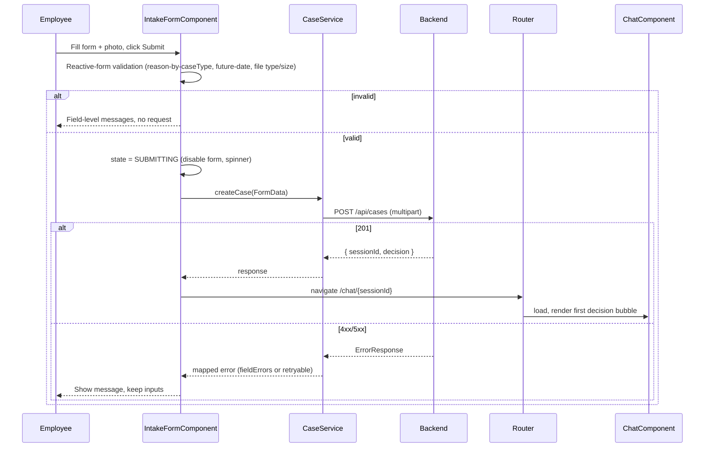

# ADR-002: Frontend — Angular + PrimeNG SPA

**Date:** 2026-06-24
**Status:** Accepted
**Relates to:** [`000-main-architecture.md`](000-main-architecture.md)

---

## 1. Scope

Covers the Angular + PrimeNG single-page app: the two views (intake form, chat), client-side validation, REST communication, state handling, loading/error UX, and rendering of the formatted decision message. It does **not** cover the REST contract internals (ADR-001) or the AI behavior (ADR-003).

---

## 2. Context7 References

| Library | Context7 Handle | Used for |
|---|---|---|
| Angular | `/angular/angular` | Standalone components, signals, reactive forms, HttpClient, router |
| PrimeNG | `/websites/v20_primeng` | Select, InputText, DatePicker, Textarea, FileUpload, Button, Message/Toast, ProgressSpinner, Card |
| ngx-markdown | resolve `ngx-markdown` if adopted | Render the Markdown decision message (with sanitization) |

---

## 3. Component Design

Angular 20, **standalone components**, signal-based local state, lazy-loaded feature routes.

- **core/**
  - `CaseService` — wraps `HttpClient`; methods: `getMetadata()`, `createCase(formData)` (multipart `FormData`), `sendMessage(sessionId, content)`, `getSession(sessionId)`. Returns typed models.
  - `models` — TypeScript interfaces mirroring the REST DTOs (CaseType, EquipmentCategory, CreateCaseResponse, ChatResponse, SessionResponse, ErrorResponse).
  - `http-error.interceptor` — maps `ErrorResponse.code` to a user-facing Polish message and a retryable flag; surfaces via a toast/message service.
  - `app-state` (signal store service) — holds the active `sessionId`, the form snapshot (for the case-summary panel and retry), the decision, and the message list.
- **features/form/**
  - `IntakeFormComponent` — PrimeNG-based reactive form; the `reason` validator toggles required based on `caseType`; date picker disables future dates; `FileUpload` restricted to accepted types/size with thumbnail preview and remove/replace. On submit: client validate → `createCase` → on success navigate to chat; on error show message and keep inputs.
- **features/chat/**
  - `ChatComponent` — renders the message list (first bubble = formatted decision via Markdown), a read-only/expandable case-summary panel, and a composer (textarea + send). Composer disabled while awaiting a reply; typing indicator shown. Appends user + assistant bubbles; if `updatedDecision` returns, shows it inline without removing history. "Start new case" resets state and routes to the form.

Routing: `/` → IntakeForm; `/chat/:sessionId` → Chat. A guard redirects to `/` if no active session is known and `getSession` 404s.

State management: signals + a small store service (no NgRx) — appropriate for two views and a single session.

---

## 4. Data Structures

Frontend models mirror ADR-001 DTOs exactly (same field names/enums) so the contract is single-sourced conceptually. Key client-only additions:

- `PendingState` enum per async action: `IDLE | SUBMITTING | AWAITING_REPLY | ERROR`.
- `DisplayMessage`: { `role`, `content`, `createdAt`, `isDecision`: boolean } — `isDecision` selects Markdown rendering for the first bubble.
- `FieldError` map surfaced beneath each control from `ErrorResponse.fieldErrors`.

The uploaded image is held only as a `File`/preview object URL in the form component until submit; it is not stored after navigation.

---

## 5. Interface Contracts (consumed)

`CaseService` consumes exactly the ADR-001 endpoints:
- `GET /api/metadata` → populates case-type and category selectors and image constraints (so the UI never hard-codes lists that must match the backend).
- `POST /api/cases` (multipart `FormData`) → on `201` store `sessionId`+decision, route to chat; on `400` map `fieldErrors` to controls; on `413/415` show file-specific message; on `502/504` show retryable error.
- `POST /api/cases/{id}/messages` → append reply; handle `404` (session expired → offer new case) and `502/504` (inline retry).
- `GET /api/cases/{id}` → rehydrate chat on reload.

Client request timeout is set generously (longer than `OPENAI_REQUEST_TIMEOUT_MS`) so the spinner covers the full backend orchestration.

---

## 6. Technical Decisions

### Signals + service store (no NgRx)
**Status:** Accepted · **Date:** 2026-06-24
**Context:** Only two views and one active session; global state is small.
**Decision:** Use Angular signals in a lightweight store service for session/decision/messages; reactive forms for the intake form.
**Rejected alternatives:** NgRx/global store — overkill for the MVP, adds boilerplate.
**Consequences:** (+) Minimal, idiomatic Angular 20. (−) Would need revisiting if many cross-view states are added.
**Review trigger:** Multi-session/tabbed cases or persisted client state.

### Backend-driven form options via `/api/metadata`
**Status:** Accepted · **Date:** 2026-06-24
**Context:** Case types, equipment categories, and image constraints must match backend validation and prompt expectations (AC-01/02/08).
**Decision:** Fetch options/constraints from `/api/metadata` at form load rather than hard-coding them in the SPA.
**Rejected alternatives:** Hard-code lists client-side — risks drift from backend enums and prompts.
**Consequences:** (+) Single source of truth on the backend. (−) One extra request at startup (cacheable).
**Review trigger:** If options become user-configurable (admin UI is out of scope).

### Markdown rendering for the decision bubble with sanitization
**Status:** Accepted · **Date:** 2026-06-24
**Context:** AC-18/19 require a nicely formatted first message (greeting, decision, justification, next steps).
**Decision:** Render the `firstMessageMarkdown` and assistant Markdown via ngx-markdown with sanitization enabled (Angular `DomSanitizer`/DOMPurify), since content originates from an LLM.
**Rejected alternatives:** Render raw HTML from the model — XSS risk; plain text — fails the formatting AC.
**Consequences:** (+) Readable, safe formatting. (−) Extra dependency; must keep sanitization on.
**Review trigger:** If richer interactive content is needed in messages.

---

## 7. Diagrams

### Component / View Diagram


### Sequence — Form submit to chat


### Sequence — Chat turn
```mermaid
sequenceDiagram
    participant U as Employee
    participant C as ChatComponent
    participant S as CaseService
    participant API as Backend
    U->>C: Type message, send
    C->>C: append user bubble; state = AWAITING_REPLY (disable composer, typing indicator)
    C->>S: sendMessage(sessionId, content)
    S->>API: POST /api/cases/{id}/messages
    alt 200
        API-->>C: { message, updatedDecision? }
        C-->>U: append assistant bubble (+updated decision inline)
    else 404
        C-->>U: "Sesja wygasła" + start new case
    else 502/504
        C-->>U: inline error + retry (message preserved)
    end
```

---

## 8. Testing Strategy

### Test scenarios for this area

| Scenario | Type | Input | Expected output | Edge cases |
|---|---|---|---|---|
| Reason required toggling | Unit | Switch caseType COMPLAINT/RETURN | `reason` control required only for COMPLAINT | Switching after typing keeps value |
| Future date blocked | Unit | Pick tomorrow | Validation error; submit disabled | Today allowed |
| File type/size guard | Unit | GIF / 11 MB file | Rejected client-side with message | Exactly 10 MB accepted |
| Submit success → navigate | Unit | Valid form; CaseService mocked `201` | Router navigates to `/chat/{id}`; store has decision | — |
| Submit field errors | Unit | CaseService mocked `400` fieldErrors | Errors shown under correct controls; inputs preserved | — |
| Submit LLM error | Unit | CaseService mocked `502` | Retryable message; form re-enabled | — |
| First bubble structure | Unit | Session with decision | Markdown rendered; greeting/decision/justification/next-steps present | Disclaimer text present |
| Chat reply append | Unit | sendMessage mocked `200` | Assistant bubble appended; composer re-enabled | `updatedDecision` rendered inline |
| Expired session in chat | Unit | sendMessage mocked `404` | "Sesja wygasła" + new-case action | — |
| Metadata drives selectors | Unit | getMetadata mocked | Category/case-type options + constraints from response | Polish labels |
| Full flow | E2E (Playwright) | Real stack, form→decision→1 chat turn | First bubble + successful reply asserted | Covered in ADR-000 TAC-10 |

### Technical acceptance criteria
- **TAC-002-01:** The `reason` control is `required` when `caseType == COMPLAINT` and optional otherwise, verified by a form unit test reacting to caseType changes (AC-05).
- **TAC-002-02:** The date picker rejects future dates and the submit button stays disabled while the form is invalid (AC-04/AC-25).
- **TAC-002-03:** Files outside accepted types or over the constraint size are rejected client-side with a field message before any request (AC-06/08).
- **TAC-002-04:** `CaseService` is tested with `HttpTestingController` (no real network) for all four endpoints including error branches.
- **TAC-002-05:** The first chat bubble renders the decision Markdown with sanitization on; raw HTML in content is not executed (XSS guard test).
- **TAC-002-06:** During `SUBMITTING`/`AWAITING_REPLY` the relevant controls are disabled and a loading/typing indicator is shown; duplicate submit is impossible (AC-25).
- **TAC-002-07:** All visible labels and messages render in Polish (AC-23), verified on the form and chat components.
