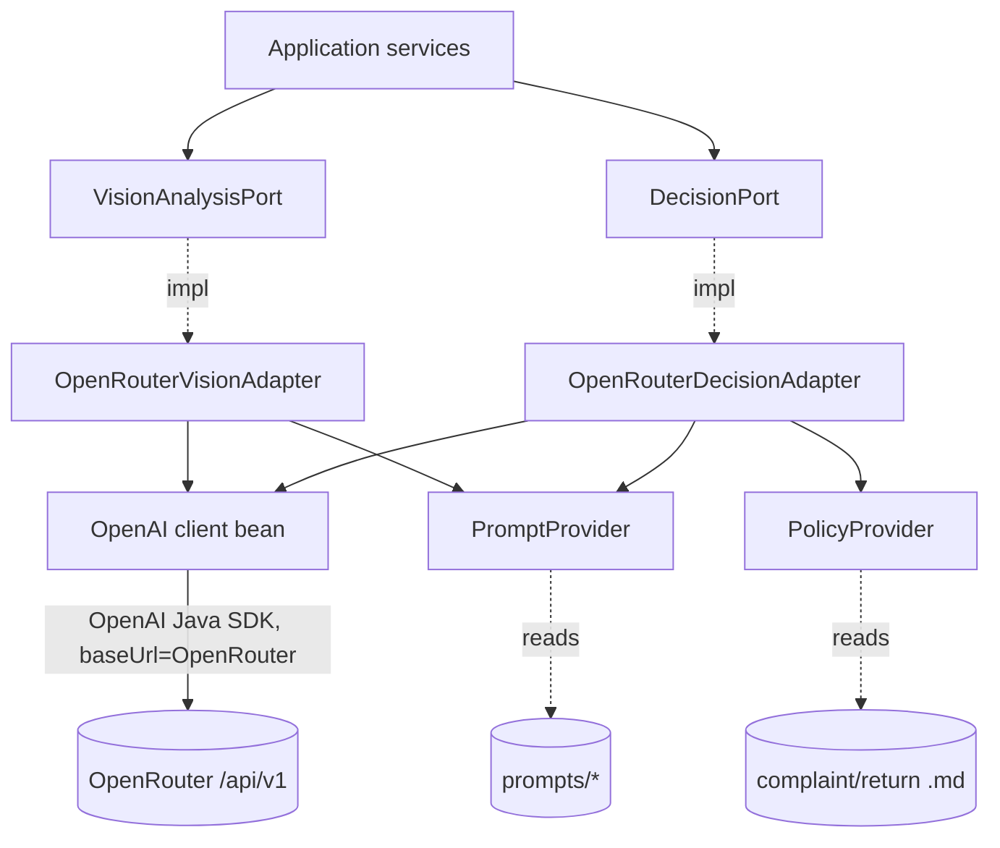
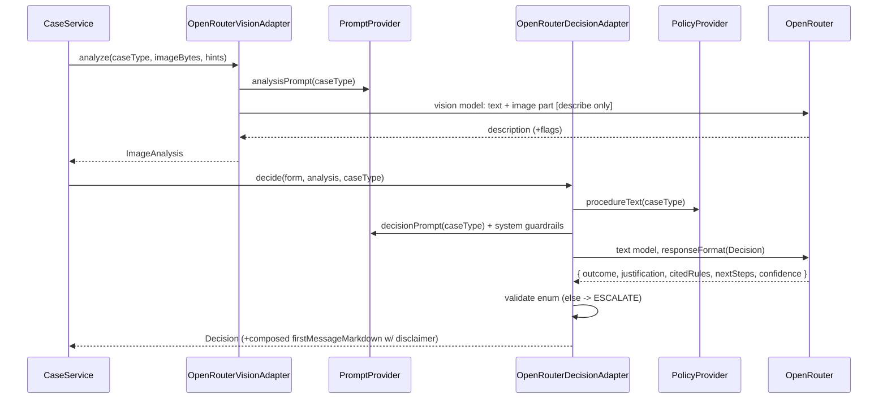

# ADR-003: AI / LLM Integration (OpenAI Java SDK → OpenRouter)

**Date:** 2026-06-24
**Status:** Accepted
**Relates to:** [`000-main-architecture.md`](000-main-architecture.md)

---

## 1. Scope

Covers the two LLM roles and their integration through the **OpenAI Java SDK pointed at OpenRouter**: the **multimodal image analysis** call and the **reasoning decision agent** (initial decision + streaming chat). Includes the **Chat Completions vs Responses API** decision, client configuration for OpenRouter, prompt strategy, procedure injection, the structured decision contract and parsing, streaming, retries/timeouts, and the PRD §11 guardrails. It does **not** cover REST/SSE plumbing (ADR-001), the UI (ADR-002), or the data model (ADR-004).

---

## 2. Context7 References

| Library | Context7 Handle | Used for |
|---|---|---|
| OpenAI Java SDK | `/openai/openai-java` | Chat Completions (sync + `createStreaming`), vision image content, `responseFormat(Class)` structured outputs, custom `baseUrl` |

> Research sources (2026-06-24): OpenAI Java SDK README & `_autodocs` (client init with `baseUrl`, `ChatCompletionAccumulator`/`ResponseAccumulator`, `responseFormat`, streaming, vision); OpenRouter Responses API overview (`https://openrouter.ai/docs/api/reference/responses/overview`) — Responses is **beta + stateless**; OpenRouter Chat Completions is the stable primary endpoint.

---

## 3. Component Design

One configured OpenAI client bean, base URL set to OpenRouter; two adapters implement the application ports:

- **`OpenAiClientConfig`** — builds the SDK client via the builder: `apiKey` = resolved key (`OPENAI_API_KEY` if set, else `OPENROUTER_API_KEY`), `baseUrl` = `OPENROUTER_BASE_URL`, `timeout` = `OPENAI_REQUEST_TIMEOUT_MS`, bounded `maxRetries`. Optional OpenRouter ranking headers (`HTTP-Referer`, `X-Title`) added per request via the params builder's additional-headers method.
- **`OpenRouterVisionAdapter`** implements `VisionAnalysisPort`. Input: `caseType`, compressed image bytes (+mime), non-image hints. Selects the **analysis prompt** by case type; calls `OPENROUTER_VISION_MODEL` via Chat Completions with a user message containing a **text part + image part** (base64 data URL). Returns `ImageAnalysis` (description + optional structured flags). The vision call **describes only — it never decides**.
- **`OpenRouterDecisionAdapter`** implements `DecisionPort`:
  - `decide(context)` — calls `OPENROUTER_TEXT_MODEL` with the **decision prompt** + form + image description + the matching procedure document, using **structured output** (`responseFormat(Decision-schema class)`); returns a validated `Decision`.
  - `streamReply(sessionContext, userMessage, sink)` — calls `OPENROUTER_TEXT_MODEL` via `createStreaming`, pushing token deltas to the SSE sink; accumulates the full reply (and, when signaled, an `updatedDecision`) for the caller to persist.

Collaborators: **`PromptProvider`** (loads versioned templates from `resources/prompts/`), **`PolicyProvider`** (loads + caches `complaint`/`return` procedure text, injects by case type — AC-16).

---

## 4. Data Structures

- **AnalysisPromptContext**: `{ caseType, equipmentCategory, modelName, purchaseDate, reason? }` — non-image hints grounding the description.
- **ImageAnalysis**: `{ description, damageObserved?, signsOfUse?, usableForResale?, confidence? (LOW|MEDIUM|HIGH) }` — flags optional; absence = unknown.
- **DecisionContext**: `{ form, imageAnalysis, procedureText, caseType }`.
- **Decision** (structured output): `{ outcome (APPROVE|REJECT|ESCALATE), justification, citedRules[], nextSteps, confidence }`. `firstMessageMarkdown` is composed server-side from these + greeting + mandatory disclaimer.
- **ChatReply** (accumulated from stream): `{ replyMarkdown, updatedDecision?, offTopicRedirect }`.

All free-text fields are **Polish** (AC-23).

---

## 5. Interface Contracts (ports)

- `VisionAnalysisPort.analyze(caseType, imageBytes, mime, hints) -> ImageAnalysis` — throws `LlmUnavailableException` / `LlmTimeoutException` after bounded retries.
- `DecisionPort.decide(DecisionContext) -> Decision` — same failure contract; never returns a null/empty outcome.
- `DecisionPort.streamReply(sessionContext, userMessage, TokenSink) -> ChatReply` — emits deltas through `TokenSink`; on upstream failure raises the typed exception (the controller converts a mid-stream failure to an `error` SSE event).

Structured-output parse failures are **not** `500`: an unparseable/invalid outcome is coerced to `ESCALATE` with a safe justification (fail-safe, TAC-04).

---

## 6. Technical Decisions

### Chat Completions API for the MVP (Responses API as forward path)
**Status:** Accepted · **Date:** 2026-06-24
**Context:** The group asked whether to use the Responses API or Chat Completions, on OpenRouter, via the OpenAI Java SDK. Research: OpenRouter's Responses API is a drop-in OpenAI-compatible endpoint but **in beta with possible breaking changes** and **stateless**; OpenRouter's Chat Completions is the stable, broadly-supported primary endpoint. The SDK fully supports both, including streaming, vision, and `responseFormat` structured outputs on Chat Completions.
**Decision:** Use **Chat Completions** for both the vision and decision/chat roles in the MVP. Both calls are stateless and we already pass full context each time, so the Responses API's server-side-state advantage gives us nothing today. Keep everything behind ports so moving the decision/chat role to the Responses API later (for native reasoning-model features or server-side tools, e.g. the RAG Backlog) is an adapter-only change.
**Rejected alternatives:**
- **Responses API now:** beta on OpenRouter (breaking-change risk), and its main benefit (stateful threads) is unused since OpenRouter Responses is stateless too; broad multimodal + structured-output behavior across OpenRouter's model zoo is better proven on Chat Completions.
- **Mix (Responses for chat, Completions for vision):** two code paths and two streaming/accumulator models for no MVP benefit.
**Consequences:** (+) Stable endpoint; mature structured outputs (critical for the APPROVE/REJECT/ESCALATE contract), vision, and streaming; one accumulator model. (−) Forgoes Responses-only conveniences until we migrate.
**Review trigger:** OpenRouter Responses API reaches GA, or we need reasoning-model/server-tool features (RAG Backlog).

### Two-model pipeline: describe then decide
**Status:** Accepted · **Date:** 2026-06-24
**Context:** PRD separates multimodal description from policy reasoning, with different prompts per case type.
**Decision:** Vision model produces a neutral condition description (`OPENROUTER_VISION_MODEL`); the text model decides (`OPENROUTER_TEXT_MODEL`) from that description + form + procedure. The vision prompt explicitly forbids deciding approve/reject.
**Rejected alternatives:** Single multimodal call that sees and decides — harder to constrain, weaker auditability of "seen" vs "decided".
**Consequences:** (+) Clear separation; description retained/inspectable (AC-12); simpler prompts. (−) Two calls = more latency/cost.
**Review trigger:** If latency/cost matters and a single multimodal model proves reliable.

### Structured output for the decision (ESCALATE fail-safe)
**Status:** Accepted · **Date:** 2026-06-24
**Context:** AC-13 requires exactly one of three outcomes; the SPA needs a machine-readable outcome + formatted text.
**Decision:** Request structured output via the SDK's `responseFormat(Decision class)` for the decision call; validate the enum; any invalid/missing outcome → coerced to `ESCALATE`. Compose `firstMessageMarkdown` server-side so the disclaimer is always present (AC-26). For streaming chat, accumulate the response (SDK `ChatCompletionAccumulator`) and parse any `updatedDecision` after the stream completes.
**Rejected alternatives:** Free-text regex parsing (brittle); trusting the model to include the disclaimer (may omit it).
**Consequences:** (+) Deterministic outcomes; guaranteed disclaimer; easy tests. (−) Schema must stay in sync; the chosen model must support structured outputs on OpenRouter (configurable model id).
**Review trigger:** If the configured model lacks structured-output support on OpenRouter.

### Procedure documents injected per case type
**Status:** Accepted · **Date:** 2026-06-24
**Context:** AC-16 + business rule: decisions grounded only in the supplied procedures; no invented policy.
**Decision:** Inject the full matching procedure text into the decision prompt; instruct the model to cite used rule points (`citedRules`) and to ESCALATE when the case is outside the document.
**Rejected alternatives:** Summarizing procedures (may drop a rule); RAG retrieval (that is the Backlog feature, out of MVP scope).
**Consequences:** (+) Faithful, auditable policy application. (−) Longer prompts; fine for the short MVP procedures.
**Review trigger:** Procedures grow large enough to need retrieval (Backlog RAG).

### Bounded retries + timeouts; guardrails in the system prompt
**Status:** Accepted · **Date:** 2026-06-24
**Context:** PRD §11 strict allowed/not-allowed behavior; upstream calls can be slow/fail; OpenRouter routes across providers.
**Decision:** Configure the SDK with `OPENAI_REQUEST_TIMEOUT_MS` and a small bounded `maxRetries` with backoff for transient errors. Encode PRD §11 guardrails in the system prompts: advisory-only, never a binding commitment, never fabricate a confident verdict, escalate/ask when unsure, decline+redirect off-topic, no unnecessary PII, Polish + professional tone.
**Rejected alternatives:** Unbounded retries (cost/latency); guardrails in code only (the model still needs the instruction).
**Consequences:** (+) Predictable failures; behavior aligned to PRD. (−) Prompt guardrails are best-effort — the structured-output validation + ESCALATE fail-safe is the hard backstop.
**Review trigger:** Observed guardrail violations in testing.

---

## 7. Diagrams

### Component Diagram


### Sequence — Initial decision (describe → decide, structured)


### Sequence — Streaming chat with optional decision update
```mermaid
sequenceDiagram
    participant Ch as ChatService
    participant D as OpenRouterDecisionAdapter
    participant OR as OpenRouter
    participant Sink as TokenSink (SSE)
    Ch->>D: streamReply(form+analysis+decision+history, userMessage, sink)
    D->>OR: text model createStreaming(full context)
    loop deltas
        OR-->>D: chunk
        D->>Sink: token delta
    end
    D->>D: accumulate full reply; parse offTopicRedirect / updatedDecision
    alt offTopicRedirect
        D-->>Ch: polite Polish redirect, no decision change
    else material new info
        D-->>Ch: reply + updatedDecision (history preserved)
    else normal Q&A
        D-->>Ch: reply only
    end
```

---

## 8. Testing Strategy

> All AI tests use a **stubbed OpenAI-compatible endpoint** (MockWebServer/WireMock via `OPENROUTER_BASE_URL`) returning canned responses, including a chunked stream for `createStreaming`. No real API calls in automated tests. Real-model behavior is checked only in a manual, opt-in smoke test.

### Test scenarios for this area

| Scenario | Type | Input | Expected output | Edge cases |
|---|---|---|---|---|
| Client targets OpenRouter | Unit | config | client built with `baseUrl=OPENROUTER_BASE_URL` + resolved key | `OPENAI_API_KEY` overrides key |
| Correct model per role | Unit | vision vs decision call | request uses `OPENROUTER_VISION_MODEL` / `OPENROUTER_TEXT_MODEL` | from env, not hard-coded |
| Analysis prompt + image part | Unit | caseType COMPLAINT | complaint-analysis prompt; image part attached | RETURN uses return-analysis |
| Vision describes only | Unit | stub description | `ImageAnalysis` populated; no outcome | missing flags → unknown |
| Procedure injection | Unit | COMPLAINT decision | request body contains complaint procedure text | RETURN contains return procedure (TAC-06) |
| Valid structured decision | Unit | stub valid JSON | `Decision` with enum outcome; disclaimer composed | citedRules captured |
| Invalid/empty outcome | Unit | garbage/unknown outcome | coerced to `ESCALATE` | non-JSON → ESCALATE |
| Low-confidence escalation | Unit | "cannot tell" fixture | ESCALATE + states missing info | contradictory data → ESCALATE |
| Streaming accumulation | Unit | chunked stub stream | deltas pushed to sink in order; full reply accumulated | empty stream handled |
| Off-topic redirect | Unit | unrelated question fixture | `offTopicRedirect=true`; no decision change | Polish redirect text |
| Decision update in chat | Unit | material new info fixture | `updatedDecision` present; explains change | history preserved (ChatService) |
| Timeout / 5xx | Unit | stub slow / 503 | typed exceptions after bounded retries | retry count bounded |

### Technical acceptance criteria
- **TAC-003-01:** The SDK client is constructed with `baseUrl = OPENROUTER_BASE_URL` and the resolved key; vision/decision calls use the env model ids (asserted via stub request).
- **TAC-003-02:** Adapter selects the correct prompt and injects the correct procedure per case type (AC-15/16, TAC-06).
- **TAC-003-03:** The vision call never returns an approve/reject outcome; perception and decision are separate ports.
- **TAC-003-04:** Any decision whose outcome is not exactly APPROVE/REJECT/ESCALATE → coerced to `ESCALATE`; a non-parseable response never yields `500`.
- **TAC-003-05:** Every composed decision includes the mandatory advisory disclaimer (AC-26).
- **TAC-003-06:** Streaming pushes deltas in order to the sink and accumulates a correct full reply; `updatedDecision` appears only when the fixture signals material new info; the original first message is never mutated.
- **TAC-003-07:** Transient upstream errors trigger bounded retries; exhaustion raises the typed exceptions mapped to `502/504` (pre-stream) or an `error` SSE event (mid-stream).
