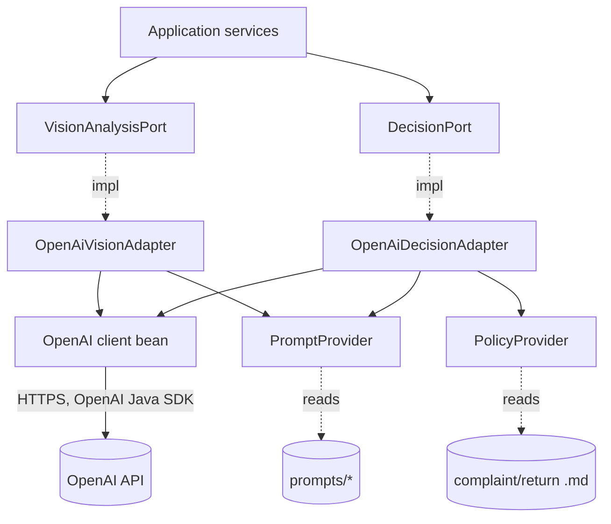
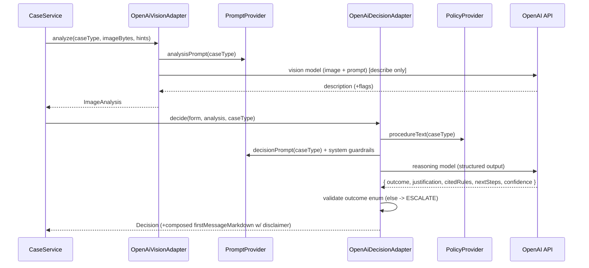
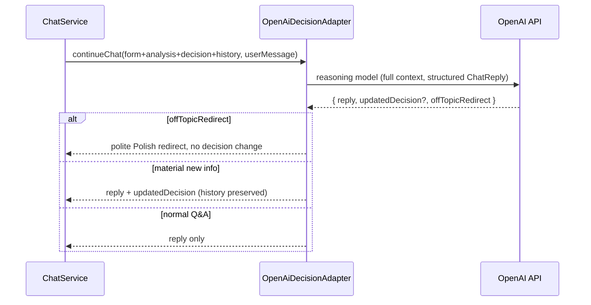

# ADR-003: AI / LLM Integration (OpenAI Java SDK)

**Date:** 2026-06-24
**Status:** Accepted
**Relates to:** [`000-main-architecture.md`](000-main-architecture.md)

---

## 1. Scope

Covers the two LLM roles and their integration through the OpenAI Java SDK: the **multimodal image analysis** call and the **reasoning decision agent** (initial decision + chat). Includes prompt strategy, the procedure-document injection, the decision output contract and parsing, retries/timeouts, and the behavior guardrails from PRD §11. It does **not** cover REST/HTTP (ADR-001) or the UI (ADR-002).

---

## 2. Context7 References

| Library | Context7 Handle | Used for |
|---|---|---|
| OpenAI Java SDK | `/openai/openai-java` | Vision (image input) + reasoning/chat completions, structured output, timeouts/retries |

---

## 3. Component Design

Two adapters implement the application ports from ADR-001, both built on a single configured OpenAI client bean:

- **`OpenAiVisionAdapter`** implements `VisionAnalysisPort`.
  - Input: `caseType`, compressed image bytes (+ mime), optional model-name/category hints.
  - Picks the **analysis prompt** by case type (complaint-analysis vs return-analysis) from `PromptProvider`.
  - Calls the `OPENAI_VISION_MODEL` with the image + prompt; returns `ImageAnalysis` (free-text description + optional structured flags). The vision call does **not** decide; it only describes.
- **`OpenAiDecisionAdapter`** implements `DecisionPort`.
  - Input for initial decision: `CaseForm`, `ImageAnalysis`, the relevant procedure document text, and the **decision prompt** for the case type.
  - Input for chat: the full conversation context (form + analysis + initial decision + all prior turns + new user message).
  - Calls `OPENAI_REASONING_MODEL`; returns a structured `Decision` (initial) or a `ChatReply` (with optional `updatedDecision`).

Supporting collaborators:
- **`PromptProvider`** — loads versioned prompt templates from `resources/prompts/` (system + per-case-type analysis + per-case-type decision + chat system prompt). Templates are data, not code.
- **`PolicyProvider`** — loads `complaint-procedure.md` / `return-procedure.md` from the configured paths (classpath by default) and caches them; injects the correct one by case type (AC-16).
- **`OpenAiClientConfig`** — builds the SDK client from `OPENAI_API_KEY`, optional `OPENAI_BASE_URL`, and `OPENAI_REQUEST_TIMEOUT_MS`; sets bounded retries.

---

## 4. Data Structures

- **AnalysisPromptContext**: { `caseType`, `equipmentCategory`, `modelName`, `purchaseDate`, `reason?` } — non-image hints passed alongside the image so the description is grounded.
- **ImageAnalysis** (adapter output): { `description`: string, `damageObserved`?: boolean, `signsOfUse`?: boolean, `usableForResale`?: boolean, `confidence`?: LOW|MEDIUM|HIGH } — flags optional; absence is treated as unknown.
- **DecisionContext** (initial): { `form`, `imageAnalysis`, `procedureText`, `caseType` }.
- **Decision** (structured output): { `outcome`: APPROVE|REJECT|ESCALATE, `justification`: string, `citedRules`: string[] (procedure points referenced), `nextSteps`: string, `confidence`: LOW|MEDIUM|HIGH }. The `firstMessageMarkdown` is composed from these fields + greeting + the mandatory disclaimer.
- **ChatReply** (structured output): { `reply`: string (Markdown, Polish), `updatedDecision`?: Decision, `offTopicRedirect`: boolean }.

All free-text fields are **Polish** (AC-23).

---

## 5. Interface Contracts (ports)

- `VisionAnalysisPort.analyze(caseType, imageBytes, mime, hints) -> ImageAnalysis` — throws `LlmUnavailableException` / `LlmTimeoutException` on upstream failure after retries.
- `DecisionPort.decide(DecisionContext) -> Decision` — same failure contract; never returns a null/empty outcome.
- `DecisionPort.continueChat(sessionContext, userMessage) -> ChatReply` — same failure contract.

Failure exceptions are caught by the backend and mapped to `502/504` (ADR-001 §6). Structured-output parsing failures are **not** surfaced as `500`: an unparseable/invalid outcome is coerced to `ESCALATE` with a safe justification (fail-safe, TAC-04).

---

## 6. Technical Decisions

### Two-model pipeline: describe then decide
**Status:** Accepted · **Date:** 2026-06-24
**Context:** PRD separates multimodal description (what is seen) from the reasoning decision (what to do), with different prompts per case type.
**Decision:** Vision model produces a neutral condition description; the reasoning model makes the decision from that description + form + procedure. The vision model is explicitly told **not** to decide approve/reject.
**Rejected alternatives:**
- Single multimodal call that both sees and decides: harder to constrain, mixes perception with policy reasoning, weaker auditability of "what was seen" vs "why decided".
**Consequences:** (+) Clear separation; the image description is retained and inspectable (AC-12); each prompt is simpler. (−) Two calls = more latency/cost.
**Review trigger:** If latency/cost is a problem and a single multimodal reasoning model proves reliable enough.

### Structured output for the decision (with ESCALATE fail-safe)
**Status:** Accepted · **Date:** 2026-06-24
**Context:** AC-13 requires exactly one of three outcomes; the SPA needs a machine-readable outcome plus formatted text.
**Decision:** Request structured output (JSON schema / structured response via the SDK) for `Decision`/`ChatReply`; validate against the enum; any invalid/missing outcome is coerced to `ESCALATE`. Compose `firstMessageMarkdown` server-side from the structured fields so the disclaimer is always appended (AC-26).
**Rejected alternatives:**
- Free-text parsing with regex: brittle, fails AC-13 reliably.
- Trust the model to format the whole bubble including disclaimer: risks a missing disclaimer.
**Consequences:** (+) Deterministic outcome handling; guaranteed disclaimer; easy tests. (−) Schema must be kept in sync; model must support structured output (configurable model id).
**Review trigger:** If the chosen model lacks structured-output support.

### Procedure documents injected per case type
**Status:** Accepted · **Date:** 2026-06-24
**Context:** AC-16 and the business constraint require decisions grounded only in the supplied procedures; the agent must not invent policy.
**Decision:** Inject the full text of the matching procedure (`complaint`/`return`) into the decision prompt; instruct the model to cite the specific rule points used (`citedRules`) and to choose `ESCALATE` when the case falls outside the document.
**Rejected alternatives:**
- Summarize procedures into the prompt: risks dropping a rule.
- RAG retrieval over a larger KB: that is the Backlog feature, out of MVP scope.
**Consequences:** (+) Faithful, auditable application of policy. (−) Long prompts; procedures must fit the model context (they are short for the MVP).
**Review trigger:** When procedures grow large enough to need retrieval (Backlog RAG).

### Bounded retries + timeouts; guardrails in the system prompt
**Status:** Accepted · **Date:** 2026-06-24
**Context:** PRD §11 lists strict allowed/not-allowed behavior; upstream calls can be slow or fail.
**Decision:** Configure the SDK with a per-call timeout (`OPENAI_REQUEST_TIMEOUT_MS`) and a small number of retries with backoff for transient errors. Encode PRD §11 guardrails in the system prompts: advisory-only, never a binding commitment, never fabricate a confident verdict, escalate/ask when unsure, decline+redirect off-topic, no unnecessary PII, Polish + professional tone.
**Rejected alternatives:** Unbounded retries (cost/latency); guardrails enforced only in code (the model still needs the instruction).
**Consequences:** (+) Predictable failure handling; behavior aligned to PRD. (−) Prompt-based guardrails are best-effort; the structured-output validation + ESCALATE fail-safe is the hard backstop.
**Review trigger:** Observed guardrail violations in testing → tighten prompts/validation.

---

## 7. Diagrams

### Component Diagram

### Sequence — Initial decision (describe → decide)

### Sequence — Chat continuation with possible decision update

---

## 8. Testing Strategy

> All AI tests use a **stubbed OpenAI endpoint** (MockWebServer/WireMock via `OPENAI_BASE_URL`) returning canned responses. No real API calls in automated tests. Prompt/guardrail quality is validated by asserting request contents and by curated fixture responses; real-model behavior is checked only in a manual, opt-in smoke test.

### Test scenarios for this area

| Scenario | Type | Input | Expected output | Edge cases |
|---|---|---|---|---|
| Complaint analysis prompt selected | Unit | caseType COMPLAINT | Request uses complaint-analysis prompt; image attached | Return uses return-analysis prompt |
| Vision describes, does not decide | Unit | Stub description | `ImageAnalysis` populated; no outcome produced here | Missing flags → treated unknown |
| Procedure injection | Unit | COMPLAINT decision | Request body contains complaint procedure text | RETURN contains return procedure text (TAC-06) |
| Valid structured decision | Unit | Stub returns valid JSON | `Decision` with enum outcome; disclaimer composed | citedRules captured |
| Invalid/empty outcome | Unit | Stub returns garbage/unknown outcome | Coerced to `ESCALATE` with safe justification | Non-JSON body → ESCALATE |
| Low-confidence escalation | Unit | Stub: low confidence / "cannot tell" | outcome ESCALATE; states missing info | Contradictory data → ESCALATE |
| Off-topic redirect | Unit | Chat: unrelated question fixture | `offTopicRedirect=true`; no decision change | Polite Polish redirect text |
| Decision update in chat | Unit | Chat: material new info fixture | `updatedDecision` present; explains change | History preserved (asserted in ChatService) |
| Timeout / 5xx | Unit | Stub delay / 503 | `LlmTimeoutException` / `LlmUnavailableException` after retries | Retry count bounded |
| Polish output | Unit | Any decision fixture | Justification/nextSteps/disclaimer in Polish | — |

### Technical acceptance criteria
- **TAC-003-01:** Adapter selects the correct prompt and (for decisions) injects the correct procedure document per case type (AC-15/16, TAC-06).
- **TAC-003-02:** The vision call never returns an approve/reject outcome; perception and decision are separate ports.
- **TAC-003-03:** Any model output whose outcome is not exactly `APPROVE`/`REJECT`/`ESCALATE` is coerced to `ESCALATE` (TAC-04); a non-parseable response never yields `500`.
- **TAC-003-04:** Every composed decision includes the mandatory advisory disclaimer (AC-26) regardless of model output.
- **TAC-003-05:** Transient upstream errors trigger bounded retries; exhaustion raises the typed exceptions mapped to `502/504`.
- **TAC-003-06:** Chat replies set `offTopicRedirect` for off-topic input and include `updatedDecision` only when the fixture signals material new information; the original first message is never mutated.
- **TAC-003-07:** Model ids are read from `OPENAI_VISION_MODEL`/`OPENAI_REASONING_MODEL` (env), never hard-coded; `OPENAI_BASE_URL` override is honored (enables the test stub).
