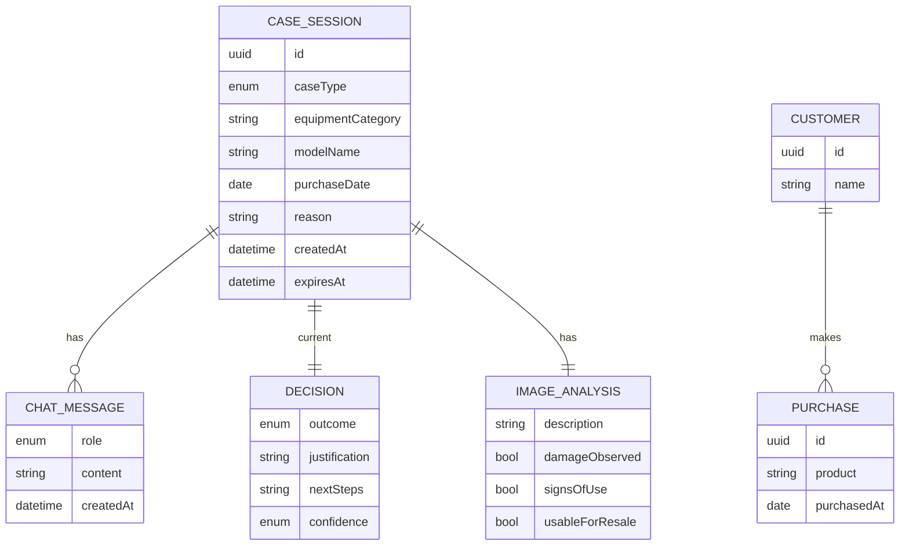
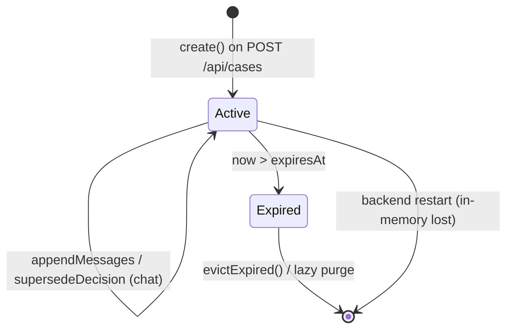

# ADR-004: Data Model & Persistence

**Date:** 2026-06-24
**Status:** Accepted
**Relates to:** [`000-main-architecture.md`](000-main-architecture.md)

---

## 1. Scope

Covers the runtime data model, the **in-memory session store** shipped in the MVP, and the **designed-but-deferred** persistence (PRD Backlog: session/decision persistence, customer & purchase-history lookup). It does **not** cover REST DTOs (ADR-001) or LLM structures (ADR-003), though it reuses their concepts.

---

## 2. Context7 References

| Library | Context7 Handle | Used for |
|---|---|---|
| Spring Boot | `/spring-projects/spring-boot` | `@ConfigurationProperties`, scheduling for TTL eviction |
| _(Backlog)_ Spring Data JPA + SQLite | resolve if/when persistence is pulled in | Deferred persistence implementation |

---

## 3. Component Design

- **`SessionStore`** (port) with the MVP implementation **`InMemorySessionStore`**:
  - Concurrent map keyed by `sessionId` (UUID v4, opaque to the client).
  - Each entry has `createdAt`/`expiresAt = createdAt + APP_SESSION_TTL_MINUTES`.
  - A scheduled sweep (and lazy check on access) evicts expired entries; absent/expired → not-found (`404`).
  - Per-session updates (append messages, supersede decision) are atomic.
- The store is the **only** server-side mutable state in the MVP. No file/DB writes; restart clears all sessions (acceptable per PRD scope).
- Raw uploaded image bytes are **not** stored; only the transient compressed bytes used for the analysis call exist during request processing and are discarded after. The retained artifact is the textual `ImageAnalysis`.
- When persistence is enabled later (Backlog), a second `SessionStore` implementation (JPA-backed) sits behind the same port; application services do not change.

---

## 4. Data Structures

### Runtime entities (in-memory)

**CaseSession**
| Field | Type | Notes |
|---|---|---|
| `id` | UUID | opaque session id returned to client |
| `caseType` | enum | COMPLAINT \| RETURN |
| `form` | CaseForm | see below |
| `imageAnalysis` | ImageAnalysis | description (+optional flags) — ADR-003 |
| `decision` | Decision | current decision (may be superseded) — ADR-003 |
| `messages` | List<ChatMessage> | ordered; index 0 = decision bubble |
| `createdAt` | datetime | |
| `expiresAt` | datetime | TTL eviction |

**CaseForm**
| Field | Type | Constraints |
|---|---|---|
| `caseType` | enum | required |
| `equipmentCategory` | enum | from predefined list (incl. OTHER) |
| `modelName` | string | required, ≤200 |
| `purchaseDate` | date | not future |
| `reason` | string? | required iff COMPLAINT, ≤4000 |

**ChatMessage**: `{ role (SYSTEM_ASSISTANT|USER|ASSISTANT), content (Markdown, Polish), createdAt }`, ordered.
**Decision** / **ImageAnalysis**: as in ADR-003, stored by value inside the session.

### Enumerations
- `CaseType`: COMPLAINT, RETURN.
- `DecisionOutcome`: APPROVE, REJECT, ESCALATE.
- `EquipmentCategory`: SMARTPHONE, TABLET, LAPTOP, DESKTOP_PC, MONITOR, TV, HEADPHONES_AUDIO, CAMERA, PRINTER, NETWORKING, SMARTWATCH_WEARABLE, SMALL_APPLIANCE, OTHER. Each maps to a Polish label exposed via `/api/metadata`; `OTHER` always present.

---

## 5. Interface Contracts (port)

`SessionStore`:
- `create(session) -> sessionId`
- `find(sessionId) -> Optional<CaseSession>` (absent if missing **or** expired)
- `appendMessages(sessionId, messages...)` — atomic; not-found if absent/expired
- `supersedeDecision(sessionId, newDecision)` — replaces current decision; **keeps** prior messages (history preserved, AC-21)
- `evictExpired()` — scheduler-invoked

Not-found and expired are indistinguishable to callers (both → `404`), avoiding session enumeration hints.

---

## 6. Technical Decisions

### In-memory store with TTL for the MVP
**Status:** Accepted · **Date:** 2026-06-24
**Context:** PRD marks persistence as Backlog and asks to keep the MVP minimal; a single local backend instance is assumed.
**Decision:** Ship `InMemorySessionStore` with TTL eviction; expose all state via the `SessionStore` port so a persistent impl can be added without touching services.
**Rejected alternatives:** SQLite now (unneeded setup/migrations); HTTP session/cookie state (couples the API to a session mechanism it doesn't need).
**Consequences:** (+) Zero DB ops; trivial to run. (−) State lost on restart; not multi-instance safe; no audit trail (acceptable; Backlog).
**Review trigger:** First of: audit/history required, multi-instance deployment, or session survival across restarts.

### No PII persistence; minimize retained data
**Status:** Accepted · **Date:** 2026-06-24
**Context:** PRD guardrail: no personal data beyond the case; internal MVP posture.
**Decision:** Store only what the case needs (form + analysis text + decision + chat). Do not persist raw images; do not collect customer identity (customer-history lookup is Backlog).
**Rejected alternatives:** Keeping raw images for re-analysis (storage + privacy cost without MVP value).
**Consequences:** (+) Smaller privacy surface. (−) Cannot re-run vision later without a fresh upload.
**Review trigger:** When customer-history (Backlog) or audit needs richer retention.

### Persistence design deferred but specified (Backlog)
**Status:** Proposed (deferred) · **Date:** 2026-06-24
**Context:** PRD Backlog: persist sessions/decisions and look up customer/purchase history.
**Decision:** When scoped, add a relational store (SQLite locally; the port unchanged) with tables mirroring the entities: `case_session`, `chat_message` (FK→session), decision/analysis embedded or split into `decision`/`image_analysis`. Customer-history adds read-only `customer`/`purchase` tables consulted during case creation. Use schema migrations from day one when enabled.
**Rejected alternatives:** NoSQL/document store (relational fits structured, related entities + audit better).
**Consequences:** (+) Clear upgrade path; no service rewrite. (−) Until enabled, no durability.
**Review trigger:** Backlog item scheduled.

---

## 7. Diagrams

### Entity Relationship (runtime + deferred)

### Session lifecycle

---

## 8. Testing Strategy

### Test scenarios for this area

| Scenario | Type | Input | Expected output | Edge cases |
|---|---|---|---|---|
| Create + find | Unit | create(session) | find(id) returns it | unknown id → empty |
| TTL expiry | Unit | session past expiresAt | find → empty (404) | boundary: exactly at TTL |
| Eviction sweep | Unit | expired + active | only expired removed | active untouched |
| Append atomic | Unit | concurrent appends | all retained, ordered | no lost update |
| Supersede keeps history | Unit | supersedeDecision after chat | decision replaced; messages intact | first bubble preserved (AC-21) |
| No raw image retained | Unit | after createCase | analysis text present, no image bytes | — |
| Category ↔ label | Unit | metadata mapping | every enum has a Polish label; OTHER present | — |

### Technical acceptance criteria
- **TAC-004-01:** `find` returns empty for unknown and expired ids; API maps both to `404` (no distinction leaked).
- **TAC-004-02:** Expired sessions are removed by the sweep and never returned by `find`.
- **TAC-004-03:** `supersedeDecision` replaces the decision while keeping all prior `messages` (AC-21).
- **TAC-004-04:** Concurrent `appendMessages` lose no messages and preserve order.
- **TAC-004-05:** No raw uploaded image bytes are present in a stored `CaseSession`; only `ImageAnalysis` text/flags.
- **TAC-004-06:** Every `EquipmentCategory` (incl. `OTHER`) has a non-empty Polish label via `/api/metadata`.
