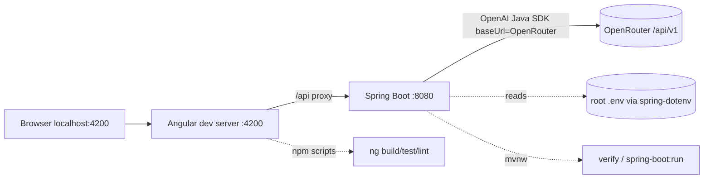

# ADR-005: Project Setup, Tooling & Build

**Date:** 2026-06-24
**Status:** Accepted
**Relates to:** [`000-main-architecture.md`](000-main-architecture.md)

---

## 1. Scope

Covers how the two projects are initialized, built, run, and wired together in development: tooling versions, Maven/Spring Boot scaffolding, Angular + Angular Material scaffolding, the dev proxy, environment-variable loading, and the verification commands. It does **not** cover runtime design (ADR-001/002/003/004).

---

## 2. Context7 References

| Library | Context7 Handle | Used for |
|---|---|---|
| Spring Boot | `/spring-projects/spring-boot` | Initializr deps, Maven plugin, config |
| OpenAI Java SDK | `/openai/openai-java` | Backend dependency coordinates |
| Angular | `/angular/angular` | CLI scaffolding, build/serve |
| Angular Material | `/websites/material_angular_dev` | `ng add @angular/material` |

---

## 3. Toolchain (verified in this environment, 2026-06-24)

| Tool | Required | Present here | Notes |
|---|---|---|---|
| JDK | 21 (LTS) language level | **25.0.2 LTS** | Compile to Java 21 release level; runs on the installed JDK 25. A JDK 21 runtime is the certified target for Spring Boot 3.5.x. |
| Maven | 3.9+ | **not installed** | Use the **Maven Wrapper** (`mvnw`/`mvnw.cmd`) bundled by Spring Initializr — no system Maven needed. |
| Node.js | 20+ LTS | **24.14.0** | For Angular build/serve. |
| npm | 10+ | **11.9.0** | Package manager. |
| Angular CLI | 20 | **not installed** | Use `npx -p @angular/cli@20 ng ...` or install locally; project scripts use the local CLI. |

---

## 4. Backend project initialization (Spring Boot + Maven)

Target location: `app/backend`. Initialize from **Spring Initializr** (bundles the Maven Wrapper so a system Maven is unnecessary):

- **Build:** Maven · **Language:** Java · **Java:** 21 · **Packaging:** jar · **Spring Boot:** latest stable 3.5.x.
- **Group:** `pl.nbp.copilot` · **Artifact:** `hardware-service-copilot` · **Package:** `pl.nbp.copilot`.
- **Starter dependencies:** Spring Web (`spring-boot-starter-web`), Validation (`spring-boot-starter-validation`), Spring Boot Actuator (health, optional), Spring Boot Test (included).
- **Manually added dependencies (pom):**
  - OpenAI Java SDK — `com.openai:openai-java` (latest 4.x; an `openai-java-spring-boot-starter` also exists — the core SDK is sufficient since we build the client explicitly for OpenRouter).
  - Thumbnailator — `net.coobird:thumbnailator` (image compression).
  - `me.paulschwarz:spring-dotenv` (dev convenience: load the root `.env` into Spring properties) — see §6.
  - Test: JUnit 5 (via starter), Mockito (via starter), `com.squareup.okhttp3:mockwebserver` **or** WireMock for the stubbed OpenRouter endpoint, AssertJ (via starter).

Source layout follows ADR-000 §4 (`web`, `application`, `domain`, `integration`, `support` packages under `pl.nbp.copilot`). Copy the procedure docs into `src/main/resources/policies/` and prompt templates into `src/main/resources/prompts/`.

---

## 5. Frontend project initialization (Angular + Angular Material)

Target location: `app/frontend`.

- Scaffold: Angular CLI 20 — **standalone** components, **routing enabled**, **SCSS** styles.
- Add Material: `ng add @angular/material` (choose a prebuilt theme + Material typography + animations).
- Add dependencies:
  - `ngx-markdown` (+ `marked`) — render Markdown for the decision/streamed replies, sanitization on.
  - `@microsoft/fetch-event-source` — consume the POST-based SSE chat stream (native `EventSource` is GET-only; see ADR-002).
- App structure follows ADR-002 §3 (`core`, `features/form`, `features/chat`).
- **Dev proxy** (`proxy.conf.json`): route `/api` → `http://localhost:8080` so the SPA calls a same-origin path in dev and CORS is effectively bypassed locally; backend CORS still configured for direct calls.

---

## 6. Environment variable loading

The root `.env` / `.env.example` holds the OpenRouter keys. Spring Boot does **not** read `.env` natively.

- **Dev:** use `spring-dotenv` so `application.yaml` placeholders resolve from the root `.env` (e.g. `OPENROUTER_API_KEY`, `OPENROUTER_BASE_URL`, `OPENROUTER_TEXT_MODEL`, `OPENROUTER_VISION_MODEL`). Alternatively export the variables in the shell before running.
- `application.yaml` maps env → properties: `openrouter.api-key: ${OPENROUTER_API_KEY:}`, `openrouter.base-url: ${OPENROUTER_BASE_URL:https://openrouter.ai/api/v1}`, `openrouter.text-model: ${OPENROUTER_TEXT_MODEL:}`, `openrouter.vision-model: ${OPENROUTER_VISION_MODEL:}`, plus the `app.image.*`, `app.session.*`, `app.policy.*`, `app.cors.*` keys from ADR-000 §7.
- Key resolution: prefer `OPENAI_API_KEY` if set, else `OPENROUTER_API_KEY` (matches `.env.example`).
- The `.env` file is gitignored and never committed; only `.env.example` is tracked.

---

## 7. Build, run & verification commands

**Backend** (`app/backend`):
- Build/test: `./mvnw verify`
- Run: `./mvnw spring-boot:run` (serves on `:8080`)
- Package: `./mvnw -DskipTests package` → runnable jar

**Frontend** (`app/frontend`):
- Install: `npm install`
- Dev server: `npm start` (alias for `ng serve --proxy-config proxy.conf.json`, serves on `:4200`)
- Test: `npm test` (Karma/Jasmine)
- Lint: `npm run lint`
- Build: `npm run build`

**E2E** (Playwright): run against the started backend + frontend; point `OPENROUTER_BASE_URL` at the local stub for deterministic runs (ADR-000 §10).

**Local run order:** start backend (`:8080`) → start frontend (`:4200`) → open `http://localhost:4200`.

Per AGENTS.md, verification before commit runs the appropriate subset for the changed scope (BE: `./mvnw verify`; FE: `npm test`, `npm run lint`, `npm run build`) and the app must start.

---

## 8. Technical Decisions

### Maven Wrapper instead of a system Maven
**Status:** Accepted · **Date:** 2026-06-24
**Context:** No Maven is installed in the environment; the 12 participants need reproducible builds.
**Decision:** Use the Maven Wrapper (`./mvnw`) generated by Spring Initializr; pin the Maven version in `.mvn/wrapper`.
**Rejected alternatives:** Require a global Maven install (extra setup, version drift); switch to Gradle (group chose Maven).
**Consequences:** (+) Zero-install, version-pinned builds. (−) First run downloads Maven + deps (network needed once).
**Review trigger:** If the org standardizes on a managed Maven/Gradle.

### Java 21 language level on a JDK 25 runtime
**Status:** Accepted · **Date:** 2026-06-24
**Context:** Only JDK 25 is installed; Spring Boot 3.5.x is certified on JDK 21.
**Decision:** Compile to the Java 21 release level; run on the available JDK. Document that a JDK 21 runtime is the certified target.
**Rejected alternatives:** Adopt Java 25 features now (not certified by Spring Boot 3.5.x; risks subtle issues).
**Consequences:** (+) Portable, certified bytecode. (−) No Java 22–25 language features.
**Review trigger:** Moving to Spring Boot 4.x or standardizing the runtime JDK.

### Dev proxy for the SPA (CORS-free local dev)
**Status:** Accepted · **Date:** 2026-06-24
**Context:** SPA on `:4200`, API on `:8080` — cross-origin in dev.
**Decision:** Use Angular's `proxy.conf.json` to forward `/api` to the backend; keep backend CORS configured for non-proxied/direct calls.
**Rejected alternatives:** Rely only on CORS (more friction during dev, exposes the SPA to CORS quirks for streaming).
**Consequences:** (+) Same-origin calls in dev, simpler SSE. (−) Proxy config must mirror the real deployment topology later.
**Review trigger:** Deployment beyond local dev.

### `spring-dotenv` to load the root `.env` in dev
**Status:** Accepted · **Date:** 2026-06-24
**Context:** The repo standard is a root `.env` (`.env.example`); Spring does not read it natively.
**Decision:** Add `spring-dotenv` so dev runs resolve `OPENROUTER_*` from the root `.env`; production uses real environment variables/secret management.
**Rejected alternatives:** Manual `export` every session (error-prone); committing config (insecure).
**Consequences:** (+) One source of secrets across the stack in dev. (−) A dev-only dependency to keep out of the prod secret path.
**Review trigger:** Introducing a secrets manager.

---

## 9. Diagrams

### Local dev topology


### Initialization sequence
```mermaid
sequenceDiagram
    participant Dev as Developer/agent
    participant SI as Spring Initializr
    participant NG as Angular CLI (npx)
    Dev->>SI: generate app/backend (web, validation, wrapper)
    SI-->>Dev: project + mvnw
    Dev->>Dev: add openai-java, thumbnailator, spring-dotenv, mockwebserver
    Dev->>Dev: ./mvnw verify (smoke)
    Dev->>NG: ng new app/frontend (standalone, routing, scss)
    NG-->>Dev: project
    Dev->>NG: ng add @angular/material; npm i ngx-markdown @microsoft/fetch-event-source
    Dev->>Dev: add proxy.conf.json; npm run build (smoke)
```

---

## 10. Testing Strategy

### Test scenarios for this area

| Scenario | Type | Input | Expected output | Edge cases |
|---|---|---|---|---|
| Backend builds | Smoke | `./mvnw verify` on fresh scaffold | build + default tests pass | wrapper downloads deps |
| Backend starts | Smoke | `./mvnw spring-boot:run` | app boots on `:8080`, actuator health UP | missing env → clear startup error |
| Env resolves | Unit | `.env` present | `openrouter.*` properties populated | missing key → fail fast with message |
| Frontend builds | Smoke | `npm run build` | production build succeeds | — |
| Frontend serves + proxy | Smoke | `npm start` | `:4200` serves; `/api` proxied to `:8080` | backend down → proxy error surfaced |
| Material installed | Smoke | `ng add @angular/material` applied | theme + animations configured | — |

### Technical acceptance criteria
- **TAC-005-01:** `./mvnw verify` succeeds on the fresh backend scaffold without a system Maven installed.
- **TAC-005-02:** The backend boots on `:8080` and exposes a health endpoint; absent required env vars fail fast with a clear message (no silent default key).
- **TAC-005-03:** `npm run build` and `npm test` succeed on the fresh frontend scaffold.
- **TAC-005-04:** `npm start` serves on `:4200` and proxies `/api` to `:8080` (verified by a proxied metadata call).
- **TAC-005-05:** Compiled backend bytecode targets Java 21 (release level), confirmed by build config.
- **TAC-005-06:** `OPENROUTER_*` values are read from the root `.env` in dev via `spring-dotenv`; no secret is committed.
