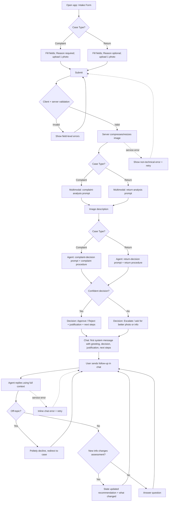

# PRD — Hardware Service Decision Copilot

> **Status:** Draft for MVP
> **Type:** PoC / MVP
> **Audience:** Developer agent (to produce an ADR, then implement)
> **Note:** Technology choices, frameworks, data schemas, prompt text, and the testing strategy are intentionally excluded — they belong in the ADR.

---

## 1. Executive Summary

The Hardware Service Decision Copilot is an internal MVP tool that helps customer-support and hardware-service employees decide whether to **approve, reject, or escalate** a customer's **complaint** (warranty claim) or **return** of electronics equipment. The employee fills a short structured form and uploads one photo of the equipment; a multimodal model describes the visible condition, and a reasoning agent combines that description with the form data and the company's written complaint/return procedures to produce a clear, justified decision. The employee can then continue in a chat interface to ask questions, add information, and refine the outcome before acting on it.

---

## 2. Problem Statement

When a customer submits a complaint or return for an electronics product, a support or service employee must manually judge whether the request is valid: inspect the item or its photos, recall the relevant warranty/return rules, weigh the purchase date and stated reason, and decide. This is slow, requires the employee to remember and consistently apply policy, and produces inconsistent decisions across staff and over time. There is no single place that combines the case data, a structured assessment of the item's visible condition, and the applicable company procedures into one defensible recommendation. As a result, decisions vary by individual, justifications are rarely written down, and borderline cases are not reliably flagged for review.

---

## 3. Users / Personas

The MVP is operated by **company employees**, not by end customers. The employee enters case data on the customer's behalf and uses the copilot's output as a recommendation to support — not replace — their own judgment.

### Persona A — Customer Support Agent ("Anna")
- First-line support handling complaints and returns by phone, email, or at a counter.
- Wants a fast, consistent recommendation she can explain to the customer, with the policy reasoning spelled out.
- Expects: a clear verdict, plain-language justification grounded in company rules, and concrete next steps to communicate.

### Persona B — Hardware Service Technician ("Marek")
- Inspects returned/complained hardware and assesses physical condition and likely cause of damage.
- Wants the system's read of the photo to match what he sees, and to challenge or correct it in chat when it does not.
- Expects: an accurate description of visible damage, a plausible cause assessment, and the ability to feed in his own observations and get an updated recommendation.

### Persona C — Team Lead / Reviewer ("Katarzyna")
- Handles escalations and borderline cases routed by first-line staff.
- Wants ambiguous and low-confidence cases clearly flagged rather than forced into a verdict.
- Expects: a transparent record of why the agent could not decide and what information is missing.

---

## 4. Main Flows

### 4.1 Happy path — Complaint, clear decision
1. Employee opens the app and sees the **intake form**.
2. Employee selects **Complaint**, picks the **equipment category**, types the **model/name**, picks the **purchase date**, writes the **reason** (mandatory for complaints), and uploads **one photo**.
3. Employee submits. The system validates all required fields client-side and server-side.
4. The system processes the image (server-side compression/resize) and sends it to the multimodal model using the **complaint-analysis prompt** (assess whether damaged, how, and the likely cause).
5. The system passes the resulting image description, the form data, and the **complaint procedure document** to the reasoning agent using the **complaint-decision prompt**.
6. The agent returns a decision (**Approve / Reject / Escalate**) with a justification referencing the relevant policy points and next steps.
7. The app transitions to the **chat interface** and renders the decision as the **first system message**: greeting, decision, justification, and next steps, nicely formatted.
8. The employee reads the recommendation and can continue in chat or end the session.

### 4.2 Happy path — Return, clear decision
1–3. As above, but employee selects **Return**. The **reason** field is optional for returns.
4. The image is sent to the multimodal model using the **return-analysis prompt** (assess whether the item shows no signs of use and could be resold as new/open-box).
5. The system passes the image description, form data, and the **return procedure document** to the agent using the **return-decision prompt**.
6–8. As in 4.1.

### 4.3 Chat continuation
1. After the first system message, the employee types a follow-up: a question, a correction, or additional information (e.g., "the customer says the crack appeared after one day").
2. The agent responds using the **full conversation context**: form data, image description, the initial decision and justification, and all prior chat turns.
3. If new information materially changes the assessment, the agent states an updated recommendation and explains what changed. The agent may revise its recommendation in chat; the original first message remains visible in history.

### 4.4 Alternative — Low confidence / ambiguous
1. During analysis or chat, the agent determines it cannot decide confidently (e.g., photo too blurry, photo does not show the item or the described damage, form data contradicts the image, or the case falls outside the provided procedures).
2. The agent returns **Escalate** (or asks a clarifying question / requests a better photo) instead of guessing, and explicitly states what is missing or uncertain.
3. The employee can supply more detail in chat or route the case to a reviewer.

### 4.5 Error — Service unavailable
1. The image analysis or agent call fails (timeout or upstream error).
2. The system shows a non-technical error message and lets the employee retry without re-entering the form.

### 4.6 Error — Invalid input
1. A required field is missing, the reason is empty for a complaint, or the uploaded file is not an accepted image type or exceeds the size limit.
2. The system blocks submission and shows a field-level message explaining what to fix. No call to any model is made.

---

## 5. User Stories

1. **Happy path (complaint):** As a support agent, I want to submit a complaint with the item's details and a photo and receive a clear approve/reject/escalate recommendation with justification, so that I can give the customer a consistent, policy-based answer quickly.
2. **Happy path (return):** As a support agent, I want the system to judge from a photo whether a returned item shows no signs of use and could be resold, so that I can decide whether to accept the return.
3. **Chat refinement:** As a service technician, I want to add my own inspection notes in chat and have the agent update its recommendation, so that the final decision reflects information the photo alone could not convey.
4. **Ambiguous result:** As a support agent, when the photo is unclear or the data is contradictory, I want the agent to tell me it cannot decide and what is missing, rather than inventing a verdict, so that I do not act on an unreliable recommendation.
5. **Invalid input:** As a support agent, when I forget a required field or upload an unsupported file, I want an immediate, specific error before anything is submitted, so that I can correct it without waiting on a failed analysis.
6. **Service failure:** As a support agent, when the analysis service is temporarily unavailable, I want to retry without re-entering everything, so that a transient outage does not cost me the whole case.
7. **Off-topic questions:** As a support agent, when I ask the agent something unrelated to the case, I want it to politely decline and steer back to the complaint/return, so that the conversation stays focused and on-policy.

---

## 6. Acceptance Criteria

### Form
- **AC-01** The form provides a **Case Type** selector with exactly two options: *Complaint* and *Return*.
- **AC-02** The form provides an **Equipment Category** selector populated from a predefined list (see Section 8, Functional).
- **AC-03** The form provides a free-text **Model / Name** input (required, non-empty after trimming).
- **AC-04** The form provides a **Purchase Date** picker; the selected date cannot be in the future.
- **AC-05** The **Reason** field is a textarea that is **required when Case Type = Complaint** and **optional when Case Type = Return**.
- **AC-06** The form requires **exactly one** image upload; submission is blocked with a field-level message if no image is attached.
- **AC-07** Submission is blocked with field-level messages listing every invalid/missing required field; no model call is made until all validations pass.
- **AC-08** The uploaded file is rejected with a specific message if its type is not in the accepted list or its size exceeds the configured maximum (see Section 8).

### Image Analysis
- **AC-09** On valid submission the image is compressed/resized server-side before being sent to the multimodal model; the original upload is not sent unmodified.
- **AC-10** When Case Type = Complaint, the multimodal model is invoked with the complaint-analysis prompt that asks whether the item is damaged, the nature of the damage, and the likely cause.
- **AC-11** When Case Type = Return, the multimodal model is invoked with the return-analysis prompt that asks whether the item shows signs of use and whether it appears resellable.
- **AC-12** The image description produced by the multimodal model is passed to the decision agent and is retained for the chat session.

### AI Decision
- **AC-13** The agent returns exactly one decision from the set **Approve / Reject / Escalate (Needs human review)**.
- **AC-14** Every decision includes a written justification that references the applicable procedure (complaint or return) and the case facts used.
- **AC-15** The decision prompt used depends on Case Type: the complaint-decision prompt for complaints, the return-decision prompt for returns.
- **AC-16** The agent injects the corresponding company procedure document (complaint or return) into its context when deciding.
- **AC-17** When the agent's confidence is low or required information is missing/contradictory, it returns **Escalate** (or requests a clearer photo / specific information) and never fabricates a confident verdict.
- **AC-18** The first chat message rendered to the user contains, in order: a greeting, the decision, the justification, and the next steps, in formatted output.

### Chat
- **AC-19** After the decision, the UI presents a chat interface with the decision shown as the first system message.
- **AC-20** Each agent reply is generated with the full conversation context: form data, image description, the initial decision/justification, and all prior chat turns.
- **AC-21** When new information in chat materially changes the assessment, the agent states an updated recommendation and explains what changed; the original first message stays visible in history.
- **AC-22** When asked an off-topic or out-of-scope question, the agent declines and redirects to the current complaint/return case.

### General
- **AC-23** All user-facing text (form labels, buttons, messages, agent output) is in **Polish**.
- **AC-24** On image-analysis or agent failure, the UI shows a non-technical error and allows retry without re-entering form data.
- **AC-25** During analysis and while awaiting an agent reply, the UI shows a loading indicator and disables duplicate submission.
- **AC-26** The agent's output includes a standing disclaimer that the recommendation is advisory and the employee makes the final decision (see Section 11).

---

## 7. Out of Scope

The following are explicitly **not** built in the MVP. Items marked **[Backlog]** are recorded as future work for later agents to pick up.

- **Authentication & user accounts.** No login, roles, or per-user identity in the MVP.
- **Customer & purchase-history lookup. [Backlog]** Retrieving existing customer records and purchase history from a database to enrich the decision.
- **Session & decision persistence. [Backlog]** Saving each session, its decisions, and actions to a database for audit/history.
- **RAG knowledge base. [Backlog]** An internal retrieval knowledge base of electronics specifications and detailed procedures the agent can query.
- **Multiple images / video.** Only one image per case is supported; no video, no multi-photo galleries.
- **Automatic execution of the decision.** The tool recommends; it does not issue refunds, create RMA tickets, send emails, or update any external system.
- **Integrations.** No CRM, ERP, ticketing, payment, or shipping integrations.
- **Admin / configuration UI.** Procedure documents and category lists are not editable from within the app.
- **Notifications.** No email, SMS, or push notifications.
- **Multilingual UI.** Polish only; no language switcher.
- **Native mobile apps.** Web only (responsive behavior is desirable but not a tracked requirement for the MVP).
- **Analytics & reporting dashboards.**

---

## 8. Constraints

### Business
- The copilot output is **advisory**: a human employee makes the final decision and is accountable for it.
- Decisions must be grounded in the supplied company **complaint** and **return** procedure documents; the agent must not invent policy not present in those documents.
- The agent must not promise a refund, replacement, or repair as a binding commitment; it recommends an outcome only.

### Functional
- **Language:** all user-facing content in Polish.
- **Case Type:** exactly two values — Complaint, Return.
- **Equipment categories (predefined list for the MVP):** Smartphone, Tablet, Laptop, Desktop PC, Monitor, TV, Headphones / Audio, Camera, Printer, Networking device (router/switch), Smartwatch / Wearable, Home appliance — small (small electronics), Other. (Final list confirmed during implementation; "Other" is always present.)
- **Image upload:** exactly one file; accepted types **JPEG, PNG, WebP**; maximum upload size **10 MB**. The server compresses/resizes the image before sending it to the multimodal model.
- **Purchase date:** cannot be a future date.
- **Reason field:** required for Complaint, optional for Return.
- **Decision set:** Approve / Reject / Escalate (Needs human review).
- **Supported environment:** current desktop versions of mainstream browsers (Chrome, Edge, Firefox, Safari).

### External document / data references

| Document | File path | When it is used |
|---|---|---|
| Complaint (warranty) procedure | `docs/policies/complaint-procedure.md` | Injected into the agent context for **Complaint** cases (AC-16) |
| Return procedure | `docs/policies/return-procedure.md` | Injected into the agent context for **Return** cases (AC-16) |

> These two documents are provided as **starting examples**. Their content is business policy, not technical configuration; they are expected to be replaced/extended with the organization's real procedures.

---

## 9. UI Description (wireframe level)

### 9.1 Intake Form screen
- **Layout:** single-column form with a title, the fields in order, and a primary **Submit** button at the bottom.
- **Fields (top to bottom):**
  1. **Case Type** — segmented control or dropdown with *Complaint* / *Return*.
  2. **Equipment Category** — dropdown from the predefined list.
  3. **Model / Name** — single-line text input.
  4. **Purchase Date** — date picker (future dates disabled).
  5. **Reason** — multi-line textarea. Label/asterisk indicates it is required only when *Complaint* is selected; the requirement indicator updates when Case Type changes.
  6. **Equipment Photo** — single-file upload with a thumbnail preview after selection and a way to remove/replace the file. Helper text states accepted formats and the size limit.
- **Interactive behavior:**
  - Changing Case Type to *Return* makes Reason optional; changing to *Complaint* makes it required.
  - Submit is enabled only when client-side validation passes; on click it triggers validation and, if valid, submission.
- **Error states:** field-level messages beneath each invalid field; a summary is acceptable but field-level messages are required (AC-07, AC-08).
- **Empty state:** the blank form is the default; no separate empty state.
- **Loading state:** after submit, show a full-step loading indicator ("Analyzing the photo and applying the procedure…") and disable the form to prevent duplicate submission (AC-25).
- **Navigation:** on a successful decision the app advances to the Chat screen; the form is not re-shown unless the session is reset/restarted.

### 9.2 Chat screen
- **Layout:** conversation area (scrollable) with a message composer (text input + send) fixed at the bottom. A compact, read-only **case summary** (type, category, model, purchase date, thumbnail) is visible or expandable for reference.
- **First message:** rendered as a system/assistant bubble containing greeting → decision (visually distinguishable, e.g., a labeled verdict) → justification → next steps, formatted for readability (AC-18, AC-19).
- **Interactive behavior:**
  - The employee types follow-ups; each send appends a user bubble and triggers an agent reply rendered as an assistant bubble.
  - The composer is disabled while awaiting a reply; a typing/loading indicator is shown (AC-25).
- **Error states:** if a reply fails, show an inline error in the conversation with a retry affordance; the user's message and prior history are preserved (AC-24).
- **Empty state:** not applicable — the chat always opens with the decision message.
- **Navigation:** an action to **start a new case** returns to a blank Intake Form (current session is not persisted in the MVP).

---

## 10. User Flow Diagram

---

## 11. Agent / System Behavior Specification

### Role and purpose
The agent is a decision copilot for complaint and return cases. It combines (a) the multimodal image description, (b) the structured form data, and (c) the applicable company procedure document to produce a single, justified recommendation, and then assists the employee through chat.

### Allowed
- Recommend exactly one outcome: **Approve**, **Reject**, or **Escalate (Needs human review)**.
- Justify the recommendation by citing the relevant points of the supplied procedure and the specific case facts.
- Ask for a clearer photo or specific missing information when needed.
- Update its recommendation when the employee provides new material information, explaining what changed.

### Not allowed
- Must not invent or apply policy that is not in the supplied procedure documents.
- Must not issue a binding commitment (guaranteed refund/replacement/repair) — recommendations only.
- Must not fabricate a confident verdict when the image is unusable, irrelevant, or the data is contradictory — it must escalate or ask instead (AC-17).
- Must not request or process personal/sensitive data beyond what the form and case require.

### Decision categories and how each is communicated
- **Approve** — the case meets the procedure's criteria. Communicate: the approval, the criteria met, and the next step (e.g., proceed with the return/claim per procedure).
- **Reject** — the case fails a specific criterion. Communicate: the rejection, exactly which criterion failed and why, and any alternative available to the customer per procedure.
- **Escalate (Needs human review)** — confidence is low, data conflicts, or the case is outside the procedures. Communicate: that human review is needed, what is uncertain or missing, and what would resolve it.

### Analysis prompt behavior
- **Complaint analysis:** assess whether the item is damaged, describe the damage type/location, and state the most likely cause (e.g., user-induced impact vs. manufacturing defect vs. normal wear), with uncertainty noted.
- **Return analysis:** assess whether the item shows signs of use, and whether it appears to be in resellable (as-new / open-box) condition.

### Mandatory disclaimer
Every decision message must include a clear, standing disclaimer (in Polish) that the recommendation is **advisory** and that the employee is responsible for the final decision. (Suggested wording, to be finalized: *"To rekomendacja pomocnicza — ostateczną decyzję podejmuje pracownik."*)

### Off-topic / out-of-scope handling
If asked anything unrelated to the current complaint/return case, the agent politely declines and redirects to the case (AC-22).

### Language and tone
- Language: **Polish** for all output.
- Tone: professional, concise, neutral, and explanatory — suitable for an internal support/service employee. No marketing language; no emotional framing of the customer.

---

## 12. Further Notes

### Assumptions made (please correct if wrong)
- **Primary user is a company employee** (support agent / service technician), not the end customer. Tone and "customer data" are framed accordingly.
- **Decision set is Approve / Reject / Escalate.** Escalate doubles as the safe fallback for low-confidence and out-of-procedure cases.
- **Low-confidence policy:** the agent escalates or asks rather than guessing.
- **MVP is kept minimal**; customer-history lookup, session/decision persistence, and the RAG knowledge base are recorded as **[Backlog]** in Section 7 for later agents.

### Open questions deferred to ADR / later
- Exact maximum image dimensions and compression target after server-side processing (engineering detail).
- Whether the chat session needs any in-memory time limit or message cap for the MVP.
- Final equipment-category list wording (the list in Section 8 is a working default).
- Final Polish disclaimer wording and any NBP-specific legal phrasing required.
