# Dokumentacja Techniczna — Hardware Service Decision Copilot

> **Dokument dla programistów utrzymujących i rozwijających aplikację**  
> Wersja: 1.0 | Data: 2026-06-30 | Język: Polski

---

## Spis treści

1. [Przegląd projektu i cel aplikacji](#1-przegląd-projektu-i-cel-aplikacji)
2. [Stos technologiczny](#2-stos-technologiczny)
3. [Architektura systemu](#3-architektura-systemu)
4. [Struktura katalogów](#4-struktura-katalogów)
5. [Backend — warstwy i klasy](#5-backend--warstwy-i-klasy)
6. [Frontend — komponenty i usługi](#6-frontend--komponenty-i-usługi)
7. [Modele domenowe](#7-modele-domenowe)
8. [Komunikacja Frontend–Backend](#8-komunikacja-frontendbackend)
9. [Integracja z modelem językowym (LLM)](#9-integracja-z-modelem-językowym-llm)
10. [Mechanizm OFFTOPIC — dlaczego chat nie odpowiada na pytania nie związane z tematem](#10-mechanizm-offtopic)
11. [Przetwarzanie obrazów](#11-przetwarzanie-obrazów)
12. [Szablony promptów](#12-szablony-promptów)
13. [Zarządzanie sesją](#13-zarządzanie-sesją)
14. [Konfiguracja aplikacji](#14-konfiguracja-aplikacji)
15. [Uruchamianie aplikacji](#15-uruchamianie-aplikacji)
16. [Testy jednostkowe i integracyjne](#16-testy-jednostkowe-i-integracyjne)
17. [Testy E2E z Playwright](#17-testy-e2e-z-playwright)
18. [Struktura API REST](#18-struktura-api-rest)
19. [Jak budować aplikacje AI podobne do tej](#19-jak-budować-aplikacje-ai-podobne-do-tej)
20. [Pytania i odpowiedzi (Q&A)](#20-pytania-i-odpowiedzi-qa)

---

## 1. Przegląd projektu i cel aplikacji

### 1.1 Cel biznesowy

**Hardware Service Decision Copilot** to asystent AI wspomagający decyzje serwisowe w obszarze reklamacji i zwrotów sprzętu elektronicznego. Aplikacja automatyzuje wstępną ocenę zgłoszeń, redukując czas obsługi i zapewniając spójność decyzji.

**Scenariusze użycia:**
- Pracownik działu serwisowego rejestruje zgłoszenie reklamacji lub zwrotu.
- System analizuje zdjęcie sprzętu i dane formularza.
- AI wydaje decyzję: **APPROVE** (zatwierdzenie), **REJECT** (odrzucenie) lub **ESCALATE** (eskalacja do supervisora).
- Pracownik może prowadzić dalszą rozmowę z AI w kontekście sprawy.

### 1.2 Przepływ aplikacji (poziom użytkownika)

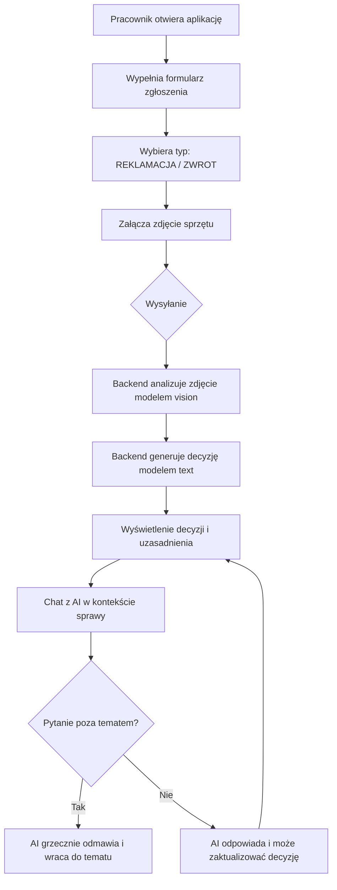

### 1.3 Możliwe decyzje systemu

| Decyzja | Opis | Kiedy |
|---------|------|-------|
| `APPROVE` | Zatwierdzenie reklamacji/zwrotu | Uszkodzenie potwierdzone, brak śladów użytkowania niezgodnego z przeznaczeniem |
| `REJECT` | Odrzucenie | Uszkodzenie mechaniczne z winy użytkownika, przekroczony termin |
| `ESCALATE` | Eskalacja do supervisora | Przypadki graniczne, niska pewność AI, brak jednoznacznych przesłanek |

---

## 2. Stos technologiczny

### 2.1 Backend

| Technologia | Wersja | Rola |
|-------------|--------|------|
| Java | 21 (LTS) | Język główny |
| Spring Boot | 3.5.1 | Framework aplikacji |
| Spring Web MVC | 6.x | REST API + SSE |
| OpenAI Java SDK | 4.41.0 | Klient HTTP do OpenRouter |
| Thumbnailator | 0.4.21 | Kompresja i skalowanie obrazów |
| TwelveMonkeys WebP ImageIO | 3.12.0 | Obsługa formatu WebP |
| spring-dotenv | 4.0.0 | Ładowanie zmiennych z pliku `.env` |
| Maven | 3.9+ | Build i zarządzanie zależnościami |

### 2.2 Frontend

| Technologia | Wersja | Rola |
|-------------|--------|------|
| Angular | 20.3 | Framework SPA |
| TypeScript | 5.9 | Język główny |
| Angular Material | 20.2 | Biblioteka komponentów UI |
| Angular Signals | 20.3 | Reaktywne zarządzanie stanem (bez NgRx) |
| @microsoft/fetch-event-source | 2.0.1 | SSE przez HTTP POST |
| RxJS | 7.x | Reaktywne programowanie |

### 2.3 Testowanie

| Narzędzie | Zastosowanie |
|-----------|-------------|
| JUnit 5 | Testy jednostkowe i integracyjne backend |
| Mockito | Mockowanie zależności w testach unit |
| Playwright | Testy E2E pełnego stosu |
| Node.js stub | Emulator OpenAI API (port 8089) |
| Jasmine + Karma | Testy jednostkowe frontend |

### 2.4 Infrastruktura i narzędzia

| Narzędzie | Zastosowanie |
|-----------|-------------|
| OpenRouter | Brama do modeli LLM (OpenAI-compatible API) |
| OpenRouter Vision Model | Analiza zdjęć sprzętu |
| OpenRouter Text Model | Generowanie decyzji i odpowiedzi czatu |
| `.env` + spring-dotenv | Konfiguracja środowiskowa |
| Spring Actuator | Health check (`/actuator/health`) |

---

## 3. Architektura systemu

### 3.1 Architektura heksagonalna (Ports & Adapters)

Aplikacja stosuje **architekturę heksagonalną** (Hexagonal Architecture, Ports & Adapters), która separuje logikę domenową od szczegółów technicznych.

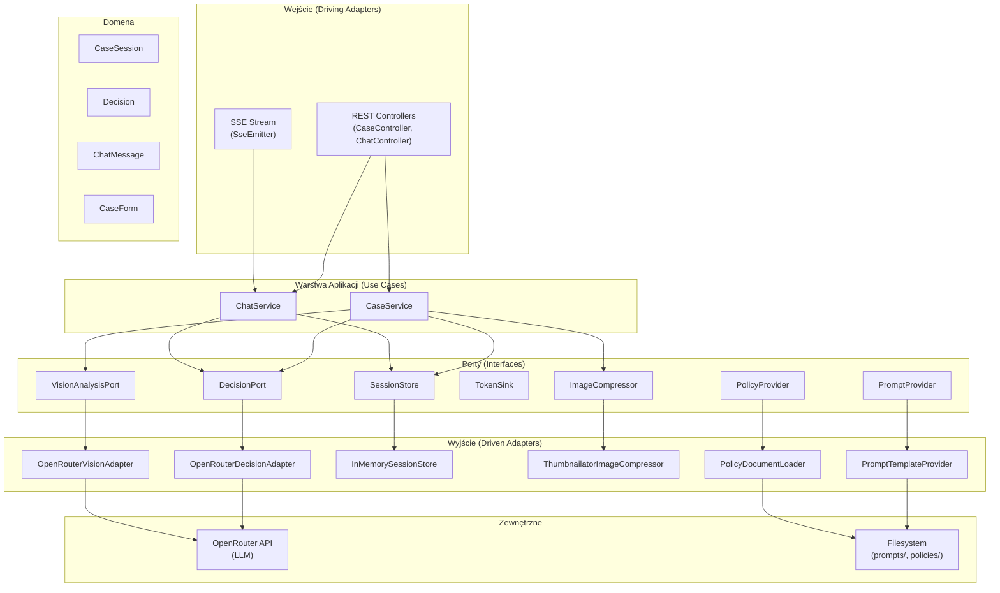

### 3.2 Pięć warstw aplikacji

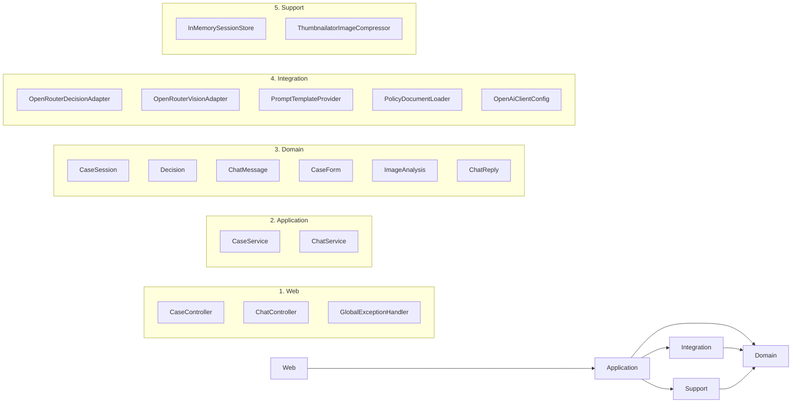

### 3.3 Przepływ tworzenia sprawy (sekwencja)

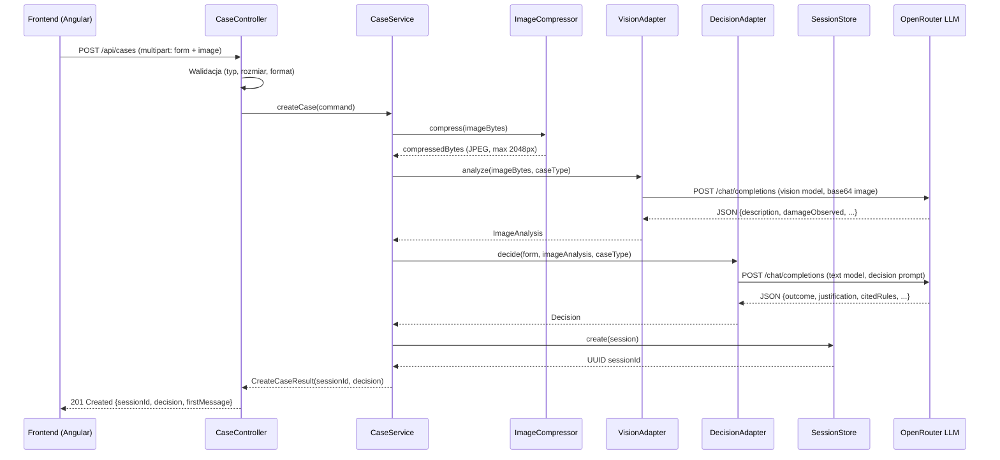

### 3.4 Przepływ wiadomości czatu (sekwencja SSE)

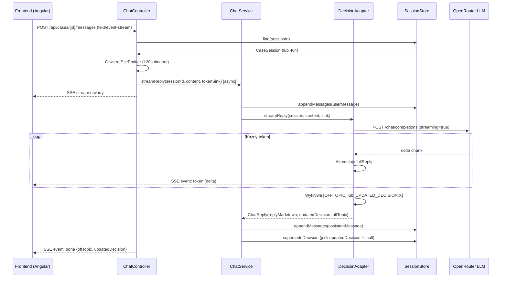

---

## 4. Struktura katalogów

```
app/
├── backend/                          Spring Boot backend
│   ├── src/main/java/pl/nbp/copilot/
│   │   ├── HardwareServiceCopilotApplication.java   # Main class
│   │   ├── web/                      # Warstwa Web (adaptery wejściowe)
│   │   │   ├── CaseController.java
│   │   │   ├── ChatController.java
│   │   │   └── GlobalExceptionHandler.java
│   │   ├── application/              # Warstwa aplikacji (use cases)
│   │   │   ├── CaseService.java
│   │   │   ├── ChatService.java
│   │   │   └── port/                 # Porty (interfejsy)
│   │   │       ├── DecisionPort.java
│   │   │       ├── VisionAnalysisPort.java
│   │   │       ├── SessionStore.java
│   │   │       ├── TokenSink.java
│   │   │       ├── ImageCompressor.java
│   │   │       ├── PromptProvider.java
│   │   │       └── PolicyProvider.java
│   │   ├── domain/                   # Modele domenowe (rekordy Java)
│   │   │   ├── CaseSession.java
│   │   │   ├── Decision.java
│   │   │   ├── ChatMessage.java
│   │   │   ├── CaseForm.java
│   │   │   ├── ImageAnalysis.java
│   │   │   ├── ChatReply.java
│   │   │   ├── CaseType.java         # Enum: COMPLAINT, RETURN
│   │   │   └── DecisionOutcome.java  # Enum: APPROVE, REJECT, ESCALATE
│   │   ├── integration/              # Adaptery wyjściowe (LLM, pliki)
│   │   │   ├── OpenRouterDecisionAdapter.java
│   │   │   ├── OpenRouterVisionAdapter.java
│   │   │   ├── PromptTemplateProvider.java
│   │   │   ├── PolicyDocumentLoader.java
│   │   │   └── OpenAiClientConfig.java
│   │   └── support/                  # Infrastruktura pomocnicza
│   │       ├── InMemorySessionStore.java
│   │       ├── ThumbnailatorImageCompressor.java
│   │       └── config/               # Klasy konfiguracyjne
│   │           ├── OpenRouterProperties.java
│   │           ├── ImageProperties.java
│   │           ├── SessionProperties.java
│   │           ├── PolicyProperties.java
│   │           └── CorsProperties.java
│   └── src/main/resources/
│       ├── application.yaml          # Konfiguracja Spring
│       ├── prompts/                  # Szablony promptów (Markdown)
│       │   ├── system.md
│       │   ├── chat.md
│       │   ├── decision-complaint.md
│       │   ├── decision-return.md
│       │   ├── analysis-complaint.md
│       │   └── analysis-return.md
│       └── policies/                 # Dokumenty polityki (Markdown)
│           ├── complaint-policy.md
│           └── return-policy.md
│
├── frontend/                         Angular frontend
│   ├── src/app/
│   │   ├── core/                     # Usługi i modele współdzielone
│   │   │   ├── app-state.ts          # Signal store (stan globalny)
│   │   │   ├── case.service.ts       # HTTP + SSE
│   │   │   ├── models.ts             # Typy TypeScript
│   │   │   └── http-error.interceptor.ts
│   │   └── features/
│   │       ├── form/
│   │       │   └── intake-form.component.ts
│   │       └── chat/
│   │           └── chat.component.ts
│   └── angular.json
│
└── e2e/                              Testy E2E Playwright
    ├── playwright.config.ts
    ├── stub/
    │   └── stub.mjs                  # Emulator OpenAI API
    └── tests/
        ├── smoke.spec.ts             # Główny test E2E
        └── pages/
            ├── IntakeFormPage.ts     # Page Object
            └── ChatPage.ts          # Page Object

docs/                                 Dokumentacja projektu
├── PRD-Product-Requirements-Document.md
├── ADR/
├── design-guidelines.md
├── PLAN-dokumentacji-technicznej.md
└── dokumentacja-techniczna.md        # Ten dokument
```

---

## 5. Backend — warstwy i klasy

### 5.1 Warstwa Web — kontrolery HTTP

#### `CaseController.java`

Przyjmuje żądania HTTP dotyczące tworzenia i pobierania spraw.

```java
@RestController
@RequestMapping("/api/cases")
public class CaseController {

    @PostMapping(consumes = MediaType.MULTIPART_FORM_DATA_VALUE)
    @ResponseStatus(HttpStatus.CREATED)
    public CreateCaseResult createCase(
            @RequestPart("form") @Valid CaseFormRequest formRequest,
            @RequestPart("image") MultipartFile image) {

        // Cross-field validation
        if (formRequest.caseType() == CaseType.COMPLAINT
                && (formRequest.reason() == null || formRequest.reason().isBlank())) {
            throw new ComplaintReasonRequiredException();
        }

        // Walidacja pliku
        validateImageFile(image);

        var command = new CreateCaseCommand(formRequest.toDomain(), image.getBytes());
        return caseService.createCase(command);
    }

    @GetMapping("/{id}")
    public CaseSessionResponse getCase(@PathVariable UUID id) {
        return caseSessionService.find(id)
                .map(CaseSessionResponse::from)
                .orElseThrow(CaseNotFoundException::new);
    }
}
```

**Wyjątki wewnętrzne (inner classes):**

| Wyjątek | HTTP | Kiedy |
|---------|------|-------|
| `ComplaintReasonRequiredException` | 400 | Brak powodu dla reklamacji |
| `ImageTooLargeException` | 413 | Plik > limit (domyślnie 10MB) |
| `UnsupportedImageTypeException` | 415 | Nie JPEG/PNG/WebP |
| `ImageRequiredException` | 400 | Brak załączonego zdjęcia |

#### `ChatController.java`

Obsługuje wiadomości czatu i strumieniuje odpowiedź przez SSE.

```java
@RestController
@RequestMapping("/api/cases/{id}/messages")
public class ChatController {

    @PostMapping(produces = MediaType.TEXT_EVENT_STREAM_VALUE)
    public SseEmitter sendMessage(
            @PathVariable UUID id,
            @RequestBody MessageRequest request) {

        // 404 PRZED otwarciem emitter — unikamy wycieku zasobu
        var session = sessionStore.find(id)
                .orElseThrow(CaseNotFoundException::new);

        var emitter = new SseEmitter(120_000L); // 120s timeout

        executor.execute(() -> {
            try {
                chatService.streamReply(id, request.content(),
                        delta -> emitter.send(SseEmitter.event()
                                .name("token")
                                .data(new TokenEvent(delta))));
                emitter.send(SseEmitter.event().name("done").data(new DoneEvent(...)));
                emitter.complete();
            } catch (Exception e) {
                emitter.send(SseEmitter.event().name("error").data(new ErrorEvent(e.getMessage())));
                emitter.completeWithError(e);
            }
        });

        return emitter;
    }
}
```

**Typy zdarzeń SSE:**

| Zdarzenie | Dane | Kiedy |
|-----------|------|-------|
| `token` | `{delta: string}` | Każdy fragment tekstu z LLM |
| `done` | `{offTopic: bool, updatedDecision: Decision\|null}` | Koniec odpowiedzi |
| `error` | `{message: string}` | Błąd podczas streamowania |

#### `GlobalExceptionHandler.java`

Centralny handler wyjątków — mapuje wyjątki domenowe na odpowiedzi HTTP.

```java
@RestControllerAdvice
public class GlobalExceptionHandler {

    @ExceptionHandler(CaseNotFoundException.class)
    @ResponseStatus(HttpStatus.NOT_FOUND)
    public ErrorResponse handleNotFound(CaseNotFoundException e) { ... }

    @ExceptionHandler(LlmTimeoutException.class)
    @ResponseStatus(HttpStatus.GATEWAY_TIMEOUT)
    public ErrorResponse handleTimeout(LlmTimeoutException e) { ... }

    @ExceptionHandler(LlmUnavailableException.class)
    @ResponseStatus(HttpStatus.BAD_GATEWAY)
    public ErrorResponse handleUnavailable(LlmUnavailableException e) { ... }
}
```

**Mapa wyjątków → HTTP:**

| Wyjątek | Kod HTTP |
|---------|----------|
| `CaseNotFoundException` | 404 |
| `ComplaintReasonRequiredException` | 400 |
| `ImageTooLargeException` | 413 |
| `UnsupportedImageTypeException` | 415 |
| `ImageRequiredException` | 400 |
| `LlmTimeoutException` | 504 |
| `LlmUnavailableException` | 502 |
| `MethodArgumentNotValidException` | 400 (z fieldErrors) |

### 5.2 Warstwa Aplikacji — serwisy (use cases)

#### `CaseService.java`

Orkiestruje pełny pipeline tworzenia sprawy.

```java
@Service
@Transactional
public class CaseService {

    public CreateCaseResult createCase(CreateCaseCommand command) {
        // 1. Kompresja obrazu
        byte[] compressed = imageCompressor.compress(command.imageBytes());

        // 2. Analiza wizualna
        ImageAnalysis analysis = visionPort.analyze(compressed, command.form().caseType());

        // 3. Generowanie decyzji
        Decision decision = decisionPort.decide(command.form(), analysis, command.form().caseType());

        // 4. Tworzenie sesji
        var session = CaseSession.create(
                command.form(), analysis, decision,
                sessionProperties.ttlMinutes());

        // 5. Zapis sesji
        sessionStore.create(session);

        return new CreateCaseResult(session.id(), decision);
    }

    // Rekordy zagnieżdżone
    public record CreateCaseCommand(CaseForm form, byte[] imageBytes) {}
    public record CreateCaseResult(UUID sessionId, Decision decision) {}
}
```

#### `ChatService.java`

Obsługuje wiadomości czatu — odczytuje sesję, streamuje odpowiedź, zapisuje.

```java
@Service
public class ChatService {

    public void streamReply(UUID sessionId, String content, TokenSink sink) {
        // 1. Załaduj sesję
        var session = sessionStore.find(sessionId)
                .orElseThrow(CaseNotFoundException::new);

        // 2. Dodaj wiadomość użytkownika
        var userMessage = ChatMessage.user(content);
        sessionStore.appendMessages(sessionId, List.of(userMessage));

        // 3. Streamuj odpowiedź przez port
        var reply = decisionPort.streamReply(session, content, sink);

        // 4. Zapisz odpowiedź AI
        var assistantMessage = ChatMessage.assistant(reply.replyMarkdown());
        sessionStore.appendMessages(sessionId, List.of(assistantMessage));

        // 5. Zaktualizuj decyzję jeśli AI ją zmieniła
        if (reply.updatedDecision() != null) {
            sessionStore.supersedeDecision(sessionId, reply.updatedDecision());
        }
    }
}
```

### 5.3 Porty — interfejsy warstwy aplikacji

Porty definiują kontrakt między warstwą aplikacji a adapterami. Żaden serwis nie zna konkretnych implementacji.

```java
// Port wejścia/wyjścia dla decyzji i czatu
public interface DecisionPort {
    Decision decide(CaseForm form, ImageAnalysis analysis, CaseType caseType);
    ChatReply streamReply(CaseSession session, String userContent, TokenSink sink);
}

// Port analizy wizualnej
public interface VisionAnalysisPort {
    ImageAnalysis analyze(byte[] imageBytes, CaseType caseType);
}

// Port magazynu sesji
public interface SessionStore {
    void create(CaseSession session);
    Optional<CaseSession> find(UUID id);
    void appendMessages(UUID id, List<ChatMessage> messages);
    void supersedeDecision(UUID id, Decision decision);
    void evictExpired();
}

// Funkcjonalny interfejs dla tokenu streamingu
@FunctionalInterface
public interface TokenSink {
    void accept(String delta);
}
```

### 5.4 Warstwa Integration — adaptery wyjściowe

Szczegółowy opis adapterów LLM znajduje się w rozdziałach 9–12.

### 5.5 Warstwa Support — infrastruktura pomocnicza

#### `InMemorySessionStore.java`

Przechowuje sesje w pamięci z obsługą TTL i blokadami per-sesja.

```java
@Component
public class InMemorySessionStore implements SessionStore {

    private final ConcurrentHashMap<UUID, CaseSession> sessions = new ConcurrentHashMap<>();
    private final ConcurrentHashMap<UUID, Object> locks = new ConcurrentHashMap<>();

    @Override
    public void appendMessages(UUID id, List<ChatMessage> messages) {
        // Blokada per-sesja — unikamy race condition przy równoczesnych wiadomościach
        synchronized (locks.computeIfAbsent(id, k -> new Object())) {
            var session = find(id).orElseThrow(CaseNotFoundException::new);
            var updated = session.withMessages(messages);
            sessions.put(id, updated);
        }
    }

    @Scheduled(fixedDelayString = "PT1M")
    @Override
    public void evictExpired() {
        var now = Instant.now();
        sessions.entrySet().removeIf(e -> e.getValue().expiresAt().isBefore(now));
        locks.entrySet().removeIf(e -> !sessions.containsKey(e.getKey()));
    }
}
```

**Ważne cechy implementacji:**
- `ConcurrentHashMap` — bezpieczna wielowątkowość dla niezależnych sesji
- `synchronized(locks.computeIfAbsent(...))` — blokada granularna per-sesja dla operacji modyfikujących
- `@Scheduled(fixedDelayString = "PT1M")` — cykliczne czyszczenie co minutę
- TTL skonfigurowany w `SessionProperties` (domyślnie 60 minut)

---

## 6. Frontend — komponenty i usługi

### 6.1 Architektura frontendu

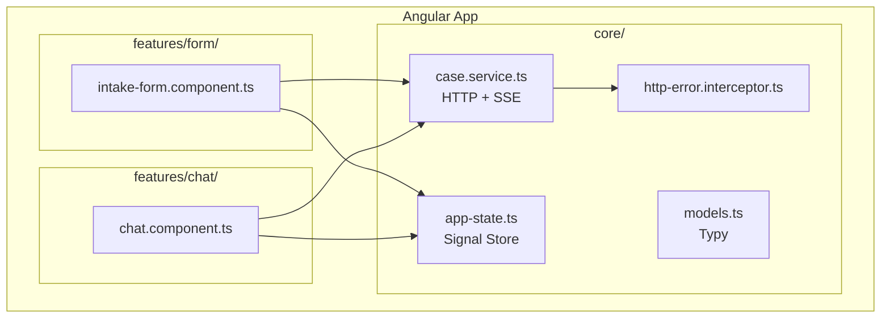

### 6.2 `app-state.ts` — Signal Store (stan globalny)

Stan aplikacji zarządzany przez Angular Signals — reaktywna alternatywa dla NgRx, bez boilerplate.

```typescript
// Prywatne sygnały (zapis tylko wewnątrz)
const _sessionId = signal<string | null>(null);
const _decision = signal<Decision | null>(null);
const _messages = signal<DisplayMessage[]>([]);
const _pendingState = signal<PendingState>('idle');

// Publiczne computed (odczyt dla komponentów)
export const sessionId = computed(() => _sessionId());
export const decision = computed(() => _decision());
export const messages = computed(() => _messages());
export const pendingState = computed(() => _pendingState());

// Akcje
export function hydrateFromCreate(result: CreateCaseResult): void {
    _sessionId.set(result.sessionId);
    _decision.set(result.decision);
    _messages.set([{
        role: 'assistant',
        content: result.decision.firstMessageMarkdown,
        isDecision: true
    }]);
}

export function appendMessage(msg: DisplayMessage): void {
    _messages.update(prev => [...prev, msg]);
}

export function updateLastMessage(delta: string): void {
    _messages.update(prev => {
        const last = prev[prev.length - 1];
        return [...prev.slice(0, -1), { ...last, content: last.content + delta }];
    });
}

export function reset(): void {
    _sessionId.set(null);
    _decision.set(null);
    _messages.set([]);
    _pendingState.set('idle');
}
```

**Dlaczego Signals zamiast NgRx:**
- Prostszy kod — brak akcji, reducerów i selectorów
- Wbudowana reaktywność — zmiana sygnału automatycznie przelicza computed i aktualizuje UI
- Typowanie bez nadmiernego boilerplate
- Wystarczający dla stanu jednego ekranu (sesja czatu)

### 6.3 `case.service.ts` — HTTP i SSE

```typescript
@Injectable({ providedIn: 'root' })
export class CaseService {

    createCase(formData: FormData): Observable<CreateCaseResult> {
        return this.http.post<CreateCaseResult>('/api/cases', formData);
    }

    sendMessage(sessionId: string, content: string, handlers: {
        onToken: (delta: string) => void;
        onDone: (event: DoneEvent) => void;
        onError: (err: Error) => void;
    }): void {
        // @microsoft/fetch-event-source — obsługuje POST z SSE
        this._fetchEventSourceImpl(`/api/cases/${sessionId}/messages`, {
            method: 'POST',
            headers: { 'Content-Type': 'application/json' },
            body: JSON.stringify({ content }),
            onmessage(event) {
                if (event.event === 'token') {
                    handlers.onToken(JSON.parse(event.data).delta);
                } else if (event.event === 'done') {
                    handlers.onDone(JSON.parse(event.data));
                }
            },
            onerror(err) {
                handlers.onError(err);
            }
        });
    }
}
```

**Dlaczego POST zamiast GET dla SSE:**
Standardowy `EventSource` obsługuje tylko GET. Aplikacja używa `@microsoft/fetch-event-source`, które pozwala na POST — niezbędne do przesyłania treści wiadomości w ciele żądania.

### 6.4 `intake-form.component.ts` — formularz zgłoszenia

```typescript
@Component({ ... })
export class IntakeFormComponent {

    form = this.fb.group({
        caseType: ['', Validators.required],
        equipmentCategory: ['', Validators.required],
        modelName: ['', Validators.required],
        purchaseDate: ['', [Validators.required, noFutureDateValidator()]],
        reason: ['']  // wymagane warunkowo dla COMPLAINT
    });

    onSubmit(): void {
        if (this.form.invalid || !this.selectedFile) return;

        const formData = new FormData();
        formData.append('form', new Blob([JSON.stringify(this.form.value)],
                        { type: 'application/json' }));
        formData.append('image', this.selectedFile);

        this.caseService.createCase(formData).subscribe({
            next: result => {
                hydrateFromCreate(result);
                this.router.navigate(['/chat']);
            },
            error: err => this.handleSubmitError(err)
        });
    }

    private handleSubmitError(err: HttpErrorResponse): void {
        // Mapowanie fieldErrors z backendu na kontrolki formularza
        err.error?.fieldErrors?.forEach((fe: FieldError) => {
            this.form.get(fe.field)?.setErrors({ serverError: fe.message });
        });
    }
}

// Walidator: data nie może być z przyszłości
function noFutureDateValidator(): ValidatorFn {
    return control => {
        const date = new Date(control.value);
        return date > new Date() ? { futureDate: true } : null;
    };
}
```

### 6.5 `chat.component.ts` — widok czatu

```typescript
@Component({ ... })
export class ChatComponent {

    readonly messages = messages;     // Signal (computed z app-state)
    readonly decision = decision;     // Signal (computed z app-state)
    readonly pendingState = pendingState;

    // Computed — połączenie wiadomości z ewentualnym buforem streamowania
    readonly effectiveMessages = computed(() => {
        const msgs = this.messages();
        const pending = this.pendingState();
        if (pending === 'streaming') {
            // Ostatnia wiadomość to bufor streamowania — dołączona do listy
            return msgs;
        }
        return msgs;
    });

    onSend(content: string): void {
        if (!content.trim() || pendingState() !== 'idle') return;

        _pendingState.set('streaming');
        appendMessage({ role: 'user', content });
        appendMessage({ role: 'assistant', content: '' }); // bufor streamowania

        this.caseService.sendMessage(sessionId()!, content, {
            onToken: delta => updateLastMessage(delta),
            onDone: event => {
                _pendingState.set('idle');
                if (event.updatedDecision) {
                    _decision.set(event.updatedDecision);
                }
            },
            onError: () => {
                _pendingState.set('idle');
                // Błąd wyświetlany przez interceptor (SnackBar)
            }
        });
    }

    startNewCase(): void {
        reset();
        this.router.navigate(['/form']);
    }
}
```

### 6.6 `http-error.interceptor.ts`

Mapuje kody błędów backendu na polskie komunikaty wyświetlane w `MatSnackBar`.

```typescript
const ERROR_MESSAGES: Record<string, string> = {
    'CASE_NOT_FOUND': 'Sprawa nie została znaleziona lub wygasła.',
    'LLM_TIMEOUT': 'Usługa AI nie odpowiedziała na czas. Spróbuj ponownie.',
    'LLM_UNAVAILABLE': 'Usługa AI jest chwilowo niedostępna.',
    'IMAGE_TOO_LARGE': 'Plik jest zbyt duży. Maksymalny rozmiar to 10 MB.',
    'UNSUPPORTED_IMAGE_TYPE': 'Nieobsługiwany format pliku. Użyj JPEG, PNG lub WebP.',
};
```

---

## 7. Modele domenowe

Wszystkie modele domenowe to **niemutowalne rekordy Java** (`record`). Gwarantuje to spójność stanu i thread-safety.

### 7.1 Diagram klas domenowych

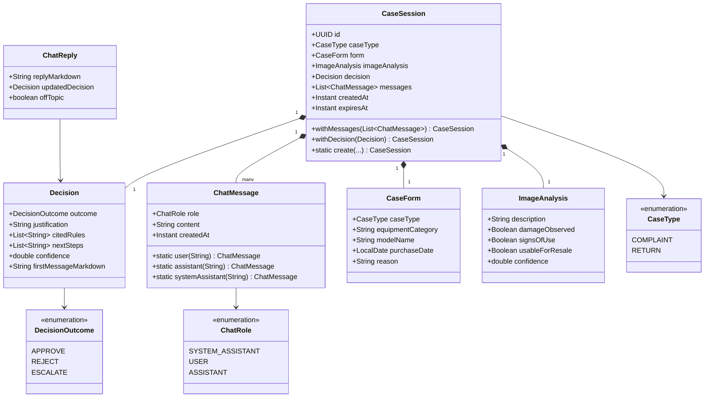

### 7.2 Opis pól kluczowych rekordów

#### `CaseSession`
```java
public record CaseSession(
        UUID id,
        CaseType caseType,
        CaseForm form,
        ImageAnalysis imageAnalysis,
        Decision decision,
        List<ChatMessage> messages,
        Instant createdAt,
        Instant expiresAt
) {
    public static CaseSession create(CaseForm form, ImageAnalysis analysis,
                                     Decision decision, int ttlMinutes) {
        return new CaseSession(
                UUID.randomUUID(), form.caseType(), form, analysis, decision,
                List.of(ChatMessage.systemAssistant(decision.firstMessageMarkdown())),
                Instant.now(),
                Instant.now().plus(Duration.ofMinutes(ttlMinutes))
        );
    }

    public CaseSession withMessages(List<ChatMessage> newMessages) {
        var all = new ArrayList<>(messages);
        all.addAll(newMessages);
        return new CaseSession(id, caseType, form, imageAnalysis, decision,
                               Collections.unmodifiableList(all), createdAt, expiresAt);
    }
}
```

#### `ChatReply` — nośnik flagi OFFTOPIC

```java
public record ChatReply(
        String replyMarkdown,    // Pełna odpowiedź AI (zawiera uprzejme odmówienie)
        Decision updatedDecision, // null jeśli decyzja niezmieniona
        boolean offTopic          // true jeśli AI wykryło pytanie poza tematem
) {}
```

---

## 8. Komunikacja Frontend–Backend

### 8.1 REST API — tworzenie sprawy

```
POST /api/cases
Content-Type: multipart/form-data

Parts:
  form (application/json): {
    "caseType": "COMPLAINT",
    "equipmentCategory": "LAPTOP",
    "modelName": "Dell XPS 15",
    "purchaseDate": "2024-01-15",
    "reason": "Ekran przestał działać"
  }
  image (image/jpeg|png|webp): <binary>

Response 201:
{
  "sessionId": "550e8400-e29b-41d4-a716-446655440000",
  "decision": {
    "outcome": "APPROVE",
    "justification": "...",
    "citedRules": ["§3.1 regulaminu gwarancji"],
    "nextSteps": ["Wyślij sprzęt do serwisu"],
    "confidence": 0.87,
    "firstMessageMarkdown": "## Decyzja: ZATWIERDZONO\n..."
  }
}
```

### 8.2 REST API — pobieranie sesji

```
GET /api/cases/{id}

Response 200:
{
  "id": "550e8400-...",
  "caseType": "COMPLAINT",
  "form": { ... },
  "decision": { ... },
  "messages": [ ... ],
  "createdAt": "2026-06-30T10:00:00Z",
  "expiresAt": "2026-06-30T11:00:00Z"
}

Response 404:
{
  "errorCode": "CASE_NOT_FOUND",
  "message": "Sprawa nie istnieje lub wygasła"
}
```

### 8.3 SSE — czat

```
POST /api/cases/{id}/messages
Content-Type: application/json
Accept: text/event-stream

Body: { "content": "Czy mogę zwrócić sprzęt pocztą?" }

Response stream (text/event-stream):
event: token
data: {"delta": "Tak"}

event: token
data: {"delta": ", oczywiście"}

event: token
data: {"delta": " możesz zwrócić sprzęt pocztą..."}

event: done
data: {"offTopic": false, "updatedDecision": null}
```

### 8.4 Diagram przepływu SSE w przeglądarce

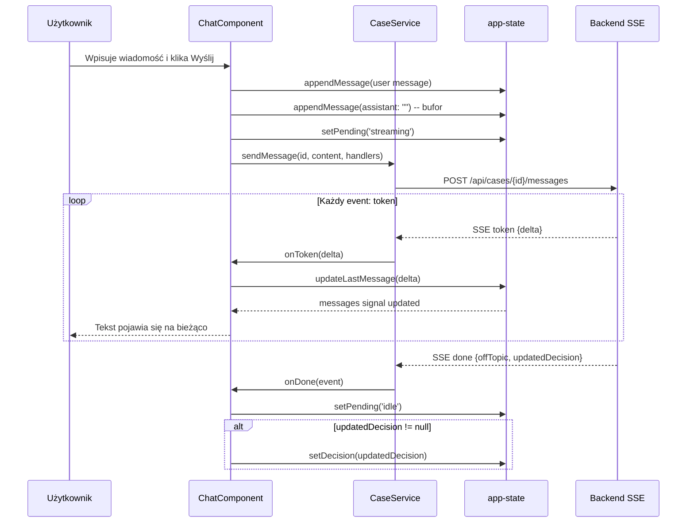

---

## 9. Integracja z modelem językowym (LLM)

### 9.1 Konfiguracja klienta OpenAI

```java
@Configuration
public class OpenAiClientConfig {

    @Bean
    public OpenAIOkHttpClient openAiClient(OpenRouterProperties props) {
        return OpenAIOkHttpClient.builder()
                .baseUrl(props.baseUrl())          // https://openrouter.ai/api/v1
                .apiKey(props.apiKey())
                .timeout(Duration.ofMillis(props.requestTimeoutMs()))  // 60s
                .maxRetries(props.maxRetries())    // 2
                .build();
    }
}
```

Klient jest kompatybilny z OpenAI API — OpenRouter udostępnia identyczny interfejs, co pozwala na zamianę providera bez zmiany kodu.

### 9.2 Dwa modele LLM

Aplikacja używa **dwóch oddzielnych modeli**:

| Model | Zmienna env | Zastosowanie |
|-------|-------------|--------------|
| Vision | `OPENROUTER_VISION_MODEL` | Analiza zdjęcia sprzętu |
| Text | `OPENROUTER_TEXT_MODEL` | Generowanie decyzji i odpowiedzi czatu |

```yaml
# application.yaml
openrouter:
  base-url: ${OPENROUTER_BASE_URL:https://openrouter.ai/api/v1}
  api-key: ${OPENROUTER_API_KEY}
  vision-model: ${OPENROUTER_VISION_MODEL:openai/gpt-4o}
  text-model: ${OPENROUTER_TEXT_MODEL:openai/gpt-4o-mini}
  request-timeout-ms: ${OPENAI_REQUEST_TIMEOUT_MS:60000}
  max-retries: 2
```

### 9.3 `OpenRouterVisionAdapter` — analiza obrazu

```java
@Component
public class OpenRouterVisionAdapter implements VisionAnalysisPort {

    @Override
    public ImageAnalysis analyze(byte[] imageBytes, CaseType caseType) {
        // 1. Koduj obraz jako base64 data URL
        String base64 = Base64.getEncoder().encodeToString(imageBytes);
        String dataUrl = "data:image/jpeg;base64," + base64;

        // 2. Pobierz prompt analizy
        String prompt = promptProvider.analysisPrompt(caseType);

        // 3. Wywołaj model vision
        var response = callWithExceptionMapping(() ->
            client.chat().completions().create(
                ChatCompletionCreateParams.builder()
                    .model(props.visionModel())
                    .addUserMessageOfImageURLContentBlocks(dataUrl, prompt)
                    .build()
            )
        );

        // 4. Parsuj JSON odpowiedzi
        return parseAnalysisResponse(response.choices().get(0).message().content());
    }

    private ImageAnalysis parseAnalysisResponse(String content) {
        try {
            return objectMapper.readValue(content, ImageAnalysis.class);
        } catch (JsonProcessingException e) {
            // Fallback: opis tekstowy bez struktury
            return new ImageAnalysis(content, null, null, null, 0.0);
        }
    }
}
```

### 9.4 `OpenRouterDecisionAdapter` — decyzja i czat

```java
@Component
public class OpenRouterDecisionAdapter implements DecisionPort {

    // Markery wykrywane w odpowiedzi modelu (bez tool use / function calling)
    private static final String OFF_TOPIC_MARKER = "[OFFTOPIC]";
    private static final String UPDATED_DECISION_MARKER = "[UPDATED_DECISION:";

    private static final String DISCLAIMER_PL =
        "\n\n---\n⚠️ *Decyzja wygenerowana automatycznie przez system AI. " +
        "W przypadku wątpliwości skonsultuj się z przełożonym.*";

    @Override
    public Decision decide(CaseForm form, ImageAnalysis analysis, CaseType caseType) {
        String prompt = promptProvider.decisionPrompt(caseType);
        String policy = policyProvider.procedureText(caseType);

        var response = callWithExceptionMapping(() ->
            client.chat().completions().create(
                ChatCompletionCreateParams.builder()
                    .model(props.textModel())
                    .addSystemMessage(promptProvider.systemPrompt())
                    .addUserMessage(buildDecisionContext(form, analysis, policy, prompt))
                    .build()
            )
        );

        return parseDecision(response.choices().get(0).message().content().orElse(""));
    }

    private Decision parseDecision(String content) {
        try {
            var raw = objectMapper.readValue(content, DecisionRaw.class);
            var firstMessage = composeFirstMessage(raw);
            return new Decision(raw.outcome(), raw.justification(), raw.citedRules(),
                                raw.nextSteps(), raw.confidence(), firstMessage);
        } catch (JsonProcessingException e) {
            // Fallback — ESKALACJA gdy AI nie zwróci poprawnego JSON
            return Decision.escalate("Błąd parsowania odpowiedzi AI");
        }
    }

    @Override
    public ChatReply streamReply(CaseSession session, String userContent, TokenSink sink) {
        var messages = buildContextMessages(session, userContent);

        var accumulator = new StringBuilder();

        // Streaming przez OpenAI Java SDK
        try (var stream = client.chat().completions().stream(
            ChatCompletionStreamParams.builder()
                .model(props.textModel())
                .messages(messages)
                .build()
        )) {
            stream.forEach(chunk -> {
                var delta = chunk.choices().get(0).delta().content().orElse("");
                if (!delta.isEmpty()) {
                    accumulator.append(delta);
                    sink.accept(delta);  // Emituje token do SSE
                }
            });
        }

        String fullReply = accumulator.toString();

        // Detekcja markerów w pełnej odpowiedzi
        boolean offTopic = fullReply.contains(OFF_TOPIC_MARKER);
        Decision updatedDecision = extractUpdatedDecision(fullReply, session.decision());

        return new ChatReply(fullReply, updatedDecision, offTopic);
    }
}
```

### 9.5 Obsługa błędów LLM

```java
private <T> T callWithExceptionMapping(Supplier<T> call) {
    try {
        return call.get();
    } catch (OpenAITimeoutException e) {
        throw new LlmTimeoutException("LLM nie odpowiedział na czas", e);
    } catch (OpenAIException e) {
        throw new LlmUnavailableException("Błąd komunikacji z LLM", e);
    }
}
```

---

## 10. Mechanizm OFFTOPIC

### 10.1 Dlaczego chat nie odpowiada na pytania nie związane z tematem?

To jeden z najważniejszych mechanizmów aplikacji. Chat jest zaprojektowany tak, aby **asystent AI skupiał się wyłącznie na bieżącej sprawie reklamacji lub zwrotu** i odmawiał odpowiedzi na pytania niezwiązane z tematem.

Mechanizm działa na **czterech poziomach**:

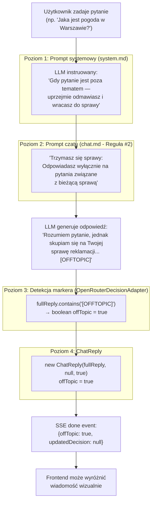

### 10.2 Poziom 1: Instrukcja w `system.md`

Prompt systemowy definiuje **rolę i ograniczenia** asystenta:

```markdown
<!-- system.md (fragment) -->
Jesteś asystentem AI wspierającym pracowników działu serwisowego NBP
w ocenie reklamacji i zwrotów sprzętu elektronicznego.

**Czego NIE robisz:**
- Nie odpowiadasz na pytania niezwiązane z bieżącą sprawą reklamacji lub zwrotu.
- Gdy użytkownik zadaje pytanie niezwiązane z bieżącą sprawą reklamacji lub zwrotu —
  uprzejmie odmawiasz i kierujesz rozmowę z powrotem do tematu sprawy.
```

### 10.3 Poziom 2: Reguła #2 w `chat.md`

Prompt kontekstowy czatu (wypełniany danymi sprawy) zawiera **explicite regułę**:

```markdown
<!-- chat.md (fragment) -->
**Zasady prowadzenia rozmowy:**

1. Odpowiadasz w języku polskim.
2. **Trzymasz się sprawy:** Odpowiadasz wyłącznie na pytania i informacje związane
   z bieżącą sprawą. Jeśli pracownik pyta o coś niezwiązanego — uprzejmie odmawiasz
   i wracasz do tematu sprawy. Dodajesz marker [OFFTOPIC] na końcu odpowiedzi.
3. Możesz zaktualizować decyzję na podstawie nowych informacji od pracownika.
```

### 10.4 Poziom 3: Detekcja markera w backendzie

W `OpenRouterDecisionAdapter.java` (linia ~68):

```java
private static final String OFF_TOPIC_MARKER = "[OFFTOPIC]";

@Override
public ChatReply streamReply(CaseSession session, String userContent, TokenSink sink) {
    // ... streaming do klienta ...

    String fullReply = accumulator.toString();

    // Detekcja markera tekstowego — bez tool use / function calling
    boolean offTopic = fullReply.contains(OFF_TOPIC_MARKER);

    Decision updatedDecision = extractUpdatedDecision(fullReply, session.decision());

    return new ChatReply(fullReply, updatedDecision, offTopic);
}
```

**Dlaczego marker tekstowy zamiast function calling?**

| Podejście | Zalety | Wady |
|-----------|--------|------|
| Marker tekstowy `[OFFTOPIC]` | Proste, działa na każdym modelu | Może pojawić się przez przypadek w treści |
| Function calling / tool use | Strukturalne, niezawodne | Wymaga wsparcia modelu, wyższy koszt |

W tym projekcie marker tekstowy jest wystarczający — ryzyko fałszywego pozytywu jest niskie, a korzyść w postaci prostoty implementacji i kompatybilności z każdym modelem jest wysoka.

### 10.5 Poziom 4: Rekord `ChatReply` i przepływ do frontendu

```java
// domain/ChatReply.java
public record ChatReply(
        String replyMarkdown,    // Pełna odpowiedź (zawiera uprzejme odmówienie)
        Decision updatedDecision, // null — off-topic = brak aktualizacji decyzji
        boolean offTopic          // TRUE gdy pytanie poza tematem
) {}
```

Po zakończeniu streamowania, `ChatController` emituje zdarzenie SSE `done`:

```java
emitter.send(SseEmitter.event()
    .name("done")
    .data(new DoneEvent(
        reply.offTopic(),
        reply.updatedDecision()
    )));
```

Frontend odbiera flagę i może opcjonalnie wyróżnić wiadomość wizualnie (np. innym tłem, ikoną).

### 10.6 Przykład działania

**Pytanie użytkownika:** "Jaka jest pogoda w Warszawie?"

**Odpowiedź LLM (ze streamingiem):**
```
Rozumiem Twoje pytanie, jednak jako asystent serwisowy NBP skupiam się wyłącznie
na bieżącej sprawie dotyczącej reklamacji laptopa Dell XPS 15 (sprawa #550e8400).

Czy mogę pomóc Ci w kwestiach związanych z tą sprawą, na przykład:
- wyjaśnić powody podjętej decyzji,
- doradzić w sprawie kolejnych kroków,
- odpowiedzieć na pytania dotyczące procedury reklamacyjnej?

[OFFTOPIC]
```

**Wynik backendu:**
```java
new ChatReply(
    "Rozumiem Twoje pytanie... [OFFTOPIC]",
    null,   // decyzja niezmieniona
    true    // offTopic = true
)
```

**Zdarzenie SSE done:**
```json
{ "offTopic": true, "updatedDecision": null }
```

---

## 11. Przetwarzanie obrazów

### 11.1 Pipeline przetwarzania

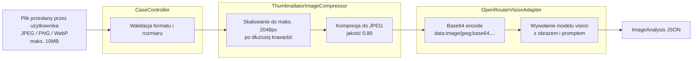

### 11.2 `ThumbnailatorImageCompressor.java`

```java
@Component
public class ThumbnailatorImageCompressor implements ImageCompressor {

    private final int maxDimension;  // 2048px z konfiguracji
    private final float quality;     // 0.80f

    @Override
    public byte[] compress(byte[] imageBytes) throws IOException {
        // TwelveMonkeys WebP ImageIO musi być na classpathie dla WebP
        try (var input = new ByteArrayInputStream(imageBytes);
             var output = new ByteArrayOutputStream()) {

            Thumbnails.of(ImageIO.read(input))
                    .size(maxDimension, maxDimension)  // zachowuje proporcje
                    .outputFormat("JPEG")
                    .outputQuality(quality)
                    .toOutputStream(output);

            return output.toByteArray();
        }
    }
}
```

**Obsługa WebP:**
- `TwelveMonkeys WebP ImageIO` rejestruje się jako `ImageIO` plugin przez ServiceLoader
- Wystarczy dodać zależność do `pom.xml` — `ImageIO.read()` automatycznie obsługuje WebP

**Parametry konfiguracyjne (`ImageProperties`):**
```java
@ConfigurationProperties("app.image")
public record ImageProperties(
        int maxDimensionPx,    // domyślnie 2048
        float jpegQuality,     // domyślnie 0.80
        long maxFileSizeBytes  // domyślnie 10MB
) {}
```

---

## 12. Szablony promptów

### 12.1 Przegląd szablonów

Wszystkie szablony promptów to pliki Markdown w `classpath:/prompts/`. Ładowane leniwie z cache (`ConcurrentHashMap`).

| Plik | Użycie | Model |
|------|--------|-------|
| `system.md` | Prompt systemowy (rola, zasady, OFFTOPIC) | Text |
| `chat.md` | Kontekst czatu (dane sprawy, reguły) | Text |
| `decision-complaint.md` | Format decyzji dla reklamacji | Text |
| `decision-return.md` | Format decyzji dla zwrotów | Text |
| `analysis-complaint.md` | Instrukcja analizy zdjęcia reklamacji | Vision |
| `analysis-return.md` | Instrukcja analizy zdjęcia zwrotu | Vision |

### 12.2 `PromptTemplateProvider.java`

```java
@Component
public class PromptTemplateProvider implements PromptProvider {

    private final ConcurrentHashMap<String, String> cache = new ConcurrentHashMap<>();
    private final ResourceLoader resourceLoader;

    @Override
    public String systemPrompt() {
        return load("system.md");
    }

    @Override
    public String chatPrompt() {
        return load("chat.md");
    }

    @Override
    public String decisionPrompt(CaseType caseType) {
        return load(caseType == CaseType.COMPLAINT
                ? "decision-complaint.md"
                : "decision-return.md");
    }

    @Override
    public String analysisPrompt(CaseType caseType) {
        return load(caseType == CaseType.COMPLAINT
                ? "analysis-complaint.md"
                : "analysis-return.md");
    }

    private String load(String filename) {
        return cache.computeIfAbsent(filename, k -> {
            var resource = resourceLoader.getResource("classpath:prompts/" + k);
            return new String(resource.getInputStream().readAllBytes(), StandardCharsets.UTF_8);
        });
    }
}
```

### 12.3 Struktura promptu decyzyjnego (`decision-complaint.md`)

```markdown
Na podstawie poniższych danych wydaj decyzję w sprawie reklamacji sprzętu.

Odpowiedz WYŁĄCZNIE w formacie JSON (bez markdown, bez dodatkowego tekstu):
{
  "outcome": "APPROVE|REJECT|ESCALATE",
  "justification": "Szczegółowe uzasadnienie decyzji po polsku",
  "citedRules": ["§X.Y regulaminu...", "Punkt Z procedury..."],
  "nextSteps": ["Krok 1", "Krok 2"],
  "confidence": 0.0-1.0
}

Zasady podejmowania decyzji:
- ZATWIERDZAJ (APPROVE) gdy: uszkodzenie fabryczne, brak śladów niewłaściwego użytkowania
- ODRZUCAJ (REJECT) gdy: uszkodzenie mechaniczne z winy użytkownika, przekroczony termin gwarancji
- ESKALUJ (ESCALATE) gdy: przypadek graniczny, niska pewność, brak jednoznacznych przesłanek
```

### 12.4 Zmienne w `chat.md`

Prompt czatu zawiera placeholdery wypełniane danymi bieżącej sprawy:

```markdown
Bieżąca sprawa:
- Typ: {{caseType}}
- Sprzęt: {{equipmentCategory}} {{modelName}}
- Data zakupu: {{purchaseDate}}
- Powód zgłoszenia: {{reason}}
- Analiza zdjęcia: {{imageAnalysisDescription}}
- Aktualna decyzja: {{currentDecision}} (pewność: {{confidence}})

[Historia wiadomości...]

Jeśli na podstawie nowych informacji decyzja powinna się zmienić, dołącz na końcu:
[UPDATED_DECISION:{"outcome":"...","justification":"...","citedRules":[...],"nextSteps":[...],"confidence":0.0}]
```

### 12.5 Marker `[UPDATED_DECISION:...]`

Analogicznie do OFFTOPIC, aktualizacja decyzji przez AI odbywa się przez marker tekstowy:

```java
private Decision extractUpdatedDecision(String fullReply, Decision current) {
    int markerStart = fullReply.indexOf(UPDATED_DECISION_MARKER);
    if (markerStart == -1) return null;

    int jsonStart = markerStart + UPDATED_DECISION_MARKER.length();
    int jsonEnd = fullReply.indexOf(']', jsonStart);
    if (jsonEnd == -1) return null;

    String json = fullReply.substring(jsonStart, jsonEnd);
    try {
        var raw = objectMapper.readValue(json, DecisionRaw.class);
        return new Decision(raw.outcome(), raw.justification(), raw.citedRules(),
                            raw.nextSteps(), raw.confidence(),
                            composeFirstMessage(raw));
    } catch (JsonProcessingException e) {
        return null;  // Fallback: zachowaj poprzednią decyzję
    }
}
```

---

## 13. Zarządzanie sesją

### 13.1 Model sesji

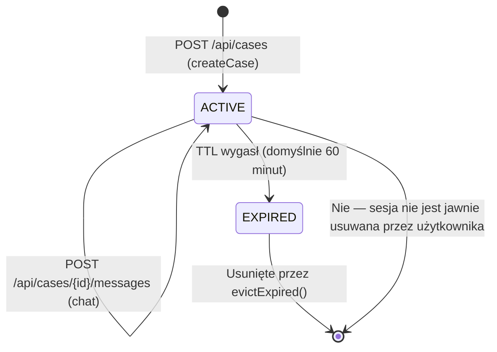

### 13.2 Architektura `InMemorySessionStore`

```java
@Component
public class InMemorySessionStore implements SessionStore {

    // Główna mapa sesji — thread-safe dla różnych sesji
    private final ConcurrentHashMap<UUID, CaseSession> sessions = new ConcurrentHashMap<>();

    // Blokady per-sesja — zapobiegają race condition przy równoczesnych wiadomościach
    private final ConcurrentHashMap<UUID, Object> locks = new ConcurrentHashMap<>();

    @Override
    public void create(CaseSession session) {
        sessions.put(session.id(), session);
    }

    @Override
    public Optional<CaseSession> find(UUID id) {
        var session = sessions.get(id);
        if (session == null || session.expiresAt().isBefore(Instant.now())) {
            return Optional.empty();
        }
        return Optional.of(session);
    }

    @Override
    public void appendMessages(UUID id, List<ChatMessage> messages) {
        synchronized (locks.computeIfAbsent(id, k -> new Object())) {
            var session = find(id).orElseThrow(() -> new CaseNotFoundException(id));
            sessions.put(id, session.withMessages(messages));
        }
    }

    @Override
    public void supersedeDecision(UUID id, Decision decision) {
        synchronized (locks.computeIfAbsent(id, k -> new Object())) {
            var session = find(id).orElseThrow(() -> new CaseNotFoundException(id));
            sessions.put(id, session.withDecision(decision));
        }
    }

    @Scheduled(fixedDelayString = "PT1M")
    @Override
    public void evictExpired() {
        var now = Instant.now();
        sessions.entrySet().removeIf(e -> e.getValue().expiresAt().isBefore(now));
        // Czyszczenie osieroconych blokad
        locks.entrySet().removeIf(e -> !sessions.containsKey(e.getKey()));
    }
}
```

### 13.3 Thread-safety — dwa poziomy

| Sytuacja | Mechanizm | Dlaczego |
|----------|-----------|---------|
| Różne sesje jednocześnie | `ConcurrentHashMap` | Odczyty/zapisy różnych kluczy są bezpieczne |
| Ta sama sesja, równoległe wiadomości | `synchronized(lock)` | `ConcurrentHashMap` nie chroni przed race condition przy złożonych read-modify-write |

---

## 14. Konfiguracja aplikacji

### 14.1 Zmienne środowiskowe (`.env`)

```bash
# Wymagane
OPENROUTER_API_KEY=sk-or-v1-...

# Opcjonalne (mają wartości domyślne)
OPENROUTER_BASE_URL=https://openrouter.ai/api/v1
OPENROUTER_TEXT_MODEL=openai/gpt-4o-mini
OPENROUTER_VISION_MODEL=openai/gpt-4o
OPENAI_REQUEST_TIMEOUT_MS=60000

# Dla testów E2E
CONTEXT7_API_KEY=...
```

### 14.2 `application.yaml`

```yaml
server:
  port: 8080

openrouter:
  base-url: ${OPENROUTER_BASE_URL:https://openrouter.ai/api/v1}
  api-key: ${OPENROUTER_API_KEY}
  vision-model: ${OPENROUTER_VISION_MODEL:openai/gpt-4o}
  text-model: ${OPENROUTER_TEXT_MODEL:openai/gpt-4o-mini}
  request-timeout-ms: ${OPENAI_REQUEST_TIMEOUT_MS:60000}
  max-retries: 2

app:
  image:
    max-dimension-px: 2048
    jpeg-quality: 0.80
    max-file-size-bytes: 10485760  # 10MB
  session:
    ttl-minutes: 60
  policy:
    complaint-path: classpath:policies/complaint-policy.md
    return-path: classpath:policies/return-policy.md
  cors:
    allowed-origins: ${CORS_ALLOWED_ORIGINS:http://localhost:4200}

spring:
  servlet:
    multipart:
      max-file-size: 10MB
      max-request-size: 15MB

management:
  endpoints:
    web:
      exposure:
        include: health
```

### 14.3 Klasy konfiguracyjne (`@ConfigurationProperties`)

```java
// Każda klasa to niemutowalny rekord Java
@ConfigurationProperties("openrouter")
public record OpenRouterProperties(
        String baseUrl, String apiKey,
        String visionModel, String textModel,
        int requestTimeoutMs, int maxRetries) {}

@ConfigurationProperties("app.image")
public record ImageProperties(
        int maxDimensionPx, float jpegQuality, long maxFileSizeBytes) {}

@ConfigurationProperties("app.session")
public record SessionProperties(int ttlMinutes) {}

@ConfigurationProperties("app.policy")
public record PolicyProperties(String complaintPath, String returnPath) {}

@ConfigurationProperties("app.cors")
public record CorsProperties(List<String> allowedOrigins) {}
```

Rejestracja w klasie głównej:

```java
@SpringBootApplication
@EnableConfigurationProperties({
    OpenRouterProperties.class,
    ImageProperties.class,
    SessionProperties.class,
    PolicyProperties.class,
    CorsProperties.class
})
@EnableScheduling
public class HardwareServiceCopilotApplication {
    public static void main(String[] args) {
        SpringApplication.run(HardwareServiceCopilotApplication.class, args);
    }
}
```

---

## 15. Uruchamianie aplikacji

### 15.1 Wymagania wstępne

- Java 21 JDK
- Node.js 20+ (frontend + E2E)
- Maven 3.9+
- Klucz API OpenRouter (lub kompatybilnego providera)

### 15.2 Krok po kroku — uruchomienie pełnego stosu

```bash
# 1. Sklonuj repozytorium
git clone <repo-url>
cd AI-Programming-Course-NBP-22-06-2026

# 2. Skonfiguruj zmienne środowiskowe
cp .env.example .env
# Edytuj .env — uzupełnij OPENROUTER_API_KEY

# 3. Backend
cd app/backend
mvn spring-boot:run
# Backend dostępny na http://localhost:8080

# 4. Frontend (nowy terminal)
cd app/frontend
npm install
npm start
# Frontend dostępny na http://localhost:4200
```

### 15.3 Weryfikacja działania

```bash
# Health check backendu
curl http://localhost:8080/actuator/health

# Oczekiwana odpowiedź:
# {"status":"UP"}
```

### 15.4 Build produkcyjny

```bash
# Backend — JAR
cd app/backend
mvn clean package -DskipTests
java -jar target/hardware-service-copilot-*.jar

# Frontend — statyczne pliki
cd app/frontend
npm run build
# Pliki w dist/frontend/browser/
```

---

## 16. Testy jednostkowe i integracyjne

### 16.1 Strategia testowania

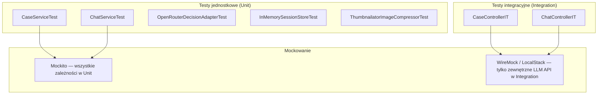

### 16.2 Przykład testu jednostkowego — `CaseServiceTest`

```java
@ExtendWith(MockitoExtension.class)
class CaseServiceTest {

    @Mock DecisionPort decisionPort;
    @Mock VisionAnalysisPort visionPort;
    @Mock SessionStore sessionStore;
    @Mock ImageCompressor imageCompressor;
    @Mock SessionProperties sessionProperties;

    @InjectMocks CaseService caseService;

    @Test
    void createCase_shouldCompressAndAnalyzeAndDecideAndStore() {
        // Given
        var command = new CreateCaseCommand(testForm(), testImageBytes());
        when(imageCompressor.compress(any())).thenReturn(compressedBytes());
        when(visionPort.analyze(any(), any())).thenReturn(testAnalysis());
        when(decisionPort.decide(any(), any(), any())).thenReturn(testDecision());
        when(sessionProperties.ttlMinutes()).thenReturn(60);

        // When
        var result = caseService.createCase(command);

        // Then
        assertThat(result.sessionId()).isNotNull();
        assertThat(result.decision().outcome()).isEqualTo(DecisionOutcome.APPROVE);

        // Verify pipeline order
        var order = inOrder(imageCompressor, visionPort, decisionPort, sessionStore);
        order.verify(imageCompressor).compress(testImageBytes());
        order.verify(visionPort).analyze(compressedBytes(), CaseType.COMPLAINT);
        order.verify(decisionPort).decide(any(), any(), eq(CaseType.COMPLAINT));
        order.verify(sessionStore).create(any());
    }
}
```

### 16.3 Przykład testu — detekcja OFFTOPIC

```java
@Test
void streamReply_shouldDetectOffTopicMarker() {
    // Given — LLM zwraca odpowiedź z markerem [OFFTOPIC]
    var llmResponse = "Skupiam się wyłącznie na sprawie reklamacji. [OFFTOPIC]";
    when(mockLlmClient.stream(any())).thenReturn(Stream.of(llmResponse));

    // When
    var reply = adapter.streamReply(testSession(), "Jaka pogoda?", delta -> {});

    // Then
    assertThat(reply.offTopic()).isTrue();
    assertThat(reply.updatedDecision()).isNull();
    assertThat(reply.replyMarkdown()).contains("[OFFTOPIC]");
}

@Test
void streamReply_shouldNotMarkAsOffTopicWhenAbsent() {
    // Given — normalna odpowiedź bez markera
    var llmResponse = "Tak, zgadzam się z decyzją APPROVE.";
    when(mockLlmClient.stream(any())).thenReturn(Stream.of(llmResponse));

    // When
    var reply = adapter.streamReply(testSession(), "Dlaczego zatwierdzono?", delta -> {});

    // Then
    assertThat(reply.offTopic()).isFalse();
}
```

### 16.4 Uruchamianie testów

```bash
# Backend — wszystkie testy
cd app/backend
mvn test

# Backend — tylko unit testy (szybko)
mvn test -Dtest="*Test"

# Backend — tylko integration testy
mvn test -Dtest="*IT"

# Frontend — unit testy
cd app/frontend
npm test

# Frontend — testy w trybie watch
npm run test:watch
```

---

## 17. Testy E2E z Playwright

### 17.1 Architektura testów E2E

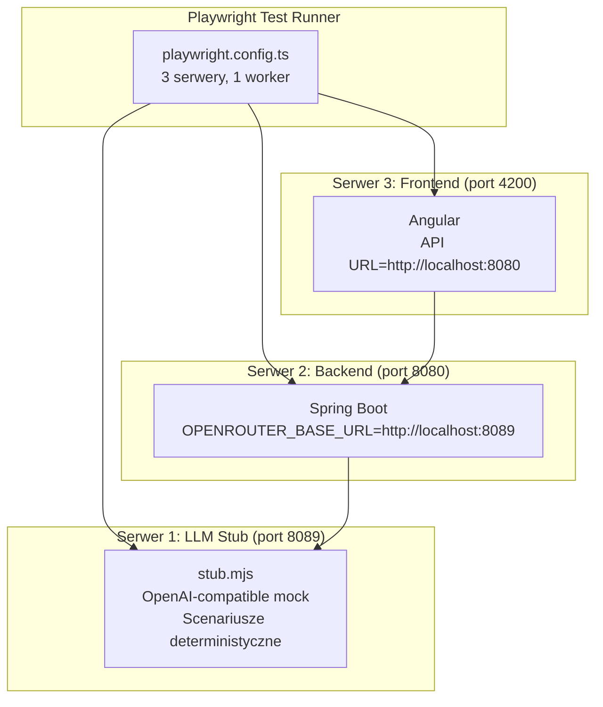

**Kluczowy punkt:** Backend jest skonfigurowany zmienną `OPENROUTER_BASE_URL=http://localhost:8089`, więc wszystkie wywołania LLM trafiają do stuba zamiast do prawdziwego OpenRouter.

### 17.2 `playwright.config.ts`

```typescript
import { defineConfig } from '@playwright/test';

export default defineConfig({
    testDir: './tests',
    workers: 1,              // Jeden worker — serwery nie są izolowane między testami
    timeout: 120_000,        // 120s — LLM może być wolny
    use: {
        baseURL: 'http://localhost:4200',
        locale: 'pl-PL',
    },
    webServer: [
        {
            // 1. Stub — musi startować pierwszy
            command: 'node stub/stub.mjs',
            url: 'http://localhost:8089/health',
            reuseExistingServer: true,
        },
        {
            // 2. Backend — czeka na stuba
            command: 'java -jar target/hardware-service-copilot.jar',
            url: 'http://localhost:8080/actuator/health',
            env: { OPENROUTER_BASE_URL: 'http://localhost:8089' },
            reuseExistingServer: true,
        },
        {
            // 3. Frontend — czeka na backend
            command: 'npm start -- --port 4200',
            url: 'http://localhost:4200',
            reuseExistingServer: true,
        }
    ]
});
```

### 17.3 `stub.mjs` — emulator OpenAI API

Stub obsługuje te same endpointy co OpenAI API i obsługuje scenariusze deterministyczne:

```javascript
// stub/stub.mjs
const SCENARIOS = {
    approve: {
        decision: { outcome: 'APPROVE', justification: 'Uszkodzenie fabryczne...', ... },
        chatReply: 'Tak, zgadzam się z decyzją zatwierdzającą.'
    },
    escalate: {
        decision: { outcome: 'ESCALATE', justification: 'Przypadek graniczny...', ... },
        chatReply: 'Przypadek wymaga oceny supervisora.'
    },
    'off-topic': {
        chatReply: 'Skupiam się wyłącznie na Twojej sprawie reklamacyjnej. [OFFTOPIC]'
    },
    updatedDecision: {
        chatReply: 'Zmieniam decyzję. [UPDATED_DECISION:{"outcome":"APPROVE",...}]'
    },
    '5xx': { status: 500 },
    timeout: { delayMs: 65000 }
};

// Endpoint: POST /v1/chat/completions
app.post('/v1/chat/completions', (req, res) => {
    const scenario = req.headers['x-scenario'] || 'approve';
    const isStreaming = req.body.stream === true;

    if (isStreaming) {
        streamResponse(res, SCENARIOS[scenario].chatReply);
    } else {
        res.json(buildCompletionResponse(SCENARIOS[scenario]));
    }
});
```

### 17.4 Page Object Model

```typescript
// tests/pages/IntakeFormPage.ts
export class IntakeFormPage {

    constructor(private page: Page) {}

    async fillAndSubmit(data: {
        caseType: 'REKLAMACJA' | 'ZWROT',
        category: string,
        model: string,
        date: string,
        reason?: string,
        imagePath: string
    }) {
        await this.selectMatOption('[data-testid="case-type-select"]', data.caseType);
        await this.selectMatOption('[data-testid="category-select"]', data.category);
        await this.page.fill('[data-testid="model-input"]', data.model);
        await this.setPurchaseDate(data.date);
        if (data.reason) {
            await this.page.fill('[data-testid="reason-textarea"]', data.reason);
        }
        await this.page.setInputFiles('[data-testid="image-input"]', data.imagePath);
        await this.page.click('[data-testid="submit-button"]');
    }

    // Angular Material select wymaga specjalnej obsługi
    private async selectMatOption(selector: string, value: string) {
        await this.page.click(selector);
        await this.page.click(`mat-option:has-text("${value}")`);
    }
}
```

```typescript
// tests/pages/ChatPage.ts
export class ChatPage {

    async waitForDecision(): Promise<string> {
        await this.page.waitForSelector('[data-testid="decision-bubble"]');
        return this.page.textContent('[data-testid="decision-bubble"]') ?? '';
    }

    async waitForStreamingComplete(): Promise<void> {
        // Czeka aż zdarzenie SSE done zostanie przetworzone
        await this.page.waitForSelector('[data-testid="send-button"]:not([disabled])');
    }

    async assertDecisionHasDisclaimer(): Promise<void> {
        const bubble = await this.page.textContent('[data-testid="decision-bubble"]');
        expect(bubble).toContain('⚠️');
        expect(bubble).toContain('wygenerowana automatycznie przez system AI');
    }

    async sendMessage(content: string): Promise<void> {
        await this.page.fill('[data-testid="message-input"]', content);
        await this.page.click('[data-testid="send-button"]');
    }
}
```

### 17.5 Główny test E2E (`smoke.spec.ts`)

```typescript
test('full flow: form → decision → chat', async ({ page }) => {
    const formPage = new IntakeFormPage(page);
    const chatPage = new ChatPage(page);

    // 1. Wypełnienie i wysłanie formularza
    await page.goto('/');
    await formPage.fillAndSubmit({
        caseType: 'REKLAMACJA',
        category: 'LAPTOP',
        model: 'Dell XPS 15',
        date: '2024-01-15',
        reason: 'Ekran przestał działać',
        imagePath: './fixtures/laptop.jpg'
    });

    // 2. Oczekiwanie na decyzję (po przejściu do /chat)
    await page.waitForURL('**/chat');
    const decisionText = await chatPage.waitForDecision();
    expect(decisionText).toContain('ZATWIERDZONO');

    // 3. Weryfikacja disclaimera
    await chatPage.assertDecisionHasDisclaimer();

    // 4. Wysłanie wiadomości i weryfikacja streamowania
    await chatPage.sendMessage('Kiedy serwis odezwie się z wynikiem?');
    await chatPage.waitForStreamingComplete();

    const lastMessage = await page.textContent('[data-testid="last-assistant-message"]');
    expect(lastMessage).toBeTruthy();
    expect(lastMessage!.length).toBeGreaterThan(10);
});
```

### 17.6 Uruchamianie testów E2E

```bash
cd app/e2e

# Instalacja zależności (pierwsze uruchomienie)
npm install
npx playwright install chromium

# Uruchomienie testów
npm test
# lub
npx playwright test

# Tryb interaktywny (UI)
npx playwright test --ui

# Konkretny test
npx playwright test tests/smoke.spec.ts

# Z widoczną przeglądarką
npx playwright test --headed
```

---

## 18. Struktura API REST

### 18.1 Pełna dokumentacja endpointów

#### `POST /api/cases`

Tworzy nową sprawę i generuje wstępną decyzję AI.

| Parametr | Typ | Wymagany | Opis |
|----------|-----|---------|------|
| `form` (part) | `application/json` | Tak | Dane formularza |
| `image` (part) | `image/*` | Tak | Zdjęcie sprzętu |

**Request `form` body:**
```json
{
    "caseType": "COMPLAINT | RETURN",
    "equipmentCategory": "LAPTOP | PHONE | TABLET | ...",
    "modelName": "string",
    "purchaseDate": "YYYY-MM-DD",
    "reason": "string (wymagany dla COMPLAINT)"
}
```

**Response 201:**
```json
{
    "sessionId": "uuid",
    "decision": {
        "outcome": "APPROVE | REJECT | ESCALATE",
        "justification": "string",
        "citedRules": ["string"],
        "nextSteps": ["string"],
        "confidence": 0.0,
        "firstMessageMarkdown": "string (Markdown)"
    }
}
```

**Kody błędów:**
| Kod HTTP | ErrorCode | Kiedy |
|---------|-----------|-------|
| 400 | `COMPLAINT_REASON_REQUIRED` | Brak `reason` dla `COMPLAINT` |
| 400 | `IMAGE_REQUIRED` | Brak pliku |
| 413 | `IMAGE_TOO_LARGE` | Plik > 10MB |
| 415 | `UNSUPPORTED_IMAGE_TYPE` | Nie JPEG/PNG/WebP |
| 502 | `LLM_UNAVAILABLE` | LLM niedostępny |
| 504 | `LLM_TIMEOUT` | LLM nie odpowiedział |

#### `GET /api/cases/{id}`

Pobiera stan istniejącej sesji.

| Parametr | Typ | Opis |
|----------|-----|------|
| `id` | UUID (path) | Identyfikator sesji |

**Response 200:**
```json
{
    "id": "uuid",
    "caseType": "COMPLAINT",
    "form": { ... },
    "imageAnalysis": {
        "description": "string",
        "damageObserved": true,
        "signsOfUse": false,
        "usableForResale": null,
        "confidence": 0.92
    },
    "decision": { ... },
    "messages": [
        { "role": "SYSTEM_ASSISTANT", "content": "...", "createdAt": "..." }
    ],
    "createdAt": "ISO-8601",
    "expiresAt": "ISO-8601"
}
```

#### `POST /api/cases/{id}/messages`

Wysyła wiadomość do czatu i streamuje odpowiedź przez SSE.

| Parametr | Typ | Opis |
|----------|-----|------|
| `id` | UUID (path) | Identyfikator sesji |
| `content` | string (body JSON) | Treść wiadomości |

**Nagłówki odpowiedzi:**
```
Content-Type: text/event-stream
Cache-Control: no-cache
Connection: keep-alive
```

**Strumień zdarzeń:**
```
event: token
data: {"delta":"fragment tekstu"}

event: done
data: {"offTopic":false,"updatedDecision":null}

event: error
data: {"message":"opis błędu"}
```

### 18.2 Format błędów

Wszystkie błędy zwracane są w jednolitym formacie:

```json
{
    "errorCode": "CASE_NOT_FOUND",
    "message": "Sprawa nie istnieje lub wygasła",
    "fieldErrors": [
        { "field": "reason", "message": "Powód jest wymagany dla reklamacji" }
    ]
}
```

Pole `fieldErrors` jest obecne tylko przy błędach walidacji (HTTP 400).

---

## 19. Jak budować aplikacje AI podobne do tej

### 19.1 Wzorzec projektowania aplikacji AI

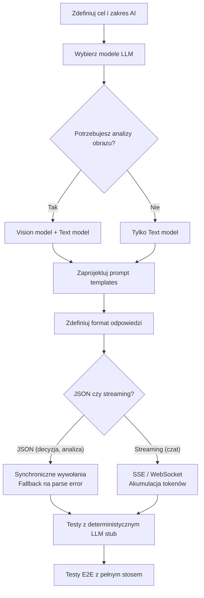

### 19.2 Kluczowe zasady budowania aplikacji AI

#### Zasada 1: Oddziel logikę domenową od LLM przez port

```java
// Dobry wzorzec — logika biznesowa nie zna OpenAI
public interface DecisionPort {
    Decision decide(CaseForm form, ImageAnalysis analysis, CaseType caseType);
}

// Zły wzorzec — bezpośrednie użycie klienta w serwisie
@Service
public class CaseService {
    @Autowired OpenAIOkHttpClient openAi;  // ŹLE
}
```

**Dlaczego:** Można podmienić model, providera lub całą strategię bez zmiany logiki biznesowej.

#### Zasada 2: Zawsze definiuj fallback na błąd parsowania LLM

```java
private Decision parseDecision(String content) {
    try {
        return objectMapper.readValue(content, DecisionRaw.class);
    } catch (JsonProcessingException e) {
        // LLM może zwrócić niepoprawny JSON — ESKALUJ zamiast rzucać wyjątek
        log.warn("Błąd parsowania odpowiedzi LLM: {}", e.getMessage());
        return Decision.escalate("Błąd przetwarzania odpowiedzi AI");
    }
}
```

#### Zasada 3: Prompt jako kod — wersjonuj, testuj, nie hardkoduj

```
# Dobrze:
classpath:prompts/decision-complaint.md (wersjonowany w git, testowalny)

# Źle:
String prompt = "Wydaj decyzję bazując na danych...";  // hardkodowany w klasie
```

#### Zasada 4: Używaj LLM stub do testów E2E

Real LLM w testach:
- Niestabilny (różne odpowiedzi, timeouty)
- Kosztowny (opłaty za tokeny)
- Niedeterministyczny (nie można assertować konkretnej treści)

Stub LLM:
- Deterministyczny (te same scenariusze zawsze)
- Szybki (0ms latency)
- Darmowy
- Testuje błędy (5xx, timeouty) bez ryzyka

#### Zasada 5: Konfidencja to nie pewność

```java
// Dobrze: gdy konfidencja niska → eskaluj
if (raw.confidence() < 0.7 || raw.outcome() == null) {
    return Decision.escalate("Zbyt niska pewność AI");
}

// Źle: ufanie LLM bezwarunkowo
return new Decision(raw.outcome(), ...);  // co jeśli outcome=null?
```

#### Zasada 6: OFFTOPIC przez marker tekstowy vs function calling

Dla prostych przypadków (jedno pytanie: "czy poza tematem?") marker tekstowy jest wystarczający:

```
# W prompcie:
Jeśli pytanie jest poza tematem, dodaj na końcu: [OFFTOPIC]

# W kodzie:
boolean offTopic = fullReply.contains("[OFFTOPIC]");
```

Użyj function calling gdy:
- Potrzebujesz wielu strukturalnych wartości z jednego wywołania
- Marker może pojawić się organicznie w treści
- Masz zagwarantowane wsparcie function calling w modelu

#### Zasada 7: Nie ujawniaj pełnych promptów systemowych użytkownikowi

Prompty systemu (`system.md`) mogą zawierać polityki wewnętrzne. Nie zwracaj ich w API odpowiedziach.

### 19.3 Architektura wielomodelowa

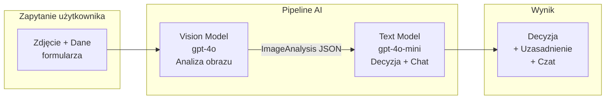

**Dlaczego dwa modele?**
- Vision model (droży): użyty raz do analizy zdjęcia
- Text model (tańszy): użyty do decyzji i każdej wiadomości czatu
- Optymalizacja kosztów: 90% wywołań to tańszy model text

### 19.4 Wzorzec SSE dla streamingu

```
Backend              Frontend
   |                    |
   |<-- POST /messages  |
   |                    |
   |-- SSE: token ------>
   |-- SSE: token ------>
   |-- SSE: token ------>  (użytkownik widzi tekst na bieżąco)
   |-- SSE: done ------->
   |                    |
```

**Zalety SSE nad WebSocket dla tego przypadku:**
- Jednokierunkowy strumień: wystarczy unidirectional (serwer → klient)
- Prostszy backend: Spring `SseEmitter` vs Spring WebSocket
- HTTP/1.1 friendly: nie wymaga upgrade protokołu
- Obsługa POST: `@microsoft/fetch-event-source` — standardowy `EventSource` nie obsługuje POST

### 19.5 Checklist przed wdrożeniem

```
□ Prompty przetestowane na edge case'ach (brak danych, niska jakość obrazu)
□ Fallback na błąd parsowania LLM
□ Timeout ustawiony rozsądnie (60s dla modeli vision)
□ Obsługa błędów LLM w UI (komunikat dla użytkownika)
□ LLM stub z wszystkimi scenariuszami błędów
□ Testy E2E pokrywające happy path i błędy
□ Klucze API w zmiennych środowiskowych, nie w kodzie
□ Polityka prywatności (dane zdjęć wysyłane do zewnętrznego API)
□ Rate limiting / throttling wywołań LLM
□ Monitoring kosztów API (OpenRouter dashboard)
```

---

## 20. Pytania i odpowiedzi (Q&A)

### Q1: Dlaczego architektura heksagonalna, a nie prosta aplikacja Spring MVC?

**A:** Architektura heksagonalna separuje logikę domenową od szczegółów technicznych (HTTP, LLM API, baza danych). Konkretne korzyści w tym projekcie:
- **Podmiana providera LLM**: Zmiana z OpenRouter na Azure OpenAI wymaga tylko nowego adaptera, bez dotykania `CaseService`.
- **Testy**: Można testować `CaseService` bez żadnego mockowania HTTP — wystarczą mocki portów.
- **Magazyn sesji**: Aktualnie in-memory. Migracja do Redis/PostgreSQL = nowa implementacja `SessionStore`, bez zmian w serwisach.

---

### Q2: Jak dodać obsługę PDF (zamiast zdjęcia)?

**A:** Wystarczy:
1. Zmienić walidację w `CaseController` — dodać `application/pdf` do listy dozwolonych typów.
2. Dodać konwerter PDF → JPEG (np. `pdfbox` → `ImageIO`) do pipeline'u kompresji.
3. Zaktualizować `ThumbnailatorImageCompressor` lub dodać nową implementację `ImageCompressor`.
4. Zaktualizować prompt analityczny — model vision obsługuje obrazy, nie PDF bezpośrednio.

---

### Q3: Dlaczego sesje są przechowywane in-memory, a nie w bazie danych?

**A:** Aplikacja jest prototypem/MVP z prostymi wymaganiami:
- Jedna instancja serwera (brak potrzeby współdzielenia sesji między węzłami)
- TTL 60 minut — sesje są krótkotrwałe, nie wymagają persystencji
- Zerowa konfiguracja bazy danych — aplikacja startuje bez zewnętrznych zależności

**Kiedy migrować do Redis/DB:**
- Skalowanie horyzontalne (wiele instancji)
- Sesje powinny przetrwać restart serwera
- Audit log wymagany (historyczne zapisy decyzji)

Migracja jest prosta dzięki interfejsowi `SessionStore` — wystarczy nowa implementacja.

---

### Q4: Jak zmienić model LLM na inny (np. Anthropic Claude)?

**A:** Dwie opcje:

**Opcja A — OpenRouter (zalecana):**
Zmień tylko zmienną środowiskową `OPENROUTER_TEXT_MODEL` na np. `anthropic/claude-3.5-sonnet`. OpenRouter tłumaczy API — zero zmian w kodzie.

**Opcja B — Bezpośredni klient Anthropic:**
1. Dodaj Anthropic Java SDK do `pom.xml`
2. Zaimplementuj nowy adapter `AnthropicDecisionAdapter implements DecisionPort`
3. Podmień bean w `@Configuration`

Logika domenowa pozostaje bez zmian.

---

### Q5: Jak dodać nowy typ sprawy (np. REPAIR — naprawa)?

**A:** Lista zmian:
1. Dodaj wartość do `CaseType` enum: `REPAIR`
2. Dodaj prompt `analysis-repair.md` i `decision-repair.md` w `classpath:prompts/`
3. Dodaj plik polityki `repair-policy.md` i skonfiguruj w `PolicyProperties`
4. Zaktualizuj mapowanie w `PromptTemplateProvider.analysisPrompt(CaseType)`
5. Walidacja w `CaseController` (czy `reason` jest wymagany)
6. Testy: dodaj scenariusz `repair` do stuba E2E

---

### Q6: Jak działa wykrywanie [UPDATED_DECISION:...] i kiedy AI zmienia decyzję?

**A:** Prompt `chat.md` instruuje model: jeśli na podstawie nowych informacji decyzja powinna się zmienić, dołącz blok JSON `[UPDATED_DECISION:{...}]` na końcu odpowiedzi.

Przykład: Użytkownik mówi "Sprzęt jest na gwarancji producentskiej, mam fakturę". AI może zmienić decyzję z REJECT na APPROVE i dołączyć marker.

Backend wykrywa marker, parsuje JSON, aktualizuje sesję przez `sessionStore.supersedeDecision()`.

Frontend odbiera zaktualizowaną decyzję w zdarzeniu SSE `done.updatedDecision` i aktualizuje widok.

---

### Q7: Co się stanie jeśli LLM zwróci niepoprawny JSON dla decyzji?

**A:** `OpenRouterDecisionAdapter.parseDecision()` łapie `JsonProcessingException` i zwraca `Decision.escalate("Błąd parsowania odpowiedzi AI")`. Użytkownik widzi decyzję ESKALUJ z informacją o błędzie AI. Supervisor może ręcznie ocenić sprawę.

To bezpieczny domyślny stan — lepiej eskalować do człowieka niż zwrócić błąd 500.

---

### Q8: Jak przetestować scenariusz timeout LLM?

**A:** W testach E2E ustaw nagłówek `X-Scenario: timeout` w żądaniu (lub skonfiguruj stuba na scenariusz `timeout` który odpowiada po 65 sekundach — powyżej timeoutu 60s backendu).

W testach jednostkowych zmockuj `OpenAIOkHttpClient` aby rzucał `OpenAITimeoutException`.

```java
when(mockClient.chat().completions().create(any()))
    .thenThrow(new OpenAITimeoutException("timeout"));
```

Oczekiwany wynik: HTTP 504 z `{"errorCode":"LLM_TIMEOUT"}`.

---

### Q9: Czy aplikacja jest bezpieczna na CSRF?

**A:** API jest stateless (brak session cookies) i używa JWT/API key w nagłówkach — CSRF nie jest zagrożeniem dla API REST. Frontend wysyła żądania z `Content-Type: application/json` co samo w sobie jest ochroną przed prostymi atakami CSRF (przeglądarki nie wysyłają cross-origin POST z JSON bez preflight CORS).

CORS jest skonfigurowany przez `CorsProperties` — tylko zdefiniowane originy są dozwolone.

---

### Q10: Jak monitorować koszty wywołań LLM?

**A:** Aktualnie aplikacja nie śledzi kosztów. Zalecane podejście:
1. **OpenRouter Dashboard** — podgląd w czasie rzeczywistym kosztów per model
2. **Własne logowanie** — dodaj interceptor do `OpenAiClientConfig` logujący liczbę tokenów z nagłówka `X-RateLimit-*` lub z `response.usage()`
3. **Metryki Spring Actuator** — własny `Counter` micrometer per wywołanie LLM
4. **Alerty** — ustaw limity budżetowe w OpenRouter (wbudowana funkcja)

---

### Q11: Jak działa zarządzanie historią wiadomości czatu wysyłaną do LLM?

**A:** `ChatService.streamReply()` przekazuje pełną sesję do `OpenRouterDecisionAdapter.streamReply()`. Adapter buduje listę wiadomości dla LLM:

```java
private List<ChatCompletionMessageParam> buildContextMessages(CaseSession session, String userContent) {
    var messages = new ArrayList<ChatCompletionMessageParam>();

    // System prompt + chat prompt (z danymi sprawy)
    messages.add(system(promptProvider.systemPrompt() + "\n\n" + buildChatContext(session)));

    // Historia wiadomości z sesji (pary user/assistant)
    session.messages().stream()
           .filter(m -> m.role() != ChatRole.SYSTEM_ASSISTANT)
           .forEach(m -> messages.add(m.role() == ChatRole.USER
               ? user(m.content())
               : assistant(m.content())));

    // Nowa wiadomość użytkownika
    messages.add(user(userContent));

    return messages;
}
```

LLM widzi pełną historię rozmowy + kontekst sprawy. Przy długich sesjach może to przekroczyć limit tokenów — aplikacja aktualnie nie implementuje truncowania (obszar do ulepszeń).

---

### Q12: Jak dodać obsługę wielu zdjęć?

**A:** Aktualnie API akceptuje jedno zdjęcie. Aby obsłużyć wiele:

**Backend:**
1. `CaseController` — zmień `@RequestPart("image")` na `@RequestPart("images") List<MultipartFile>`
2. `ImageCompressor.compress(byte[])` → `compressAll(List<byte[]>)`
3. `VisionAnalysisPort.analyze()` — wyślij wiele bloków `image_url` w jednym żądaniu (OpenAI API obsługuje wiele obrazów w jednej wiadomości)
4. Zaktualizuj prompt analizy

**Frontend:**
1. Input `accept="image/*" multiple`
2. Pętla dodawania części do `FormData`

---

*Dokument wygenerowany: 2026-06-30. Wersja kodu: commit `110214e` (main).*
